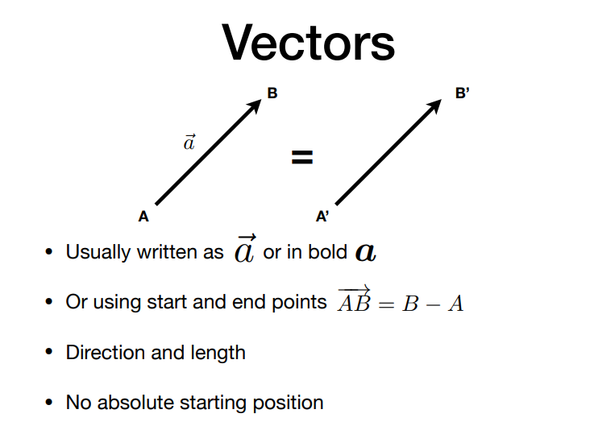
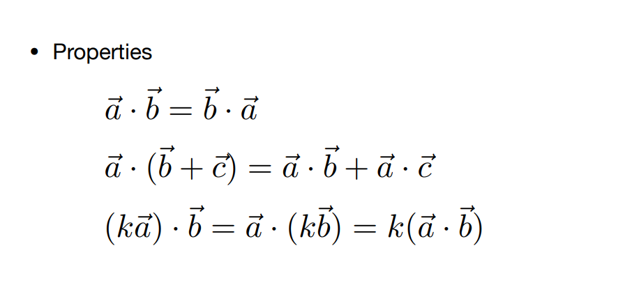
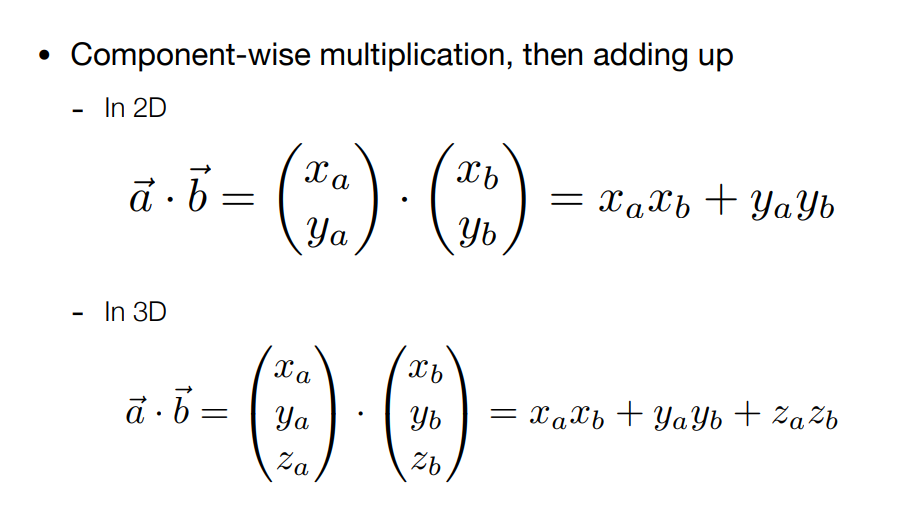
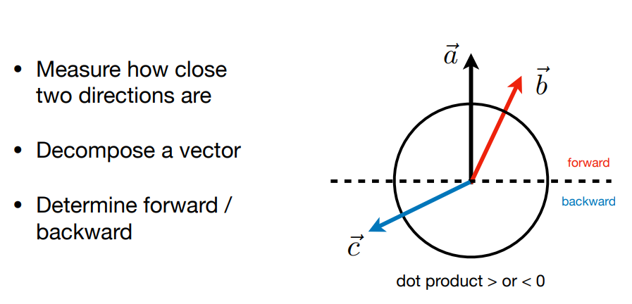
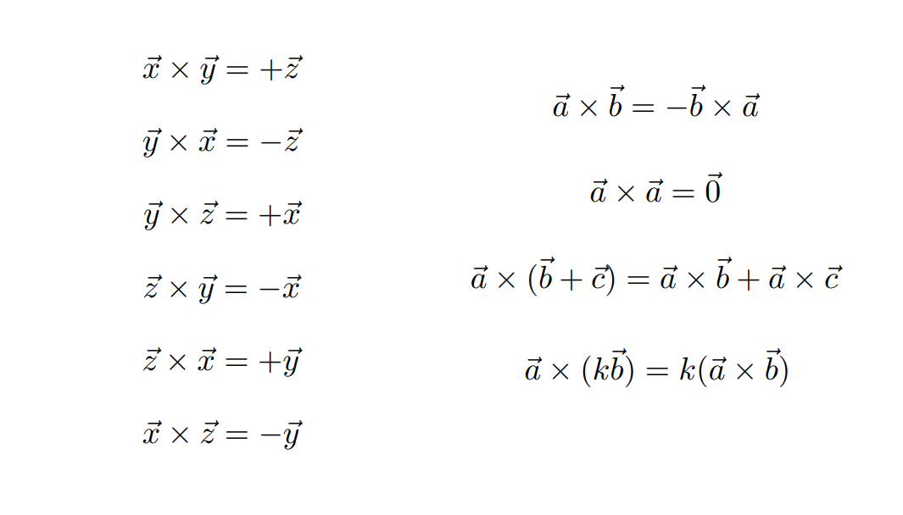
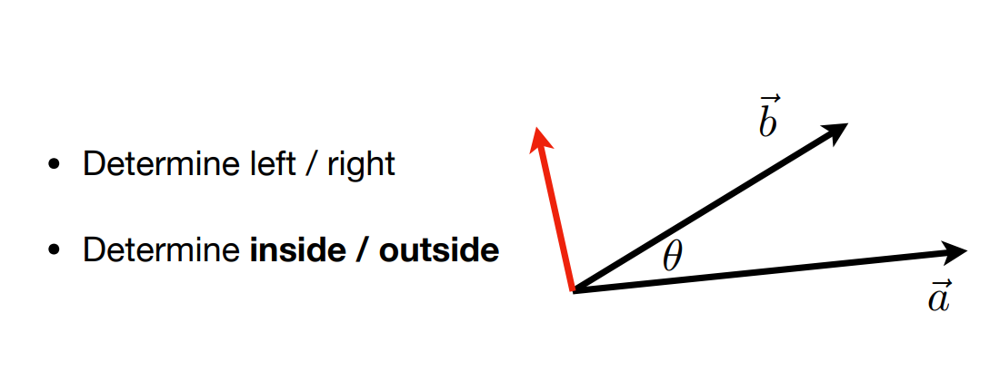

# 向量和矩阵

## 一.Vectors (向量)

### 1.向量含义

### 2.向量长度

单位向量：大小为1的向量。我们通常使用单位向量表示方向，不关心其长度。

### 3.向量相加

相加有两种方式：如上，平行四边形法则和三角形法则。

### 4.向量相乘

#### 点乘

如上图，点乘在几何中的含义，点乘可方便让我们得到两个向量的夹角。（当两个向量都为单位向量时，这时候计算会非常方便）

如上，点乘满足这些数学规律，交换律，分配律和结合律。

如何上，在2D,3D空间上两个向量的点乘结果。

**点乘用途：**
> 点乘：在图形学中最大的用处，就是找到两个向量的夹角。

1.点乘可以计算一个向量在另一个向量上的**投影**，和一个向量的两个分量。如下图：

2.点乘还可以告诉我们一个**前或后**的信息。

如图：从$\vec{a}$起点向上看形成forward区域，向下看形成backward区域。

+ $\vec{b}$终点落在foward区域，我们认为$\vec{b}$和$\vec{a}$的大致方向相同。
+ $\vec{c}$的终点落在backward区域，我们认为$\vec{c}$和$\vec{a}$的方向大致相反。

>如上结论。我们可以知道，向量的点乘可以告诉我们向量方向性，方向相同，相反或垂直。
> 点乘为负数：方向相反。
> 点乘为正数：方向相同。
> 点乘为0：方向垂直。
> 同意，点乘的结果我们也可以知道两个向量方向是否相近。（数值越靠近1，则夹角越小，方向越近）

#### 叉乘

叉乘：给出两个向量$\vec{a}$和$\vec{b}$，通过叉乘会生成一个新的向量$\vec{c}$，则$\vec{c}$垂直于$\vec{a}$和$\vec{b}$。即垂直于$\vec{a}$,$\vec{b}$形成的平面。
上图只给出了$\vec{a}和\vec{b}$的叉乘大小，并没有给出方向。方向我们需要通过右手螺旋定则判断 （注意，$\vec{a}\times\vec{b} 和\vec{b}\times\vec{a}$的结果并不相同（方向相反），即叉乘不满足交换律）。
>右手螺旋定则：手掌展开，四指与拇指垂直，四指指向**第一个向量**，慢慢旋转四指握向手心>（旋转方向为**第二个向量**），旋转完成后，**拇指所指方向**为叉乘所得向量方向。
>右手坐标系：第一个向量指x轴正方向，第二个向量y轴正方向，则同上得到拇指所指方向为z轴正方向。

如上右边是叉乘的运算法则。左边公式是以右手系为准则（$\vec{x} \times\vec{y} = +\vec{z}$）。如果是左手系(OpenGL)，则（$\vec{x} \times \vec{y} = -\vec{z}$）.

>上面说明了叉乘在几何中的含义，下面看看叉乘在代数中运算

如上，写明了$\vec{a}\times\vec{b}$的结果，和使用A矩阵替代$\vec{a}$进行运算，两者结果一样。

**叉乘的用途**

1.判断左右，内外

如上图，

+ 判断左右（左图）：给定两个向量$\vec{a}和\vec{b}$,怎么判定$\vec{b}在\vec{a}左边还是右边$？。即用$\vec{a}\times\vec{b}$得到的叉乘结果数值如果是正的，则$\vec{b}在\vec{a}的左边$。反之如果是负数，在右边。
+ 判断内外（右图）：怎么判断p在是否在三角形内？即利用上面的规则判断p点位于三条边的左边还是右边（左/右看三角形每条边指向的方向）。如上图给定A,B,C三个点，逆时针排列。得到$\vec{CA},\vec{AB}和\vec{BC}三条向量$，则分别计算($\vec{CA}\times\vec{CP},\vec{AB}\times\vec{AP},\vec{BC}\times\vec{BP}$)三组叉乘,即可得到P都位于三条向量的左边。即得到p点在三角形内。

## 二.矩阵

