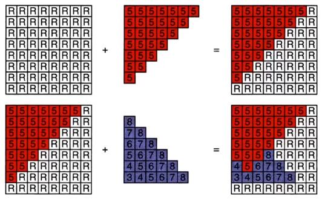
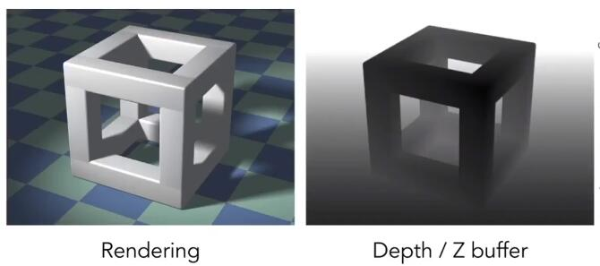

# 深度测试

> 深度测试简单得说，就是对于某一个像素点，始终记录深度值最小得那个，也就是离摄像机最近的那一个。

## 一.何为深度？

深度：像素点在场景中距离摄像机的距离。

从**MVP**变换中，我们知道，经过视图变换后，摄像机一直被放在(0,0,0)点，相机朝向-Z方向看场景。那么此时物体距离摄像机越远(深度值大)，则对应的Z值就越小。反指，Z值越大。

## 二.何为深度测试？

深度缓冲(Depth Buffer):可以变相理解为一张用于维护每个像素点最小深度值的图片(其根本是一块**内存**)，每个像素的初始值对应无限远的深度。

帧缓冲(Frame Buffer):可变相理解为一张用于存储当前像素颜色的图片(内存)，每个像素的初始值对应背景颜色。

注：**即帧缓冲区负责存储每个像素当前的最终颜色，而深度缓冲区用于存储每个像素当前的最小深度。**

下图为深度测试过程:

在绘制一个物体表面时，先需要将该表面对应的像素深度值与深度缓冲区中存储的深度值进行比较，

+ 如果当前深度大于或等于深度缓冲区中记录的深度，那么直接丢弃该像素。
+ 如果当前的深度值小于深度缓冲区中记录的深度值，则对该像素进行shading，并将shading的结果写入帧缓冲区，同时更新深度缓冲区中对应的最小深度。

在整个着色的过程中，会同时生成两张图片，一张图片是我们看到的最终渲染出来的图片(由帧缓冲区生成)，另一张是深度图(由深度缓冲区生成)。

下图为：渲染结果和深度图

