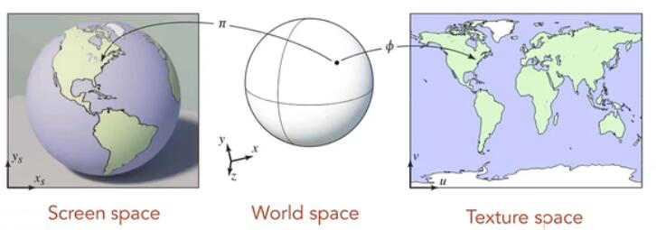
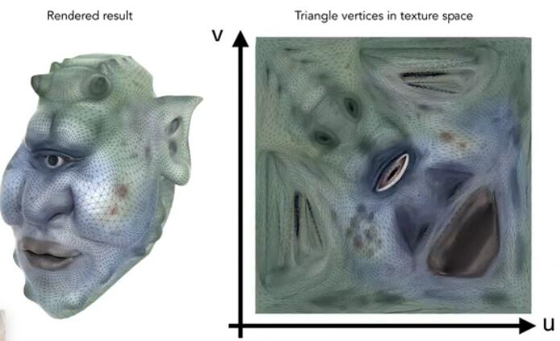
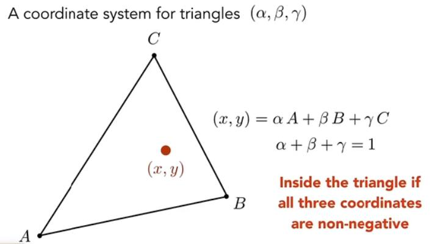
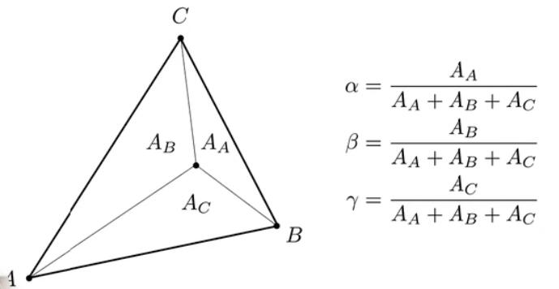
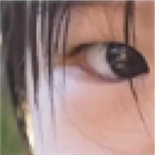
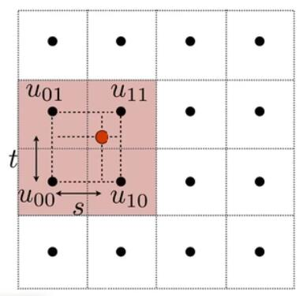

# 纹理映射

纹理的意义:

+ 对于任何一个三维物体，我们都可以把他的表面展开到一张二维平面的图像中。
+ 并且模型上的每一个点都与这张二维平面图像上的点存在一一对应的关系。

## 一.UV坐标

要确定模型上的点与二维平面上的点之间关系，就需要为展开的二维平面定义一个坐标系。

这个坐标系通常用UV来表示，**并且无论这张图像有多大，它的UV坐标范围总是是从0到1的.**

定义模型时，对应三角形的每个顶点，都对应一个UV坐标。

顶点中的UV坐标会在顶点着色器传入片元着色器的时候进行插值。

从而得到三角形中每一个像素点对应的UV坐标，实现模型上的每一个像素与纹理的一一对应关系

## 二.重心坐标

>重心坐标是一种可以使得任意参数在三角形内部进行插值的方法。

**利用重心坐标进行插值，可以使得任意在三角形顶点中计算的值（如颜色、UV坐标、法向量等）在三角形内部有一个平滑的过渡。**

在三角形内部任意一个点(x,y)都可以表示成三角形三个顶点A,B,C的线性组合

$$
 (x,y)=αA+βB+γC
$$

并且$α，β，γ$是非负数，且满足：

$$
α+β+γ=1
$$

只要满足上面的条件，那么$α，β，γ$ 就可以称为一个重心坐标，用来描述这个点(x,y).

### 计算重心坐标

如图，三角形ABC中任意一个点与三角形三个顶点分别连线之后，将三角形分割成了三块$(A_A, A_B, A_C)$ 假设与A顶点不相交的三角形面积为$A_A$,与B顶点不相交的三角形面积为$A_B$,与C顶点不相交的三角形面积为$A_C$.

那么就可以得到三角形重心坐标(α,β,γ)分别为:

$$
α = \frac{A_A}{A_A + A_B + A_C}
$$

$$
β = \frac{A_B}{A_A + A_B + A_C}
$$

$$
γ = \frac{A_C}{A_A + A_B + A_C}
$$

> 在第二节 向量和矩阵中我们知道，知道三角形的三个顶点位置之后，可以利用向量叉乘计算三角形面积

### 如何利用重心坐标进行插值

假设三角形三个顶点的UV坐标分别为：$UV_A, UV_B, UV_c$.
那么三角形内部重心坐标为$(α，β，γ)$的点对应的UV坐标为：
$$
    UV = αUV_A + βUV_B + γUV_c
$$

## 三.插值

### 纹理太小会出现的问题

物体上任意一个点都对应纹理上的一个位置，但通常情况下，这个位置不会是整数。

那么此时如果只是简单的做四舍五入，使得这个点与纹理中的像素一一对应。

就可能发生物体上临近的若干个点都会被映射到纹理的同一个像素中，使得物体上的这些点都是同一个颜色，进而造成下图这种效果。

### 双线性插值

当一个点被映射到纹理中的一个非整数位置时，如果想知道当前位置的纹理应该是什么，就可以利用双线性插值进行计算。

