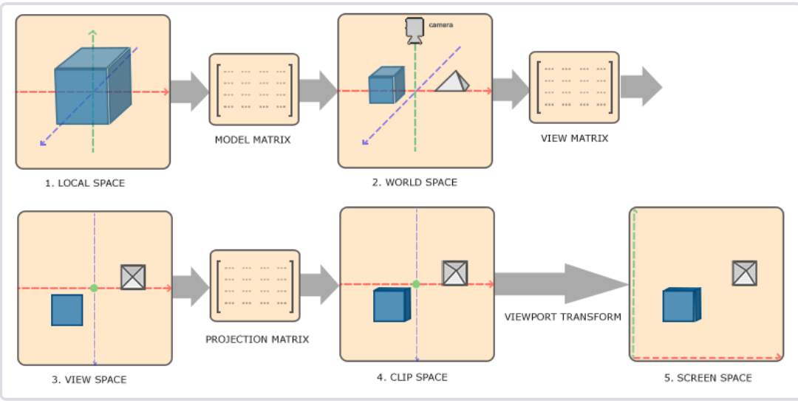
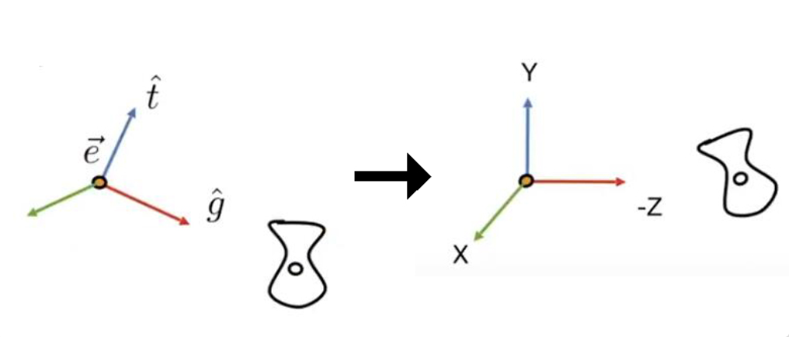
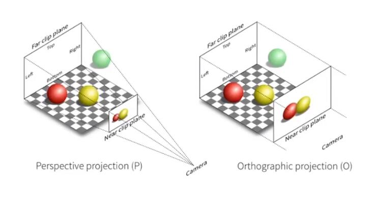
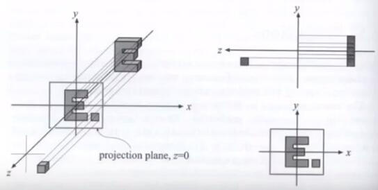
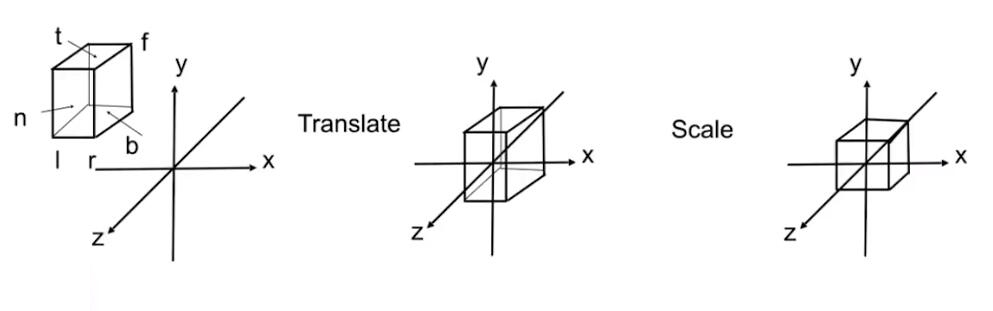
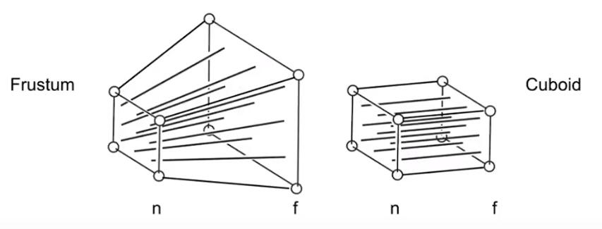
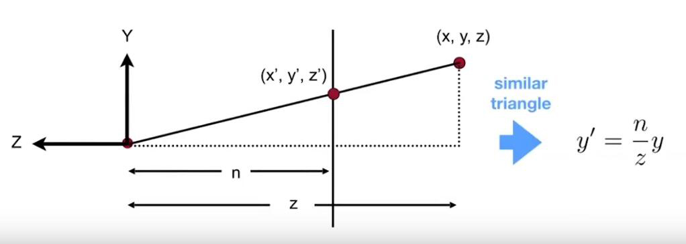

# MVP变换

## 一.如何将局部坐标转换到屏幕坐标？

将坐标从一个坐标系变换到另一个坐标系，我们需要用到几个变换矩阵，最重要的几个分别是模型(Model)、观察(View)、投影(Projection)三个矩阵.

顶点坐标起始于局部空间(Local Space)，在这里它称为局部坐标(Local Coordinate)，它在之后会变为世界坐标(World Coordinate)，观察坐标(View Coordinate)，裁剪坐标(Clip Coordinate)，并最后以屏幕坐标(Screen Coordinate)的形式结束。

下面的这张图展示了整个流程以及各个变换过程做了什么

1.局部坐标是对象相对于局部原点的坐标，也是物体起始的坐标。
2.下一步是将局部坐标变换为世界空间坐标，世界空间坐标是处于一个更大的空间范围的。这些坐标相对于世界的全局原点，它们会和其它物体一起相对于世界的原点进行摆放。
3.接下来我们将世界坐标变换为观察空间坐标，使得每个坐标都是从摄像机或者说观察者的角度进行观察的。
4.坐标到达观察空间之后，我们需要将其投影到裁剪坐标。裁剪坐标会被处理至-1.0到1.0的范围内，并判断哪些顶点将会出现在屏幕上。
5.最后，我们将裁剪坐标变换为屏幕坐标，我们将使用一个叫做视口变换(Viewport Transform)的过程。

## 二.MVP变换

>计算机图形学其实就是一种利用数学算法，将二维或三维的场景转化成，计算机显示器能够显示的栅格图像的科学。

MVP变换对应了三种变换：

+ 模型变换(Model Transfromation)
+ 视图变换(View Transformation)
+ 投影变换(Projection Transformation)

### 1.模型变换

模型变换其实就是各个模型进行各自的矩阵变换的过程(可以查看第02节中的矩阵变换)

### 2.视图变换

视图变换就是如何防置摄像机，确定摄像机摆放的三个参数:

+ Position:摄像机位置
+ Gaze Direction:摄像机方向
+ Up Direction:摄像机的上方向

众所周知，两个物体如何做相同运动，那么可以看作两个物体之间仍然保持静止(相对运动)，也就是说，相机和场景中所有物体都执行相同运动时，拍出来的结果不会发生任何变化。

如上图相机放在标准位置。

我们将相机永远放在一个标准的位置(相机位置永远在坐标原点，相机永远向-Z方向看，相机永远以Y轴为向上方向)。

为了让场景中的物体坐标从世界坐标变成，相机观察的坐标，则场景中的所有物体都要乘以相同的变换矩阵，则这个矩阵我们称为**视图变换矩阵**。（如果要相机与场景保持相对静止，就需要相机和场景中所有物体都执行相同的操作，也就是乘以相同的变换矩阵。）

**视图变换矩阵的作用可以理解成，将场景中的相机变换到标准位置，为了使场景与相机保持静止，那么场景中的所有物体都需要乘上该矩阵。**

#### 计算

直接计算将场景中的相机变换到标准位置比较困难，但是有一件事情很**简单，就是将一个标准位置下的相机，变换到当前相机的位置**，我们假设这个变换过程为𝑉。

那么将当前相机位置变换回标准位置，其实就是做一次𝑉变换的逆变换而已，也就是求𝑉的逆矩阵$V^{-1}$.
那么此时这个矩阵$V^{-1}$就是我们需要计算的视图变换矩阵.

这个变换矩阵可以分为三部分：平移，旋转，缩放。

**平移：**
将标准相机放置到当前相机位置的矩阵可以表示成：
$$
 \left[
 \begin{matrix}
   1 & 0 & 0 & t_x \\
   1 & 0 & 0 & t_y \\
   1 & 0 & 0 & t_z \\
   1 & 0 & 0 & 1\\
  \end{matrix}
  \right]
$$

这个变换的逆变换就是直接将平移量乘上-1即可:
$$
 \left[
 \begin{matrix}
   1 & 0 & 0 & -t_x \\
   1 & 0 & 0 & -t_y \\
   1 & 0 & 0 & -t_z \\
   1 & 0 & 0 & 1\\
  \end{matrix}
  \right]
$$

**旋转:**

将标准相机旋转到与当前相机的方向一致的矩阵，可以通过将 X轴旋转到$\vec{e} = (\vec{g} \times\vec{t})$、Y轴旋转到t、Z轴旋转到$-\vec{g}$ 这三个矩阵相乘得到。

最终将标准相机旋转到与当前相机的方向一致旋转矩阵可以表示成：

$$
 \left[
 \begin{matrix}
   X_{\vec{g}\times\vec{t}} & X_t & X-g & 0 \\
   Y_{\vec{g}\times\vec{t}} & Y_t & Y-g & 0 \\
   Z_{\vec{g}\times\vec{t}} & Z_t & Z-g & 0 \\
   0 & 0 & 0 & 1 \\
  \end{matrix}
  \right]
$$

而**旋转矩阵是正交矩阵，也就是说旋转矩阵的逆矩阵就等于它的转置矩阵**，因此计算该矩阵的逆矩阵只需要对上面的旋转矩阵部分转置即可。

最终将当前相机的方向旋转到与标准相机方向一致旋转矩阵可以表示成:

$$
 \left[
 \begin{matrix}
   X_{\vec{g}\times\vec{t}} & Y_{\vec{g}\times\vec{t}} & Z_{\vec{g}\times\vec{t}} & 0 \\
   X_t & Y_t & Z_t & 0 \\
   X-g & Y-g  & Z-g & 0 \\
   0 & 0 & 0 & 1 \\
  \end{matrix}
  \right]
$$

**缩放：**

缩放矩阵表示成：
$$
 \left[
 \begin{matrix}
   S_x & 0 & 0 & 0 \\
   1 & S_y & 0 & 0 \\
   1 & 0 & S_z & 0 \\
   1 & 0 & 0 & 1\\
  \end{matrix}
  \right]
$$

缩放矩阵的逆矩阵表示为：
$$
 \left[
 \begin{matrix}
   \frac{1}{S_x} & 0 & 0 & 0 \\
   1 & \frac{1}{S_y} & 0 & 0 \\
   1 & 0 & \frac{1}{S_z} & 0 \\
   1 & 0 & 0 & 1\\
  \end{matrix}
  \right]
$$

最终的视图变换矩阵：将三个逆矩阵相乘得到视图变换矩阵。

$$
 \left[
 \begin{matrix}
   1 & 0 & 0 & -t_x \\
   1 & 0 & 0 & -t_y \\
   1 & 0 & 0 & -t_z \\
   1 & 0 & 0 & 1\\
  \end{matrix}
  \right]
  \left[
 \begin{matrix}
   X_{\vec{g}\times\vec{t}} & Y_{\vec{g}\times\vec{t}} & Z_{\vec{g}\times\vec{t}} & 0 \\
   X_t & Y_t & Z_t & 0 \\
   X-g & Y-g  & Z-g & 0 \\
   0 & 0 & 0 & 1 \\
  \end{matrix}
  \right]
  \left[
 \begin{matrix}
   \frac{1}{S_x} & 0 & 0 & 0 \\
   1 & \frac{1}{S_y} & 0 & 0 \\
   1 & 0 & \frac{1}{S_z} & 0 \\
   1 & 0 & 0 & 1\\
  \end{matrix}
  \right]
$$

### 3.视图变换

投影变换有两种：正交投影和透视投影，分别对应两种相机：正交投影相机，透视投影相机。

经过正交投影得到的画面中，平行线仍然是平行的，不会有近大远小的效果，大多用于工程制图。

经过透视投影得到的画面中，平行线不再平行，有近大远小的效果，人眼的成像类似于透视投影

#### 正交投影

由于前面通过视图变换已经将相机摆放在了标准位置，因此，正交投影只需要将Z方向压平，最后再将X和Y的范围映射到-1到1即可

**计算**

1.首先定义一个空间中的立方体，具有上平面t，下平面b，左平面l，右平面r，近平面n，远平面f。

2.然后将这个空间中的立方体平移到标准位置。

3.再将这个立方体缩放成为一个标准立方体(长宽高范围都为-1到1)。

从上面三步得到**正交投影矩阵**:

$$
 \left[
 \begin{matrix}
   \frac{2}{r-l} & 0 & 0 & 0 \\
   0 & \frac{2}{t-b} & 0 & 0 \\
   0 & 0 & \frac{2}{n-f} & 0 \\
   0 & 0 & 0 & 1\\
  \end{matrix}
  \right]
 \left[
 \begin{matrix}
   1 & 0 & 0 & -\frac{r+l}{2} \\
   0 & 1 & 0 & -\frac{t+b}{2} \\
   0 & 0 & 1 & -\frac{n+f}{2} \\
   0 & 0 & 0 & 1\\
  \end{matrix}
  \right]
$$

#### 透视投影

通过对比透视投影的正交投影可以发现，透视投影和正交投影其实类似，只不过透视投影的远平面比近平面要大，而正交投影的远平面的近平面大小一样。

那么通过观察可以发现，如果将透视投影的远平面进行挤压，最终压成和近平面一样大，那就得到了一个正交投影。

而透视投影矩阵也正是这么计算的

**计算**

计算透视投影可以分成两步：首先将透视投影的视锥挤成正交投影的视锥，然后再进行一次正交投影。

而计算正交投影已经写出来了，那么目前唯一的问题就是，怎么将透视投影的视锥挤成正交投影的视锥。

在挤压之前，首先规定：

+ 近平面上的任何一个点在挤压的过程中永远不变
+ 远平面上的任何一个点在挤压的过程中Z值不会发生变化
+ 远平面的中心点在挤压后仍然是中心点

从侧面看透视投影视锥的上半部分可以表示成上图的形式。

通过相似三角形可以得到，近平面上的点$(x^,,y^,,z^,)$ 和视锥任意平面上的点 (x,y,z) 他们的Y坐标满足$y^, = \frac{n}{z}y$，X坐标对应满足$x^, = \frac{n}{z}x$.

由上面可以得到：
$$
 \left[
 \begin{matrix}
   x^, \\
   y^, \\
   z^, \\
   1 \\
  \end{matrix}
  \right] =
  \left[
 \begin{matrix}
   \frac{nx}{z} \\
   \frac{ny}{z}, \\
   unknown, \\
   1 \\
  \end{matrix}
  \right]
$$

由于齐次坐标定义了：
$$
 \left[
 \begin{matrix}
   x \\
   y \\
   z \\
   1 \\
  \end{matrix}
  \right] =
  \left[
 \begin{matrix}
   \frac{x}{w} \\
    \frac{y}{w} \\
   \frac{z}{w} \\
   1 \\
  \end{matrix}
  \right] 
$$

所以
$$
 \left[
 \begin{matrix}
   x^, \\
   y^, \\
   z^, \\
   1 \\
  \end{matrix}
  \right] =
  \left[
 \begin{matrix}
   \frac{nx}{z} \\
   \frac{ny}{z}, \\
   unknown, \\
   1 \\
  \end{matrix}
  \right] =
\left[
 \begin{matrix}
   nx \\
   ny \\
   unknown \\
   1 \\
  \end{matrix}
  \right]
$$

表示成矩阵的形式
$$
 \left[
 \begin{matrix}
   x^, \\
   y^, \\
   z^, \\
   1 \\
  \end{matrix}
  \right] =
\left[
 \begin{matrix}
   nx \\
   ny \\
   unknown \\
   1 \\
  \end{matrix}
  \right] =
   \left[
 \begin{matrix}
 n & 0 & 0 & 0 \\
 0 & n & 0 & 0 \\
 ? & ? & ? & ? \\
 0 & 0 & 1 & 0 \\
  \end{matrix}
  \right] 
   \left[
 \begin{matrix}
   x \\
   y \\
   z \\
   1 \\
  \end{matrix}
  \right]
$$

可以看到目前的信息中，矩阵的第三行元素还不知道是什么，那么现在就只需要计算第三行的元素即可。

而矩阵的第三行与Z值相关，同时我们又定义了在挤压的过程中：

**1.近平面上的点不变：**
$$
  \left[
 \begin{matrix}
 n & 0 & 0 & 0 \\
 0 & n & 0 & 0 \\
 ? & ? & ? & ? \\
 0 & 0 & 1 & 0 \\
  \end{matrix}
  \right] 
   \left[
 \begin{matrix}
   x \\
   y \\
   n \\
   1 \\
  \end{matrix}
  \right] = 
    \left[
 \begin{matrix}
   x \\
   y\\
   n \\
   1 \\
  \end{matrix}
  \right] =
    \left[
 \begin{matrix}
   nx \\
   ny \\
   n^2 \\
   n \\
  \end{matrix}
  \right]
$$

所以单看矩阵的第三行可以得到

$$
(0,0,A,B)
\left[
\begin{matrix}
   0 \\
   0 \\
   f \\
   1 \\
\end{matrix}
\right] =
f^2
$$

**2、远平面上的点Z值不变，并且中心点还是中心点：**
$$
   \left[
 \begin{matrix}
 n & 0 & 0 & 0 \\
 0 & n & 0 & 0 \\
 ? & ? & ? & ? \\
 0 & 0 & 1 & 0 \\
  \end{matrix}
  \right] 
   \left[
 \begin{matrix}
   0 \\
   0 \\
   f \\
   1 \\
  \end{matrix}
  \right] = 
    \left[
 \begin{matrix}
   0 \\
   0 \\
   f \\
   1 \\
  \end{matrix}
  \right] =
    \left[
 \begin{matrix}
   0 \\
   0 \\
   f^2 \\
   1 \\
  \end{matrix}
  \right]
$$

所以单看矩阵的第三行可以得到

$$
(0,0,A,B)
\left[
\begin{matrix}
   x \\
   y \\
   n \\
   1 \\
\end{matrix}
\right] =
nf^2
$$

联立上面两个观察可以得到

$$
\left\{
\begin{array}{c}
    An + B = n^2 \\
    Af + B = f^2 \\
\end{array}
\right.
$$

最后解方程可以得到

$$
\left\{
\begin{array}{c}
    A = n + f \\
    B = -nf \\
\end{array}
\right.
$$

因此矩阵就可以完整的写出
$$
   \left[
 \begin{matrix}
 n & 0 & 0 & 0 \\
 0 & n & 0 & 0 \\
 0 & 0 & n+f & -nf \\
 0 & 0 & 1 & 0 \\
  \end{matrix}
  \right] 
$$

该矩阵将透视投影的视锥挤压成了正交投影视锥，因此要完成最终的投影，只需要再进行一次正交投影即可。

假设透视投影矩阵记做$M_{persp}$,正交投影矩阵记做$ M_{ortho}$,刚刚计算的透视转正交矩阵记做 $M_{presp->ortho}$.

那么就有$M_{persp} = M_{ortho}M_{persp->ortho}$

## 三.MVP变换流程

>场景中的每一个模型，都会执行一次MVP变换，使得模型最终以正确的方式呈现在屏幕上。

1.首先模型乘以自身的模型矩阵，将标准位置下定义的模型放置到世界坐标当中。

2.然后乘以视图矩阵，将模型变换到了相机坐标系下

3.最后乘以投影矩阵，将相机坐标系下的模型投影到一个-1到1的经典立方体当中。

注：在模型经过MVP变换之后，通常还需要做一次视口变换，将-1到1的范围映射到屏幕空间中。