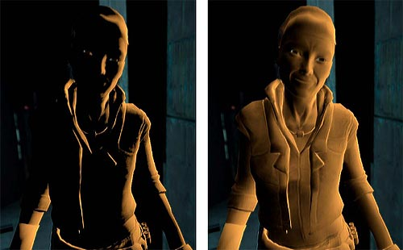

# 前言

## 如何模拟真实的光照环境来生成一张图像(3点)？

+ 光线从光源中发射出来。
+ 光线和场景中的一些物体相交，一些光线被吸收，另一些光线被散射到其他方向。
+ 最后，摄像机吸收了一些光，产生一张图像。

### 1.光源

实时渲染时，通常将光源当作一个没有体积的点，用$l$表示其方向。

**问**：如何量化光（光源发射多少光）？
**答**：使用**辐照度**来量化光。

对于平行光，它的辐照度可以通过计算在垂直于$l$的单位时间内穿过的能量来得到。

**问**：当物体表面和$l$不垂直的时候怎么计算表面的辐照度？
**答**:使用光源方向$l$和表面法线$n$之间的夹角的余旋值来得到。


### 2.吸收和散射

光线和物体相交通常有两种结果：**散射和吸收**.

散射只改变光线的方向，但不改变光线的密度和颜色。
吸收只改变光线的密度和颜色，但不改变光线的方向。

光线在物体表面经过散射后，有两种方向：一种将会散射到物体内部，称为**折射和投射**。另一种会散射到外部，称为**反射**.

对于不透明物体，折射进入物体内部的光线还会继续与内部的颗粒进行相交，其中一些光线最后会重新发射出物体表面，另一些则被物体吸收。那些从物体表面重新发射出的光线将具有和入射光线不同的方向分布和颜色。。


为区分两种不同的散射方向，在光照模型中使用不同的部分来计算它们：**高光反射**(specular)表示物体表面是如何反射光线的，**漫反射**(diffuse)部分则表示有多少光线会被折射，吸收和散射出表面。

根据入射光线的数量和方向,我们可以计算出射线的数量和方向，我们通常使用**出射度**来描述。辐照度和出射度之间是满足线性关系的，而他们之间的比值就是材质的漫**反射和高光反射属性**。

### 3.着色

着色指的是，根据材质**属性**(eg:漫反射属性等)，**光源信息**(eg:光源方向，辐照度等)，使用一个等式去计算沿某个观察方向的出射度的过程。我们把这个等式称为**光照模型**。

不同的光照模型有不同的目的。eg:一些用于描述粗糙的物体表面，一些用于描述金属表面等。

## 标准光照模型

> 下面是早期光照模型。 现在有更复杂的理论 eg:BRDF等。。

### 1.环境光

$C_{ambient}$,用于描述其他所有的间接光照。

间接光照指的是，光线通常会在多个物体之间反射，最后进入摄像机。

### 2.自发光

$C_{emission}$,用于描述给定一个方向时，一个表面本身会向该方向发射多少辐射量。
需要注意，如果没有使用全局光照，这些自发光的表面并不会真的照亮周围的物体，而是它本身看起来更亮而已。

### 3.漫反射

$C_{diffuse}$,当光线从光源照射到模型表面时，该表面会向每个方向散射多少辐射量。

漫反射光照是用于对那些被物体表面随机散射到各个方向的辐射度进行建模的。
漫反射中视角的位置不重要，因为反射是完全随机的，因此可以认为在任何反射方向上的分布都是一样的。但入射光线的角度很重要。

漫反射光照符合**兰伯特定律**：反射光线的强度与表面法线和光源方向之间夹角的余旋值成正比。如下，漫反射部分的计算：

$$
C_{diffuse} = (C_{light}*M_{diffuse})max(0, n*I)
$$

$n$是表面法线，$I$是指向光源的单位矢量，$M_{diffuse}$是材质的漫反射颜色，$C_{light}$是光源颜色。

需要注意,需防止法线和光源方向点乘的结果为负值，为此，需使用取最大值的函数来将其截取到0，这样可以防止物体被从后面来的光源照亮。

### 4.高光反射

$C_{specular}$,用于描述当光线从光源照射到模型表面时，该表面会在完全镜面反射方向散射多少辐射量。


### 5.逐像素还是逐顶点

通常来讲：在片元着色器中计算光照模型，被称为逐像素光照；在顶点着色器中计算，被称为逐顶点光照。

# 传统的光照模型

当光照射到物体表面时，**物体会对光会发生反射、透射、吸收、衍射、折射和干涉**。

其中被物体吸收的部分转化为了热，而其他形式的光进入了人的眼睛，成为了我们看到的样子。

**为了模拟这些现象，人们建立了一些数学模型，用来代替现实生活中复杂的物理模型，这些数学模型就称为明暗效应模型或者光照模型**。

这里只涉及一些传统的经验光照模型(Lambert模型、Half Lambert模型、Phong模型、Blinn-Phong模型)。

## 无光照模型

渲染一个物体，但是不应用任何光照模型，那么事实上，就只是把模型的贴图显示出来而已。


```GLSL
// vertexShader
varying vec2 vUv;
void main() {
	vUv = uv;
	gl_Position = projectionMatrix * modelViewMatrix * vec4(position, 1.0);
}

// fragmentShader
uniform sampler2D uTexture;
varying vec2 vUv;
void main() {
    gl_FragColor = texture2D( uTexture, vUv );
}
```

不应用光照模型虽然也能看到物体，但是立体感较差，并且**不会有光线的明暗信息**

## 定义一些方向

使用光照模型之前首先需要定义一些东西。

我们考虑的着色结果，都是考虑在某一个点上应该是什么样的结果，而这个点通常称为着色点(shading point)。

每一个shading point都应该在物体表面上。虽然，物体表面可能是一个曲面，但是仍然可以认为，它是由很多小的平面构成的。

在一个平面内，可以定义：

+ **平面的法线方向n**：垂直平面，并由内指向外。
+ **观测方向v**：shading point与相机位置的连线方向。
+ **光源方向l**：shading point与光源位置的连线方向。
  


## Lambert模型

**Lambert模型**是一种经验模型，主要用来简单的**模拟粗糙物体表面的光照现象**。

从日常生活中可以发现，一个物体**面向光源的地方更亮，而背向光源的地方更暗。**

而在一个shading point中判断其是否面向光源，其实可以通过判断该shading point的法向量n是否与光源方向l足够接近，也就是他们之间的夹角是否足够小。**夹角越小，光线越强，夹角越大，光线越弱。**

通过向量知识可知，通过向量的点乘就可以判断两个向量之间是否足够接近。

Lambert模型分为两个部分：环境光、漫反射。

$$
ILambert = ambient + diffuse
$$

**环境光：**

环境光和其他光照模型一样

$$
ambient = K_a * ambientColor
$$

+ K_a: 材质的环境光反射系数
+ ambientColor:是环境光强度和颜色数值，通常是vec3类型

**漫反射：**
漫反射项也和其他模型一样

$$
diffuse=K_l∗lightColor∗max(0.0,dot(N,L))
$$

+ K_l:材质的灯光反射系数(如果使用贴图，那就用贴图颜色作为漫反射系数)
+ lightColor:是灯光强度和颜色数值，通常是vec3类型
+ N:法向量方向
+ L:光线方向

**最终颜色:**
最终Lambert模型的颜色为：

$$
    finalColor = ambient + diffuse
$$

+ ambient:环境光
+ diffuse:漫反射

```GLSL
// vertexShader
uniform vec4 lightPosition;
varying vec2 vUv;
varying vec3 vNormal;
varying vec4 vPosition;
varying vec4 vlightPosition;

void main() {
    vUv = uv;
    vNormal = normalize( normalMatrix * normal );
    vPosition = modelViewMatrix * vec4(position, 1.0);
    vlightPosition = modelViewMatrix * lightPosition;
    gl_Position = projectionMatrix * vPosition;
}

// fragmentShader
uniform sampler2D uTexture;
uniform vec3 ambientColor; // 环境光颜色
uniform vec3 lightColor; // 灯光颜色
uniform float K_a; // 环境光反射系数

varying vec2 vUv;
varying vec3 vNormal;
varying vec4 vPosition;
varying vec4 vlightPosition;

void main() {
    vec3 vL = normalize(vlightPosition.xyz - vPosition.xyz);
    vec3 ambient = ambientColor * K_a;
    vec3 K_l = texture2D( uTexture, vUv ).rgb;
    vec3 diffuse = K_l * lightColor * max(0.0, dot(vNormal, vL));
     gl_FragColor = vec4(ambient + diffuse,1.0); 
}

```


加了Lambert模型之后，渲染效果比之前好多了，增加了立体感。

**弊端**：在光源照不到的地方，Lambert模型表现的效果是全黑的。但事实上，我们日常所处的环境中很多时候会有环境光，不会导致全黑的效果。**Half Lambert可以弥补这一弊端**。

### Half Lambert模型

由于向量的点乘结果在-1到1之间。而在光照模型中，我们只会使用0到1之间的值，小于0的值认为该光源被遮挡对着色没有影响。

也正是因为我们使用了0到1之间的值，所以导致在光源无法照射到的地方，着色结果是全黑的。

而Half Lambert模型想法很简单，就是把0到1之间的值变成0.5到1。



**Half Lambert模型的漫反射**
Half Lambert模型与Lambert模型的区别在漫反射公式，Half Lambert模型的漫反射公式：

$$
diffuse=K_l∗lightColor∗(max(0.0,dot(N,L))∗0.5+0.5)
$$

+ $K_l$：材质的灯光反射系数(如果使用贴图，那就用贴图颜色作为漫反射系数)
+ lightColor：是灯光强度和颜色数值，通常是vec3类型
+ N：法向量方向
+ L：光线方向

```GLSL
// vertexShader
uniform vec4 lightPosition;
varying vec2 vUv;
varying vec3 vNormal;
varying vec4 vPosition;
varying vec4 vlightPosition;

void main() {
    vUv = uv;
    vNormal = normalize( normalMatrix * normal );
    vPosition = modelViewMatrix * vec4(position, 1.0);
    vlightPosition = modelViewMatrix * lightPosition;
    gl_Position = projectionMatrix * vPosition;
}

// fragmentShader
uniform sampler2D uTexture;
uniform vec3 ambientColor; // 环境光颜色
uniform vec3 lightColor; // 灯光颜色
uniform float K_a; // 环境光反射系数

varying vec2 vUv;
varying vec3 vNormal;
varying vec4 vPosition;
varying vec4 vlightPosition;

void main() {
    vec3 vL = normalize(vlightPosition.xyz - vPosition.xyz);
    vec3 ambient = ambientColor * K_a;
    vec3 K_l = texture2D( uTexture, vUv ).rgb;
    vec3 diffuse = K_l * lightColor * (max(0.0, dot(vNormal, vL)) * 0.5 + 0.5);
	gl_FragColor = vec4(ambient + diffuse,1.0);
}
```


Half Lambert模型之后，渲染效果相比于使用Lambert模型，在暗部变得更亮了，更符合现实场景。

## Phong模型

在日常生活中，我们可以发现，在一些光滑的物体表面，除了会有类似Lambert模型那样的明暗关系，还会有一些“布灵布灵”的高光。

并且这些高光的位置还会随着观察的方向变化而变化。

而**Phong模型就是在Lambert模型下增加了高光项**。

因此**Lambert模型通常用来描述粗糙的物体表面，而Phong模型通常用来描述光滑的物体表面。**

Phong模型分为三个部分：环境光、漫反射、高光。

$$
Iphong=ambient+diffuse+specColor
$$

**环境光：**

环境光和其他光照模型一样

$$
ambient = K_a * ambientColor
$$

+ K_a: 材质的环境光反射系数
+ ambientColor:是环境光强度和颜色数值，通常是vec3类型

**漫反射：**
漫反射项也和其他模型一样(这里为了使得暗部显示正常，所以用了Half Lambert模型)

$$
diffuse=K_l∗lightColor∗(max(0.0,dot(N,L))∗0.5+0.5)
$$

+ K_l:材质的灯光反射系数(如果使用贴图，那就用贴图颜色作为漫反射系数)
+ lightColor:是灯光强度和颜色数值，通常是vec3类型
+ N:法向量方向
+ L:光线方向

**高光：**

要计算高光，首先需要知道高光产生的原因

**高光产生的原因**
高光是由于物体表面较为光滑，对光的反射较强。

当光线照射到物体表面之后会被反射出来。

如果此时我们看向的方向正好与反射的光线方向很接近，就会看到一个很明显的光斑，这个光斑就是我们所说的高光。


如图所示，光线沿着-l方向照射到物体表面，并且沿着R方向被反射出来，如果此时R方向与V方向足够接近，那么就会看到一个高光。

**高光的计算**
高光是由于反射光的方向与观测方向足够接近，那么我们就需要先计算反射光方向。


如上图所示，$\vec{L}$为光线方向，$\vec{R}$为反射方向，$\vec{n}$为法线方向。

由于向量平移之后仍然可以表示本身，因此可以将$\vec{R}$平移，使得$\vec{R}$的起点与$\vec{L}$的终点重合。

假设$\vec{B} = \vec{L} + \vec{R}$,则向量$\vec{B}$一定在$\vec{n}$方向上。

并且假设$\vec{L}$在$\vec{n}$方向上的投影为$\vec{b}$，那么$\vec{b} = (\vec{L*\vec{n})*\vec{n}}$

由于$\vec{L}$与$\vec{R}$的长度相同，因此向量$\vec{L},\vec{R},\vec{B}$组成的三角形是等腰三角形。

从而$\vec{B} = 2*\vec{b}$，也就是$2*\vec{b} = \vec{L} + \vec{R} = 2 * (\vec{L} * \vec{n}) * \vec{n}$

所以反射方向$\vec{R} = 2*(\vec{L}*\vec{n})*\vec{n} - \vec{L}$

知道反射方向之后，就可以写出高光的表达式：

$$
specColor=K_s∗highlightColor∗max(0.0,dot(v,R))
$$

+ $K_s$：材质的高光反射系数.
+ highlightColor：是高光强度和颜色数值，通常是vec3类型
+ v：观测方向.
+ R：光线反射方向.

渲染结果如下：


从渲染结果中可以看到，确实相比于Half Lambert模型增加了一些高光项，但是高光范围很大，不太像我们在现实生活中看见的小的光斑。

因此我们**需要用指数函数缩小光斑的范围**，修改之后的高光表达式为：

$$
specColor=K_s∗highlightColor∗pow(max(0.0,dot(v,R)),smoothness)
$$

**smoothness：高光的平滑度**
设置平滑度smoothness为40之后，可以看到光斑的范围缩小了很多，更符合现实生活中看到的样子。


```GLSL

// vertexShader
uniform vec4 lightPosition;
uniform vec4 cPosition;
varying vec2 vUv;
varying vec3 vNormal;
varying vec4 vPosition;
varying vec4 vlightPosition;
varying vec4 vCPosition;

void main() {
	vUv = uv;
    vNormal = normalize( normalMatrix * normal );
    vPosition = modelViewMatrix * vec4(position, 1.0);
    vlightPosition = modelViewMatrix * lightPosition;
    vCPosition = modelViewMatrix * cPosition;
	gl_Position = projectionMatrix * vPosition;
}

// fragmentShader
uniform sampler2D uTexture;
uniform vec3 ambientColor; // 环境光颜色
uniform vec3 lightColor; // 灯光颜色
uniform vec3 highlightColor; // 高光颜色
uniform float K_a; // 环境光反射系数
uniform float K_s; // 高光反射系数
uniform float smoothness; // 高光平滑度

varying vec2 vUv;
varying vec3 vNormal;
varying vec4 vPosition;
varying vec4 vlightPosition;
varying vec4 vCPosition;

void main() {
    vec3 ambient = ambientColor * K_a;
    vec3 vL = normalize(vlightPosition.xyz - vPosition.xyz);
    vec3 K_l = texture2D( uTexture, vUv ).rgb;
    vec3 diffuse = K_l * lightColor * (max(0.0, dot(vNormal, vL)) * 0.5 + 0.5);
    vec3 v = normalize(vCPosition.xyz - vPosition.xyz);
    vec3 R = 2.0 * dot(vNormal, vL) * vNormal - vL;
    // 反射光线也可以使用reflect函数计算，只不过与我们推倒的公式不同
    // reflect的入射光方向是从光源指向平面的，而我们推导的公式，是从平面指向光源的。
    vec3 specColor = K_s * highlightColor * pow(max(0.0, dot(v, R)), smoothness);
    gl_FragColor = vec4(ambient + diffuse + specColor, 1.0);
}

```

**Phong模型着色效果**。


### Blinn-Phong模型

在前面有说到高光是因为反射的光线方向与观测方向接近，因此计算高光之前我们需要计算反射的方向。

反射的方向计算比较复杂，比较耗时，而Blinn-Phong模型则解决了这一问题。

**高光的计算**。

人们巧妙地发现了其实只需要计算光线方向$\vec{l}与观测方向\vec{v}的半程向量\vec{h}是否与法向量\vec{n}足够接近就可以了。$


而半程向量的计算非常简单，只需要将两个向量相加，再单位化即可。

$$
\vec{h}=normalize(\vec{l} + \vec{v})
$$

因此Blinn-Phong光照模型的高光项就可以表示为：

$$
specColor=K_s∗highlightColor∗pow(max(0.0,dot(n,h)),smoothness)
$$

+ n：法向量
+ h：半程向量

Blinn-Phong光照模型极大的简化了Phong模型中的高光计算，并且能够达到与Phong模型类似的效果。

```GLSL
// vertexShader
uniform vec4 lightPosition;
uniform vec4 cPosition;
varying vec2 vUv;
varying vec3 vNormal;
varying vec4 vPosition;
varying vec4 vlightPosition;
varying vec4 vCPosition;

void main() {
	vUv = uv;
    vNormal = normalize( normalMatrix * normal );
    vPosition = modelViewMatrix * vec4(position, 1.0);
    vlightPosition = modelViewMatrix * lightPosition;
    vCPosition = modelViewMatrix * cPosition;
	gl_Position = projectionMatrix * vPosition;
}

// fragmentShader
uniform sampler2D uTexture;
uniform vec3 ambientColor; // 环境光颜色
uniform vec3 lightColor; // 灯光颜色
uniform vec3 highlightColor; // 高光颜色
uniform float K_a; // 环境光反射系数
uniform float K_s; // 高光反射系数
uniform float smoothness; // 高光平滑度

varying vec2 vUv;
varying vec3 vNormal;
varying vec4 vPosition;
varying vec4 vlightPosition;
varying vec4 vCPosition;

void main() {
    vec3 ambient = ambientColor * K_a;
    vec3 vL = normalize(vlightPosition.xyz - vPosition.xyz);
    vec3 K_l = texture2D( uTexture, vUv ).rgb;
    vec3 diffuse = K_l * lightColor * (max(0.0, dot(vNormal, vL)) * 0.5 + 0.5);
    vec3 v = normalize(vCPosition.xyz - vPosition.xyz);
    vec3 h = normalize(v + vL);
    vec3 specColor = K_s * highlightColor * pow(max(0.0, dot(vNormal, h)), smoothness);
    gl_FragColor = vec4(ambient + diffuse + specColor, 1.0);
}
```


# Unity中的光照

## Unity中的环境光和自发光

Unity中，场景中的环境光可以在Window->Lighting->Ambient Source/Ambient Color/Ambient Intensity中控制。

Shder中我们可以通过Unity内置变量**UNITY_LIGHTMODE_AMBIENT**就可以得到环境光的颜色和强度信息。

自发光比较简单，大多数物体是没有自发光特性的，如果需要可在物体颜色输出的时候+上自发光颜色。

## Unity Shader中实现漫反射光照模型

基本光照模型中漫反射计算公式

$$
    C_{diffuse} = (C_{light}*m_{diffuse})*Max(0,\vec{n}*I)
$$

4个参数：

+ 入射光线的颜色和强度$C_{light}$
+ 材质的漫反射系数$M_{diffuse}$
+ 表面法线$\vec{n}$
+ 光源方向$I$

### 逐顶点光照

### 逐像素光照

### 半兰伯特光照模型


## Unity Shader中实现高光反射光照模型

### 逐顶点光照

### 逐像素光照

### Blinn-Phone光照模型