# 纹理映射

纹理的意义:

+ 对于任何一个三维物体，我们都可以把他的表面展开到一张二维平面的图像中。
+ 并且模型上的每一个点都与这张二维平面图像上的点存在一一对应的关系。


## 一.UV坐标

要确定模型上的点与二维平面上的点之间关系，就需要为展开的二维平面定义一个坐标系。

这个坐标系通常用UV来表示，**并且无论这张图像有多大，它的UV坐标范围总是是从0到1的.**


定义模型时，对应三角形的每个顶点，都对应一个UV坐标。

顶点中的UV坐标会在顶点着色器传入片元着色器的时候进行插值。

从而得到三角形中每一个像素点对应的UV坐标，实现模型上的每一个像素与纹理的一一对应关系

## 二.重心坐标

>重心坐标是一种可以使得任意参数在三角形内部进行插值的方法。

**利用重心坐标进行插值，可以使得任意在三角形顶点中计算的值（如颜色、UV坐标、法向量等）在三角形内部有一个平滑的过渡。**


在三角形内部任意一个点(x,y)都可以表示成三角形三个顶点A,B,C的线性组合

$$
 (x,y)=αA+βB+γC
$$

并且$α，β，γ$是非负数，且满足：

$$
α+β+γ=1
$$

只要满足上面的条件，那么$α，β，γ$ 就可以称为一个重心坐标，用来描述这个点(x,y).

### 计算重心坐标


如图，三角形ABC中任意一个点与三角形三个顶点分别连线之后，将三角形分割成了三块$(A_A, A_B, A_C)$ 假设与A顶点不相交的三角形面积为$A_A$,与B顶点不相交的三角形面积为$A_B$,与C顶点不相交的三角形面积为$A_C$.

那么就可以得到三角形重心坐标(α,β,γ)分别为:

$$
α = \frac{A_A}{A_A + A_B + A_C}
$$

$$
β = \frac{A_B}{A_A + A_B + A_C}
$$

$$
γ = \frac{A_C}{A_A + A_B + A_C}
$$

> 在第二节 向量和矩阵中我们知道，知道三角形的三个顶点位置之后，可以利用向量叉乘计算三角形面积

### 如何利用重心坐标进行插值

假设三角形三个顶点的UV坐标分别为：$UV_A, UV_B, UV_c$.
那么三角形内部重心坐标为$(α，β，γ)$的点对应的UV坐标为：
$$
    UV = αUV_A + βUV_B + γUV_c
$$

## 三.插值

### 纹理太小会出现的问题

物体上任意一个点都对应纹理上的一个位置，但通常情况下，这个位置不会是整数。

那么此时如果只是简单的做四舍五入，使得这个点与纹理中的像素一一对应。

就可能发生物体上临近的若干个点都会被映射到纹理的同一个像素中，使得物体上的这些点都是同一个颜色，进而造成下图这种效果。


### 双线性插值

当一个点被映射到纹理中的一个非整数位置时，如果想知道当前位置的纹理应该是什么，就可以利用双线性插值进行计算。


首先，先找到与当前位置邻近的四个像素点$U_{00},U_{01},U_{11},U_{10}.$
并且计算出这四个像素点中心围成的矩形，得到当前位置到矩形底部的距离𝑡和到矩形左侧的距离𝑠,得到这些信息之后，就可以**利用线性插值函数进行水平方向和竖直方向上的插值**。

线性插值函数lerp(在glsl中为mix)中的x为相似度，当x等于0时，值为$v_0$，当x等于1时，值为$v_1$:
$$
lerp(x,v_0,v_1) = v_0 + x(v_1 - v_0)
$$
​
双线性插值方法首先对矩阵范围的上下两条边，通过s进行线性插值，得到$u_0和u_1$

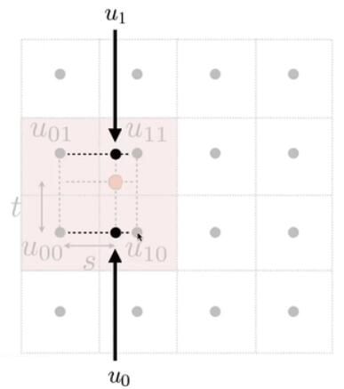

$$
u_0 = lerp(s, u_{00},u_{10}) \\
u_1 = lerp(s,u_{01},u_{11})
$$

然后再用一次线性插值函数将$u_0和u_1$利用𝑡进行线性插值即可得到最后的结果。

$$
f(x,y) = lerp(t,u_0,u_1)
$$

**经过双线性插值后的结果综合考虑了邻近四个像素点的颜色，因此在物体的各个点之间会有一个平滑的过渡**，对比如下：

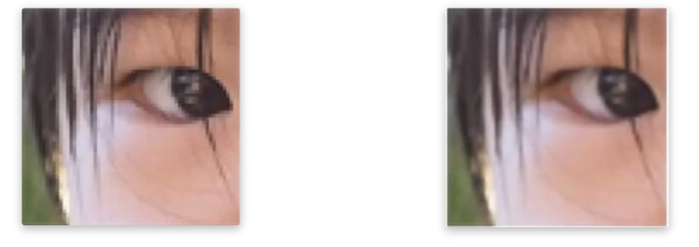

### 纹理太大会出现的问题

通常，潜意识中，人们都会觉得纹理大会更好，能表示更多的信息。

但其实恰恰相反，**纹理太大反而会造成更严重的问题**。

比如下面这个对比图，左图为我们想要的渲染结果，或者说正确的结果。右图为使用一张很大的纹理，直接通过像素点中心计算颜色渲染出来的结果。

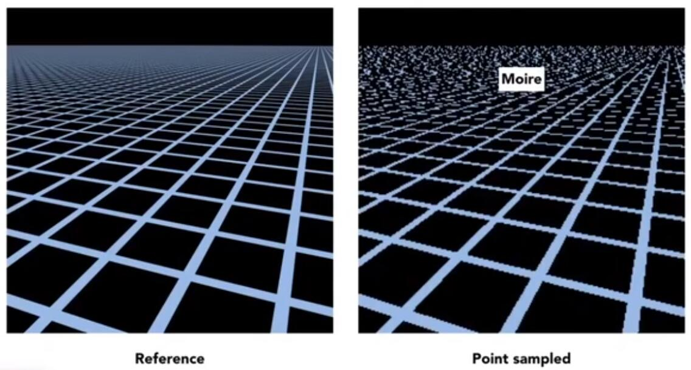

可以很明显的发现，右图中，远处出现了很明显的**摩尔纹**。

造成这一现象的原因，是因为屏幕上的像素覆盖纹理上的范围是各不相同的

屏幕像素在近处覆盖纹理的范围较小，因此通常可以用最近纹理的像素颜色表示。

但是**屏幕像素在远处可能会覆盖很大一片的纹理像素，如果现在仍然以最近纹理像素的颜色来表示其覆盖的那一大块像素的颜色，就会在远处造成摩尔纹的问题。**

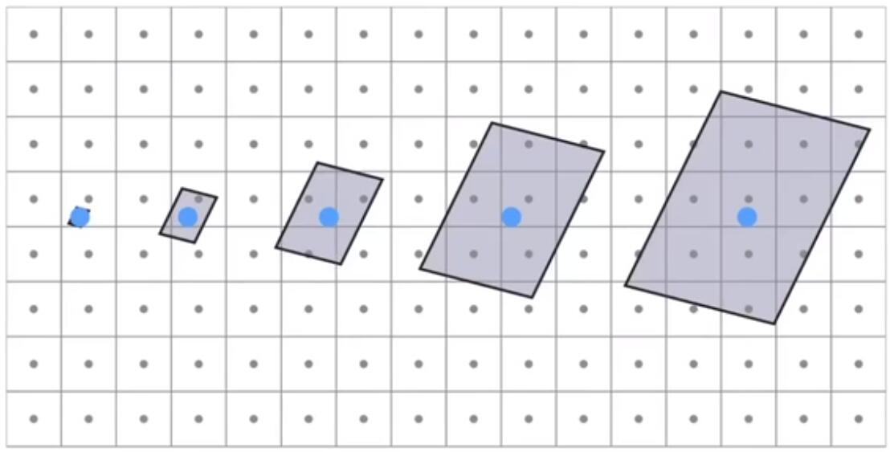

因此，其实纹理过大，也可以理解成是采样率不足导致的，由于屏幕像素可能会覆盖了一大块纹理，但是却只用了一个采样点采样，最终导致摩尔纹的出现。

所以解决这一问题，一个很直观的想法就是提高采样率，使用**图形学基础—抗锯齿**中提到的超采样方法确实可以得到一个比较好的效果.

下图是每个像素使用512个采样点采样后的结果：

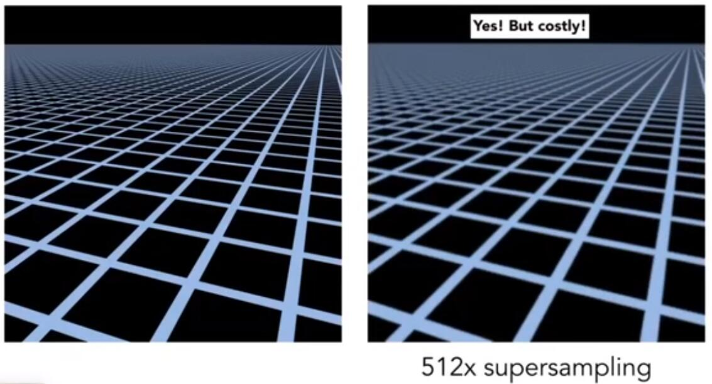

可以看到超采样确实解决了问题，但是高的采样率带来的问题就是高的性能消耗，让整个算法变慢。

除了超采样，还有没有其他的方法能够解决这一问题？--MipMap

### MipMap

纹理过大出现摩尔纹是因为采样率不足导致的。既然采样会引起走样，那么我们就不采样了。

前面说，我们知道屏幕的像素可能会覆盖很大一块材质，而我们如果能不进行采样就立刻能知道覆盖的这块材质的平均值，那就会使得算法快很多。

MipMap就是这样的一种方法，通过给定区域，立刻就能知道这块区域的值是多少。

**MipMap的速度很快，但是结果是不准的，因为其中涉及一些近似，并且只能做正方形的查询。**

**其实MipMap就是由一张图去生成一系列的图**,比如我们有一张128*128大小的原始纹理，称之为第0层纹理。可以用他去生成更多更高层的纹理，并且每一层都是上一层宽高缩小一半后的结果。

如下MipMap:

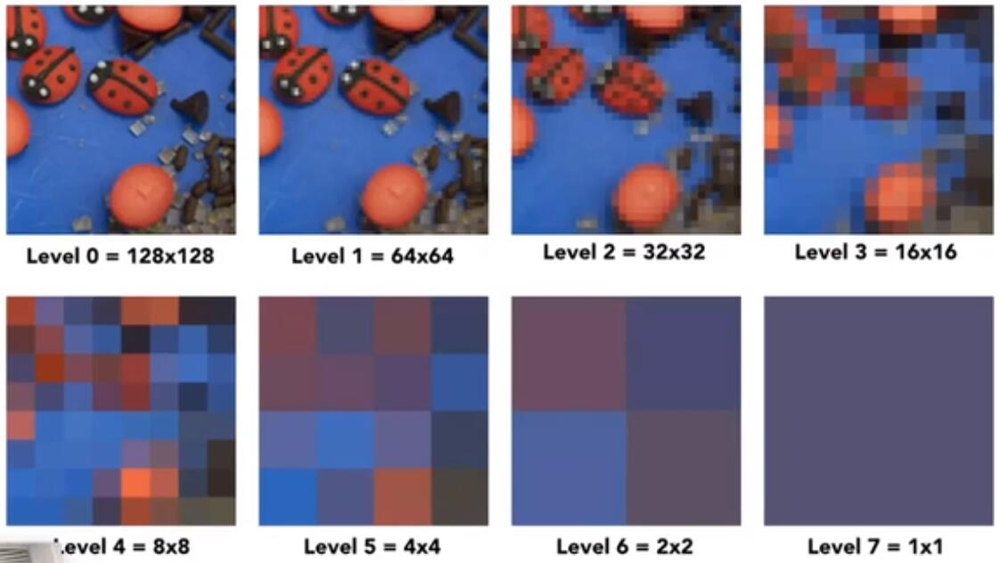

并且最终生成的一系列图以下面这种图像金字塔的方式存储起来，如下图MipMap图像金字塔：

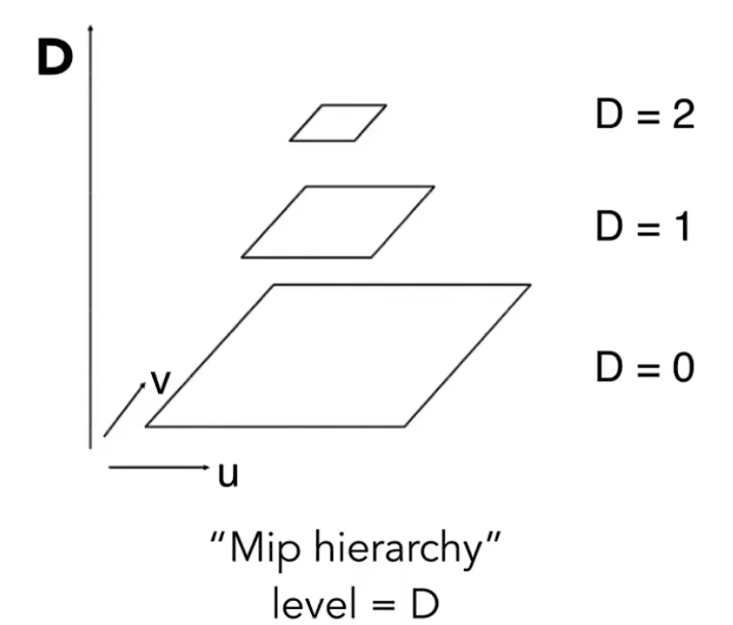

通过等比数列求和可以发现，**无论原始的图像生成多少层MipMap，内存资源都最多只会增加原始图片的1/3的额外存储量**

那怎么知道，应该在MipMap构建出的图像金字塔中的那一层查询像素的值呢？

如下图(MipMap范围计算)：

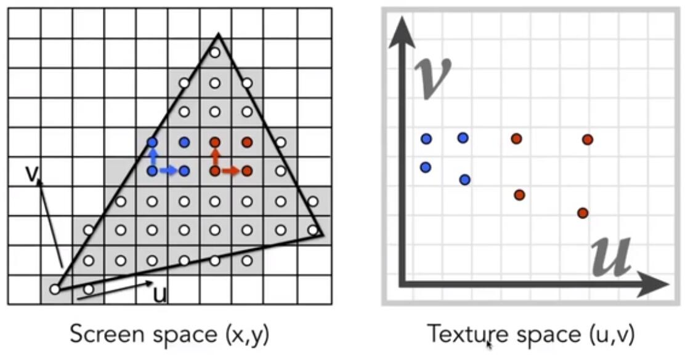
可以将当前像素点的中心投影到纹理上，得到一个位置A。

再将当前像素右侧相邻的像素中心投影到纹理上，得到一个位置B。

最后将当前像素上方相邻的像素中心投影到纹理上，得到一个位置C。

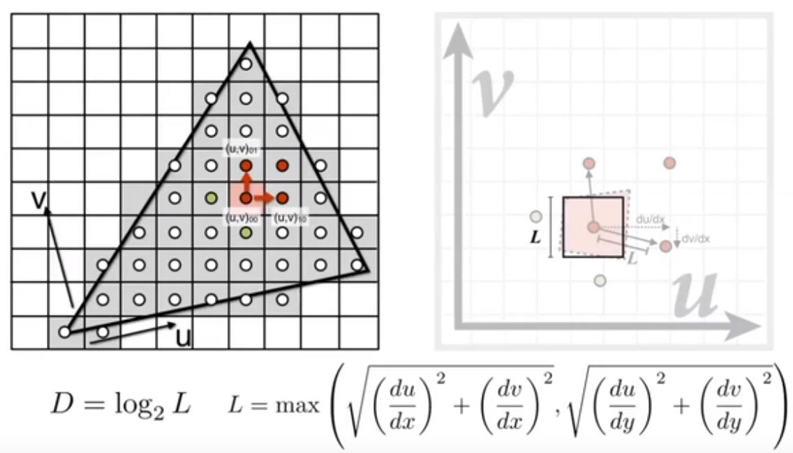

通过计算A到B距离和A到C距离中的最大值，可以近似出一个正方形范围。

这个正方形范围的边长L为：

$$
L = max(\sqrt{(\frac{du}{dx})^2 + (\frac{dv}{dx})^2},\sqrt{(\frac{du}{dy})^2 + (\frac{dv}{dy})^2})
$$

得到正方形范围之后在第log2边长层，这个正方形表示的范围会变成一个像素的大小，因此可以在图像金字塔的那一层查对应的像素作为最终的结果

这个正方形范围在MipMap中的查询层数D为：

$$
    D = log_2L
$$

但是目前只能查询整数层，比如第0层，第1层。因此可能在不同层的分割线之间产生一个明显的断层。

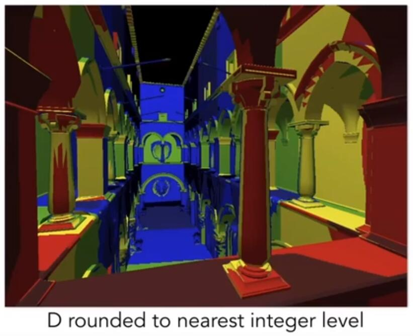

那么怎么查询每层之间，比如第0.6层是什么值呢？

很显然需要做插值

#### 三线性插值

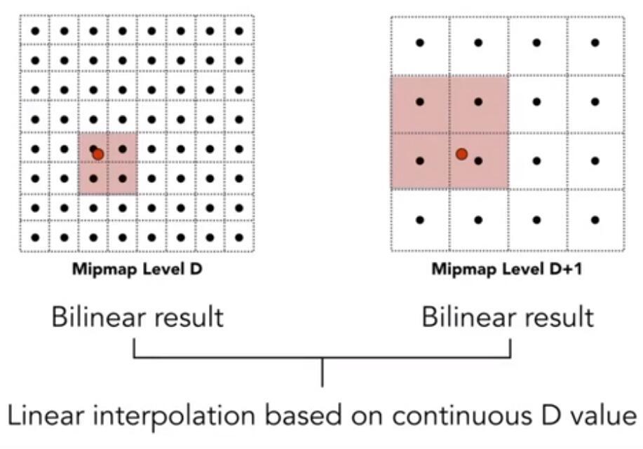

假设我们需要查询第0.6层的值。

我们就可以先在第0层利用双线性插值，计算出像素点在第0层的值。

然后在第1层利用双线性插值，计算出像素点在第1层的值。

最后第0层的值与第1层的值之间再做一次线性插值，就可以得到层与层之间的结果。

因为使用了三次线性插值，因此这个方法叫做三线性插值，它能够帮助我们计算MipMap非整数层的值

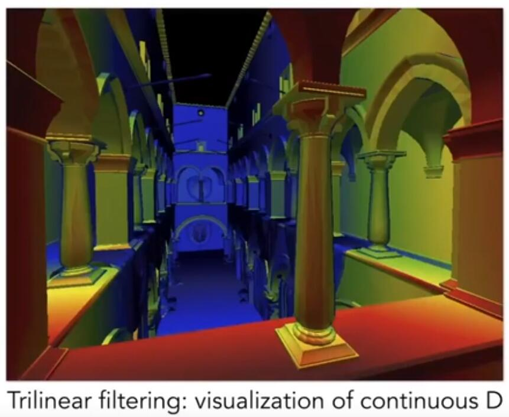

可以看到使用了三线性插值之后，MipMap得到一些很连续的结果

#### MipMap是否真能完全解决问题？

假设每个像素使用512个点作为采样点渲染出的结果作为准确结果。

那么对比MipMap生成的结果，发现其实并不算理想

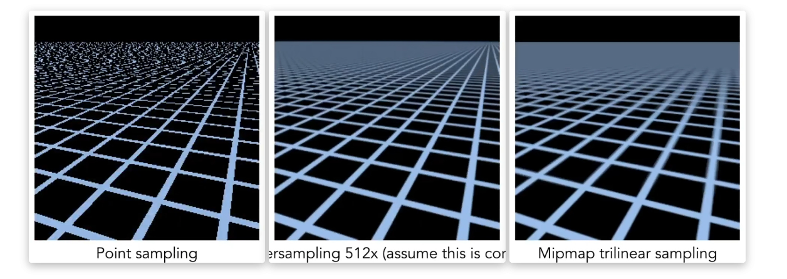

虽然MipMap相比于直接输出的结果确实好了很多，但是相比于超采样结果，MipMap生成的结果到了远处细节全部都糊掉了。

这是因为MipMap只能查询正方形区域，而屏幕上的一个像素映射到纹理上，并不一定都是是一个规律的形状。

很可能有些是长条的，有些是斜的，如果简单的用一个正方形去计算平均值，就会造成overblur。

MipMap远处模糊原因：
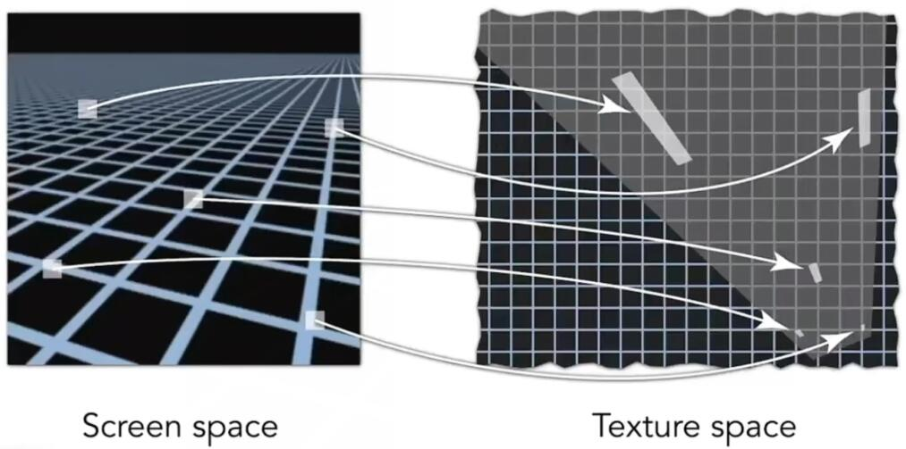

另一种方法，各向异性过滤会得到一个比MipMap更好的结果（各向异性过滤）

### 各向异性过滤

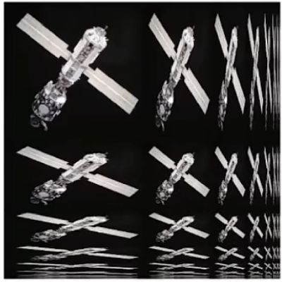

各向异性过滤和MipMap类似，一样根据原始图像生成新的图像。

从各向异性过滤生成的图可以看到，在水平方向上排列的图，高度都没有变化，只是宽度会缩小一半。

同样的竖直方向上排列的图，宽度没有变化，只是高度缩小一半。

而原本MipMap则只会生成这里对角线上的图。

因此**各向异性过滤能够具备MipMap并不具备的，查询不同宽高范围的能力。**

但是很明显的，各项异性过滤在存储上的开销要比MipMap大，**随着生成图像层数的增多，增加的存储量会最终收敛到原图像的3倍。**

各向异性过滤对于一些长条的形状会得到一个比MipMap更好的效果。如下图为各向异性过滤效果：

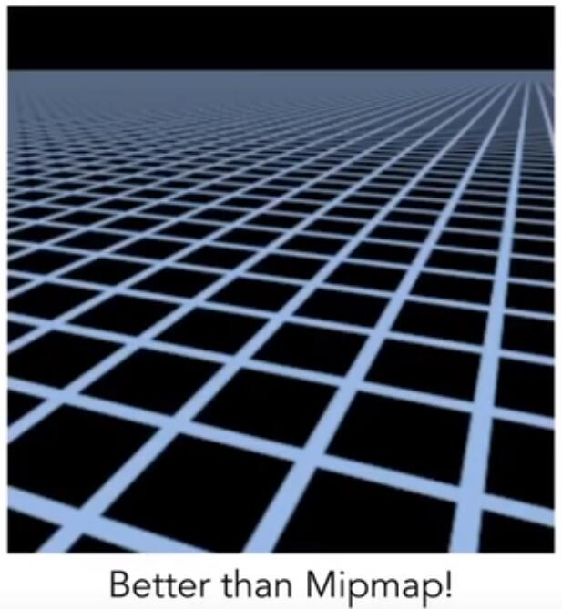

但是前面有说，屏幕上的一个像素映射到纹理上，并不一定都是是一个规律的形状。**对于水平或竖直摆放的长条形各向异性过滤能够很好的胜任，但是对斜的长条形范围也并没有得到很好的解决。**

如下图：各项异性过滤优缺点


当然，除了MipMap和各项异性过滤，还有很多其他的范围查询的方法，比如EWA查询。但是这里不再多做介绍。

EWA查询：
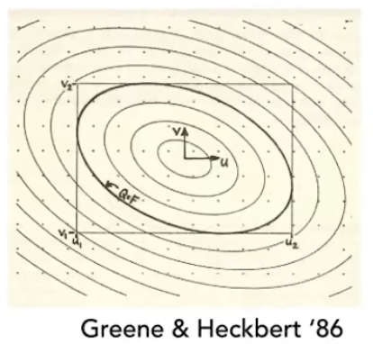

## 三.纹理的一些高级应用

纹理不仅仅只能用来定义模型颜色，还可以用来存储一些其他信息。

### 环境光照贴图

一个模型在场景中，会接受来自周围四面八方的光，而我们**可以用一张纹理去描述物体周围的环境光长什么样，这张纹理就称之为环境光贴图。**

如何使用一张纹理描述环境光？

可以理解成在场景中，放入一个非常光滑的金属球，它可以反射出周围的环境信息。

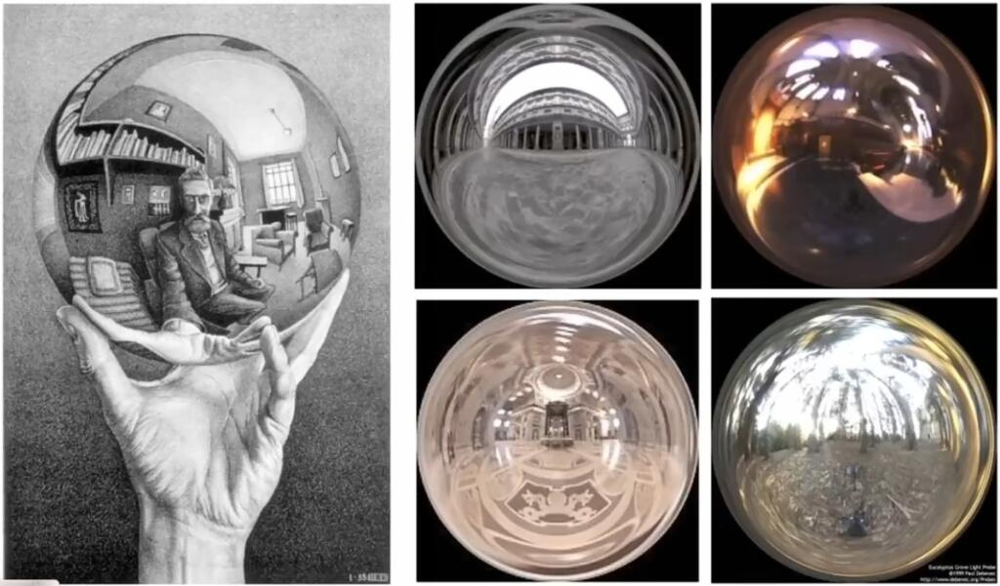

所以**我们可以把环境光信息记录在一个球上，将这个球的表面展开成一张二维平面，就得到了一张环境光贴图。**
如下：环境光照贴图展开

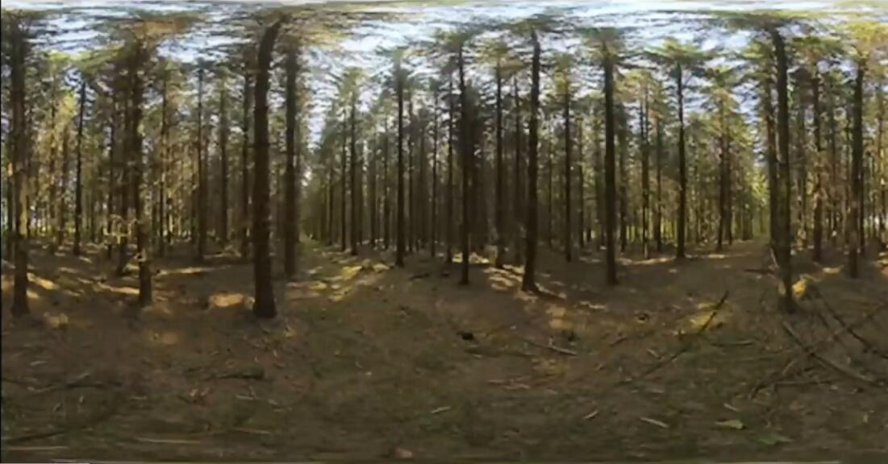

但是，**直接这样展开会有一个问题，就是贴图的下面和下面会出现很明显的扭曲的现象。**

这种扭曲现象会让环境光的计算变得比较困难。

怎么解决扭曲问题？

人们发现，**仍然可以用一个球表示环境光，但是现在，可以认为球有一个立方体包围盒，把球包裹住，然后从球的中心出发将球面上的点投影到立方体的表面上**，就得到了六张图。


六张图展开后得到类似这样的效果

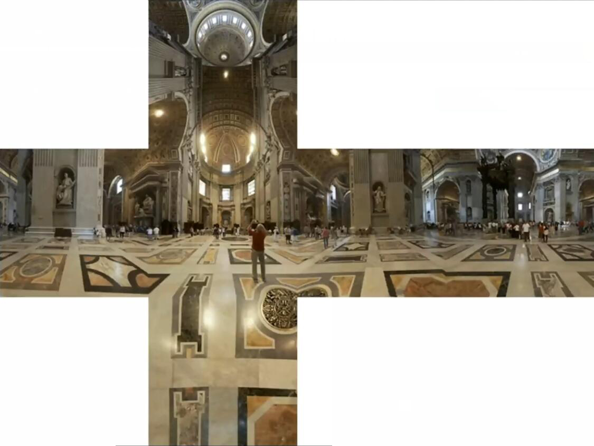

这样一来，就可以用贴图很方便的表示出周围环境的光

**在GLSL中使用环境光贴图**

```glsl

// 环境光贴图使用一个立方体表示，对应glsl中的samplerCube类型
// 因此首先需要定义一个samplerCube类型的uniform变量，用于传入环境光贴图
uniform samplerCube uTextureCube;

// 查询环境光贴图使用的是一个vec3变量进行查询
// 这里我们使用世界坐标下的视线反射方向
vec3 cameraToVertex = normalize(cPositionWC.xyz - positionWC.xyz);
vec3 R = 2.0 * dot(normal, cameraToVertex) * normal - cameraToVertex;

// 也可以使用reflect函数计算，只不过与我们推倒的公式不同
// reflect的入射光方向是从相机指向平面的，而我们推导的公式，是从平面指向相机的。
vec3 cameraToVertex = normalize(positionWC.xyz, cPositionWC.xyz);
vec3 R = reflect( cameraToVertex, normal );

// 也可以通过refract计算折射光线，产生折射效果。
vec3 R = refract( cameraToVertex, normal, refractionRatio );

// 查询环境光
vec3 ambientMapColor = texture(uTextureCube, R).rgb;

// 也可以尝试使用mix函数混合，ambientMapFactor为环境光贴图贡献的环境光比例
mix(K_l, ambientMapColor, ambientMapFactor)
```

应用环境光找贴图效果：
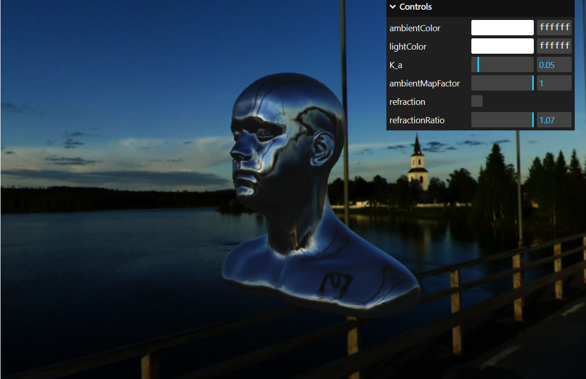


### 凹凸贴图

纹理还可以定义一个物体表面沿着它的法线方向，向上或向下平移多少。而表面的高度一变，相应的法线方向也会发生变化。

这样的贴图我们通常称之为凹凸贴图或者法线贴图。

凹凸贴图使得法线变化之后，着色结果也会相应的发生变化。

但其实利用**凹凸贴图只是将任何一个像素的法线进行一个扰动，用于计算一个假的法线，使得表面产生一个假的着色结果，从而欺骗人的眼睛。而事实上，模型的几何并没有发生任何变化。**

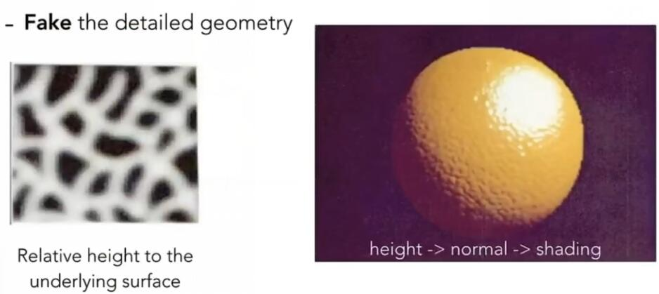

应用凹凸贴图之后，物体的表面的平移，使得法线的方向发生了改变。

凹凸贴图计算1：
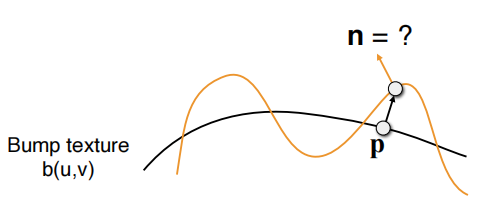

那么新的法线应当如何计算？

首先假设当前的二维平面中，法线方向为(0, 1)。

然后可以利用差分的方法(当前点和相邻点的高度差)可以求出当前点的切线方向。

$$
dp = c*[h(p+1) - h(p)]
$$

其中c是一个常数，表示凹凸贴图的影响程度。

而法线垂直于切线，因此可以求出法线的方向：(-dp,1).normalized()。(旋转90°：X,Y对调，并且Y加上负号)

凹凸贴图计算1：
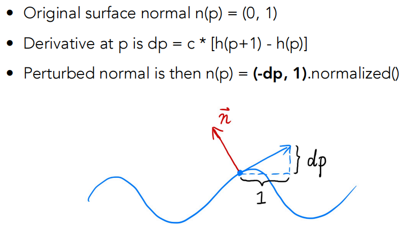

在平面上是这么做，那么在三维上呢？

假设我们在当前位置建立一个局部的“法线坐标系”，使得原始的法线方向为(0, 0, 1)，

而我们有个二维的贴图(u方向和v方向)。

因此首先，我们可以先计算u方向上的切线：

$$
dp/du=c1∗[h(u+1)−h(u)] 
$$

然后计算v方向上的切线：

$$
dp/dv=c2∗[h(v+1)−h(v)]
$$

然后类比之前二维的方法，计算出新的法线方向：$(-dp/du, -dp/dv, 1).normalized()。$

最后将“法线坐标系”下的法线变换回原本的坐标系中即可:

**在GLSL中计算新的法线**

```GLSL
// 首先构建TBN矩阵
// 其中T为平面的切线方向
// B为副切线方向
// N为法线方向。
// 该矩阵的作用是为了把用微分求出来的法线从局部坐标系转换到模型空间
vec3 t = normalize(vec3(x * y / sqrt( x * x + z * z ), sqrt( x * x + z * z ), z * y / sqrt( x * x + z * z )));
vec3 b = cross(n, t);
mat3 TBN = mat3( t.x, t.y, t.z, b.x, b.y, b.z, n.x, n.y, n.z);

// 用微分法计算新的法线方向
vec2 dSTdx = dFdx( vUv ); // 求uv在x方向上的偏导数
vec2 dSTdy = dFdy( vUv ); // 求uv在y方向上的偏导数

float Hll = bumpScale * texture2D( uNormalMap, vUv ).x;
float dBx = bumpScale * texture2D( uNormalMap, vUv + dSTdx ).x - Hll;
float dBy = bumpScale * texture2D( uNormalMap, vUv + dSTdy ).x - Hll;

// 局部坐标下的新法线方向
vec3 ln = normalize(vec3(-dBx, -dBy, 1.0));

// 模型空间下的新法线方向
vec3 newNormal = normalize(TBN * ln);
```

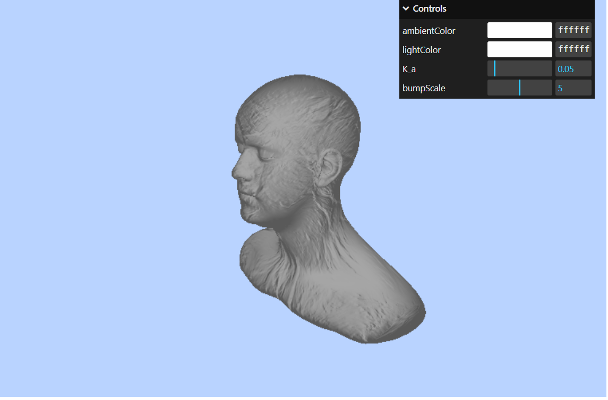

### 位移贴图

位移贴图和凹凸贴图其实就是一张贴图。

但是不同的是，作为凹凸贴图时，我们只会用他计算一个假的法线，并不会真的改变形状。

而位移贴图就是真的会将模型的顶点进行移动，真实的改变了物体的形状。

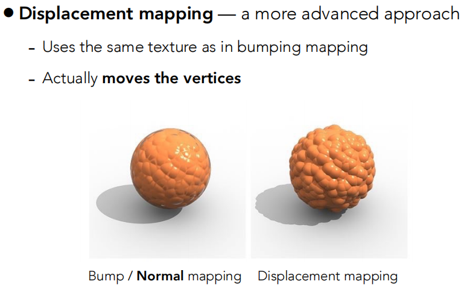

可以看到，凹凸贴图在物体的边界处会“露馅”，而位移贴图效果就很好。

但是使用位移贴图的前提是，几何体的三角面要足够的细致才行。

### 体积贴图

纹理不只是只能存在与二维空间，我们也可以定义三维的纹理。

可以理解成是一个球，将这个球切开之后，内部仍然是实心的。

这里的三维纹理，并不是一些图片，而是定义了一个在三维空间中的噪声函数。

使得在空间中的任意一个点，都能计算出这个噪声的值。通过对这个噪声值经过一系列处理变成我们需要的样子。

三维的纹理广泛应用在体渲染中，特别是在医学方面得到了广泛的应用。

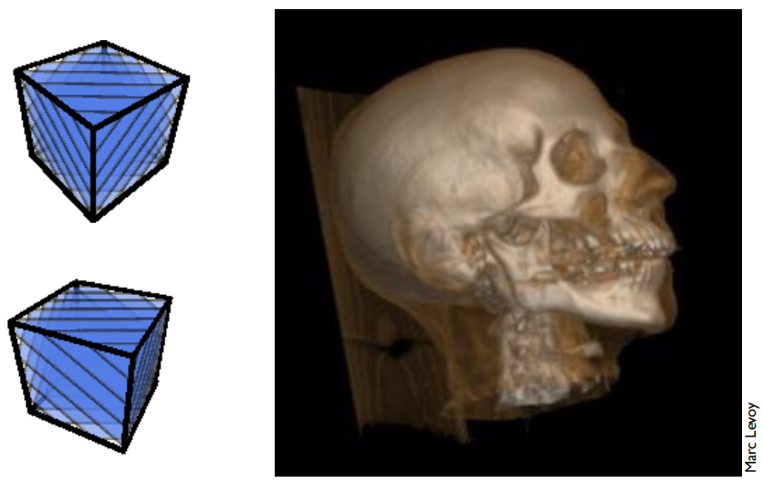

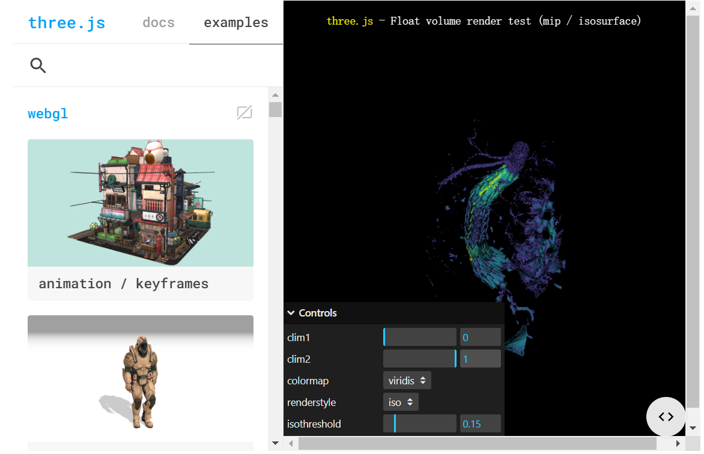

### 阴影贴图/环境光遮蔽贴图

纹理还可以记录一些提前计算好的信息，比如记录阴影/环境光遮蔽信息。

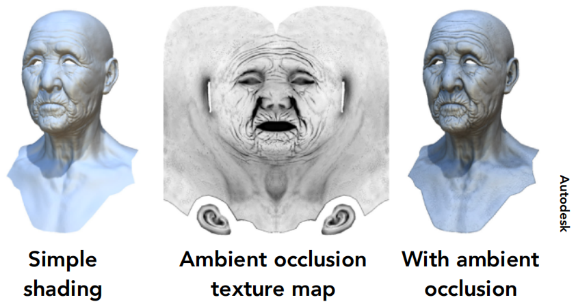

从这里可以看出，纹理不只是能够存储颜色，还可以存储很多提前计算好的信息。

**纹理的具体作用，需要看在着色器中，究竟是怎么使用纹理的。**