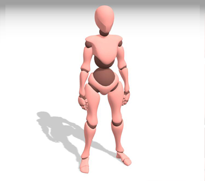
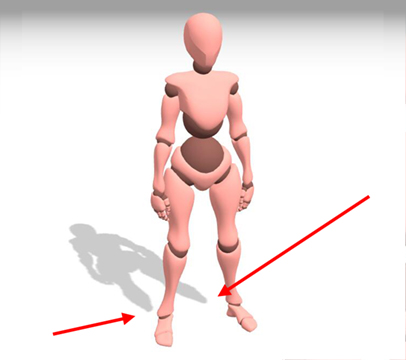

# ShadowMapping

ShadowMapping 是光栅化渲染中最常用的一种生成阴影的方式

## ShadowMapping

ShadowMapping 本质上是一种图像空间上的做法。
也就是在生成阴影的这一步，是不需要知道场景的空间信息的。

### ShadowMapping的主要思想

ShadowMapping 的主要思想其实很直观：

**如果一个点不在阴影里，而我们又能看到这个点，那就说明这个点能被相机看到，并且也能被光源看到。**

**而如果一个点在阴影里，而我们又能看到这个点，那就说明这个点能被相机看到，并且不能被光源看到。**

### ShadowMapping的实现思路.

既然前面说我们判断一个点在不在阴影里，是需要判断光源能不能看见，那么我们就需要想办法看一眼。

因此，我们可以先在**光源处放置一个虚拟的相机看向场景，然后做一遍深度测试，得到一张深度图**，通过深度图就能知道光源看到了什么。

然后**再从相机位置看向场景，并将看到的每一个像素点，都投影回光源相机看到的画面中，计算这个像素在光源相机下的深度值**。

用这个**深度值和光源相机渲染得到的深度图上对应的深度进行比较。如果大于深度图上记录的深度，那么说明这个像素点会被遮挡。**

### ShadowMapping 的具体实现

使用了ShadowMapping和未使用ShadowMapping的对比

#### 第一趟pass,生成阴影贴图

将相机放在光源位置，用 z-buffer 的方式存一张深度图，称之为阴影贴图 (Shadow Map)，并记录此时的投影变换矩阵 M，点光源对应透视投影，定向光对应正交投影

#### 第二趟pass,正式渲染场景

将相机放到眼睛的位置，考察每个片元处是否处于阴影。方法为：

用第一趟 pass 里面的矩阵 M 将三维点$(P_x,P_y,P_z)$变换为二维坐标$(p_x,p_y)$和深度$p_z$. 

将$p_z$与第一次 pass 存下来的阴影贴图对应点的深度$c(p_x,p_y)$ 进行对比，若$p_z > c(p_x,p_y)$，则认为此片元处于阴影中

最后将遮挡情况表现在着色点的颜色中即可。

### ShadowMapping中存在的一些问题

#### 自遮挡

shadowMapping 判断一个点是不是可见，是通过判断投影回去的深度值是否与深度图上记录的深度值一致来确定的。

然而，在计算机中，判断两个浮点数相等是很困难的一件事情。

如果只是简单的判断投影回去的深度大于深度图上的深度，那么就会产生一个很脏的阴影，这种现象称之为阴影的自遮挡。

**注意看下面模型身上会有很多黑色的条纹**.

为了解决阴影自遮挡的问题需要引入一个 bias 的数值(Depth Bias)。

使得我们投影回去的深度，不仅要大于深度图上记录的深度，还要大于 bias 加深度图上的深度。这样就会减少一些由于数值精度产生的问题。如下图，经过bias调整后的阴影

#### 不接触阴影

但是如果 bias 调整的过大，又会造成阴影与模型不衔接，这种现象称之为不接触阴影。（如下图，过大的bias使得阴影不完整）

#### 锯齿

另一个很常见的问题是，由于阴影的生成需要依赖深度图，因此深度图的尺寸会影响阴影的质量。

过小的深度图尺寸会产生一个锯齿严重的阴影，增大深度图的尺寸阴影质量会变高，但是又会使得渲染效率降低。

### ShadowMapping的一些优化方法

#### 优化阴影贴图的使用率

ShadowMapping 计算阴影，需要从阴影贴图中进行采样，一般而言，出现采样不合理的情况，都是因为创建的贴图与实际使用的部分两者不匹配。

例如：在场景中，有一个模型和一个灯光，灯光的相机视野很大，能够覆盖场景中很大得一块范围。但是我们的相机视野很小，只看到场景中的那个模型。这样也能得到看起来正确的阴影，但是相机视锥外的的阴影贴图就全部被浪费了。

下面介绍两个能够使得创建的阴影贴图与相机视锥更匹配的方法，使得阴影贴图能够得到充分的利用

#### Fitting

如下图所示，假设创建了一个场景，设置了灯光相机的视锥体，那么在进行一趟 ShadowMapping 之后，生成的阴影贴图就记录了黄色区域的深度信息。

但是很明显，光源相机的范围(黄色区域)过大了，它不仅超出了 Scene 的范围，而且很多区域没有在主相机的视锥中，这些区域记录的信息都会白白被浪费掉。

在正式开始介绍 Fitting 之前，先介绍两个概念：

1.潜在阴影接收者(Potential Shadow Receiver)，也就是有可能会被阴影覆盖的片元，这些片元必须是同时在 Camera、Scene 和 Light 范围内的。

$$
    PSR = C⋂S⋂L
$$

2.潜在阴影遮挡者(Potential Shadow Caster)，也就是可能遮住光线的片元，这一类的片元必须在 Scene 和 Light 的范围内，但是不一定会在 Camera 的范围内（比如看到的阴影可能是被相机视锥外的物体遮挡产生的）。这部分区域可以表示成 PSR 区域加上 PSR 区域到 Light 近平面的区域，再减去 Scene 之外的范围。

$$
    PSR = (PSR+psrToLightNear)⋂S
$$

PSR 和 PSC 示意图如下(橙色区域)：

可以看到，**如果能让 Light 视锥体缩小到刚好能包住 PSC 就算得上不错的 Fitting，包括从 xy 方向和从 z 方向两个途径：**

Brabec[1] 最早提出将 Light 的视锥体集中到 PSR 区域(由于 PSC 与 PSR 在 XY 方向上范围一致，所以其实还是集中到了 PSC 范围上)，也就是把 Light 的视锥体在 XY 方向上通过平移和缩放，使得 Light 的视锥更接近 PSR 区域，提高阴影贴图的使用率

如下图，Light视锥沿xy方向平移和缩放

$$
F = 
 \left[
 \begin{matrix}
   S_x & 0 & 0 & o_x \\
   0 & S_y & 0 & o_y \\
   0 & 0 & 1 & 0 \\
   0 & 0 & 0 & 1 \\
  \end{matrix}
  \right] \\
$$

$$
S_x = \frac{2}{x_{max} - x_{min}}
$$

$$
S_y = \frac{2}{y_{max} - y_{min}}
$$

$$
o_x = \frac{S_x(X_{max} + X_{min})}{2}
$$

$$
o_y = \frac{S_y(y_{max} + y_{min})}{2}
$$

#### Partition

### 软阴影

#### PCF软阴影

#### PCSS软阴影