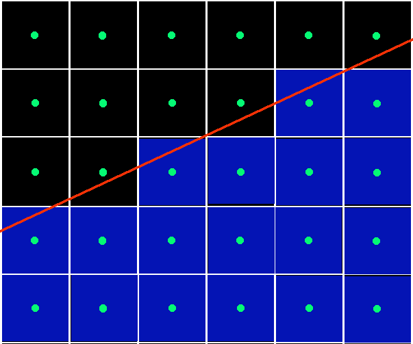
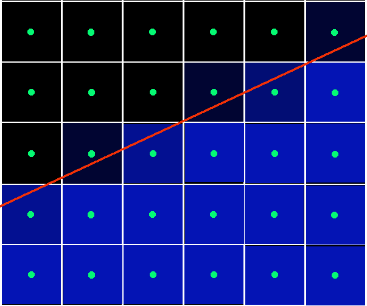
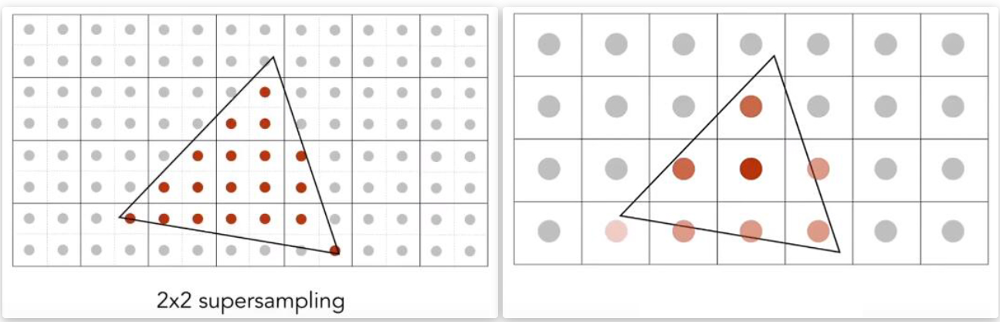
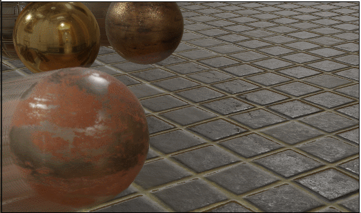

# 抗锯齿

## 锯齿产生的原因

众所周知，屏幕是由一个个像素组成的。渲染过程其实就是确定每一个像素颜色的过程。

下图表示一个光栅化阶段的三角形边界。在没有做抗锯齿的操作的情况下，我们只判断像素中心点在不在三角形内，如果三角形覆盖了像素点中心，则该像素被着色。如果三角形没有覆盖像素点中心，则该像素不会被着色。

由于我们**只对每个像素的中心点进行采样，因此采样率的不足造成了三角形在光栅化时，覆盖到的像素点都是离散的、断断续续的，这样就形成了锯齿**(aliasing)

下图：边界锯齿的形成

而实际情况下，我们期望得到的是如下图所示这样的效果。每一个像素点按照三角形对当前像素覆盖的面积，按比例贡献颜色。而这也正是抗锯齿技术想要达到的目的。

## 抗锯齿思路

我们了解了锯齿的出现是因为采样率不足导致的，也了解了我们期望得到的结果，所以我们就有了两种思路去实现抗锯齿效果。

1.第一种思路是每个像素中进行多次采样，然后根据多次采样的结果综合的来计算像素的颜色。常见的使用这种方式实现的抗锯齿技术有SSAA、MSAA、TAA。

2.第二种思路是通过后处理的方式，找到屏幕中像素块的边界，然后根据边界信息，将两侧的像素颜色进行插值，得到一个平滑的过渡，实现抗锯齿效果。常见的使用方式实现的抗锯齿技术有FXAA、SMAA。

### SSAA

SSAA称为超采样反走样，顾名思义，它将每一个像素都划分成若干小的采样点

并对每一个划分出来的采样点都做一次shading(这里可以暂时理解成判断在不在三角形内，如果在就是红色，如果不在就是白色)。

最后将所有采样点的颜色值取平均，作为当前像素点的颜色

SSAA细分的采样点个数可以使任意多个，通常游戏中的SSAA抗锯齿选项会设置x2、x3、x4之类的选项，其中x2表示每个像素点细分出4个采样点，x3是9个采样点，x4是16个采样点。显然采样点越多，得到的抗锯齿效果越好，但是带来的计算负担也会更大.

### MSAA

MSAA称为多重采样反走样，是对SSAA的一个改进。

很显然，SSAA的计算量非常的大。如果每个像素都细分成4个采样点，我们就需要每个像素点进行4次shading。相较于直接采样来说，就多了四倍的计算量。

而MSAA的做法也很容易理解。

我们依然会每个像素细分若干个采样点，对于每个采样点都会进行一次coverage test/覆盖测试，也就是测试当前采样点是否在三角形内部。

如果采样点通过了覆盖测试，则再进行一次深度测试，判断是否被其他三角形覆盖。如果深度测试也通过了，那么这个采样点就会被着色。

只不过MSAA在每个像素点中，只会对像素点中心进行一次着色，而像素细分出来的采样点如果会被着色，则直接共用像素点中心的着色结果。

最终再将多个采样点的颜色进行平均，作为当前像素的最终颜色。

在shading的运算量远远大于光栅化的今天，MSAA由于只在每个像素中做了一次shading，所以会比SSAA快得多，而且得到的效果也比较理想

### TAA

TAA称为时间性抗锯齿，它与SSAA原理相似，只不过在SSAA中每个像素的采样点，都是在同一帧里面细分出来并且着色的。

而TAA的采样点则是分布在时间上，也就是每个像素的采样点是使用前面若干帧已经渲染出来的画面，与当前帧在像素内部不同位置的采样结果综合计算得到的。

TAA在静止的场景中效果与使用SSAA一致，但是比SSAA快的多。但是在运动的场景中就会出现重影(ghosting)现象

下图为TAA会出现的ghosting现象:

### FXAA

FXAA称为快速近似抗锯齿，它是一种注重快速的视觉抗锯齿效果，而非追求完美的真实抗锯齿效果。

FXAA和增加样本数没有任何关系，它是一种后处理抗锯齿。

FXAA先把一个有锯齿的结果得出来，然后通过像素的色彩差异找到边缘，并计算边缘的倾斜方向。最后根据边缘的倾斜方向进行混合。得到一个近似的圆滑边缘。

由于FXAA是在后处理阶段进行抗锯齿的，与SSAA、MSAA这些抗锯齿技术相比，并没有提高采样率，因此FXAA精度上肯定不如这些抗锯齿技术，比如画面会略显模糊，并且光照高频(颜色变化很快)的地方会有闪烁的情况出现，但是胜在它很快。

<video controls src="https://www.liaomz.top/video/FXAA%E9%97%AE%E9%A2%98.mp4" title="(本地/anti_alising_6(FXAA问题))"></video>

### SMAA

SMAA称为增强型子像素形态学抗锯齿，它与FXAA的原理类似，主要解决的是FXAA画面模糊的问题。

SMAA对边界判断进行了大量的优化，对锯齿处理更加细致，得到的效果也比较好。但是和FXAA一样，SMAA也没提高采样率，在高频区域移动相机也会有闪烁的情况出现。

### DLSS

NVIDIA的DLSS抗锯齿可以说是一种比较另类的抗锯齿方式(超分辨率，其实严格意义上说不算抗锯齿)。

首先确定一个很明显的现象就是，在相同的场景相同设置下，渲染一张720P的画面一定会比渲染一张1080P的画面锯齿要更加严重。

但是渲染一张1080P的画面相比于渲染一张720P的画面消耗的资源更多，绘制的更慢。

而DLSS则是利用大量高精度的画面进行深度学习，并训练出一个能够进行图像增强的模型。

从而实现，渲染一个较低分辨率的画面，再将这个画面进行AI运算，输出一个高分辨率的画面，达到抗锯齿的效果。

DLSS由于只需要输出一张低分辨率的画面，就可以运算出高分辨率的画面，因此在渲染相同分辨率的画面时，渲染的帧率会更高。

缺点就是，需要老黄家显卡的支持

<video controls src="https://www.liaomz.top/video/DLSS.mp4" title="视频本地路径/anti_alising/DLSS.mp4"></video>

