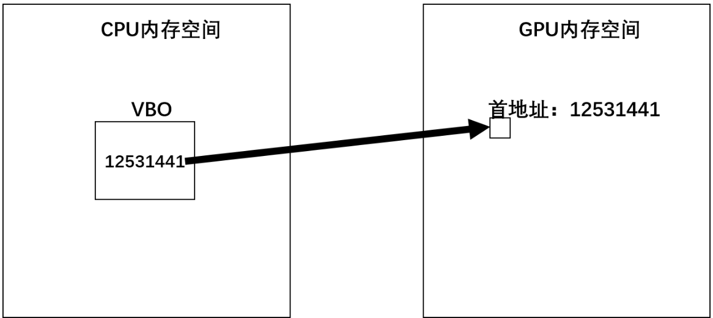
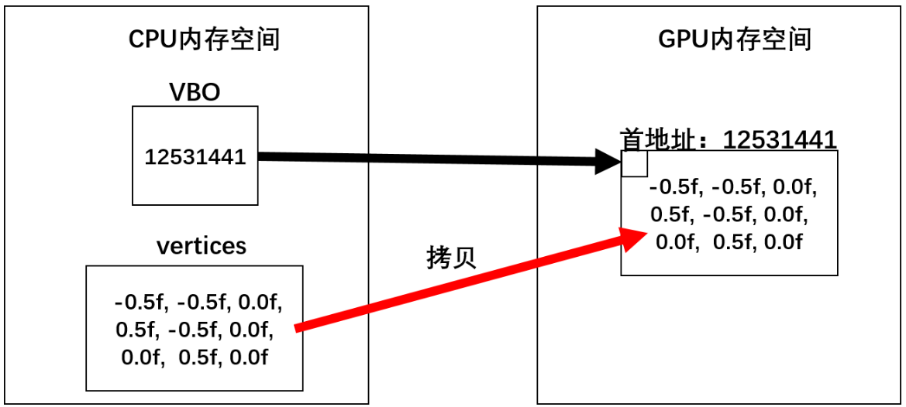
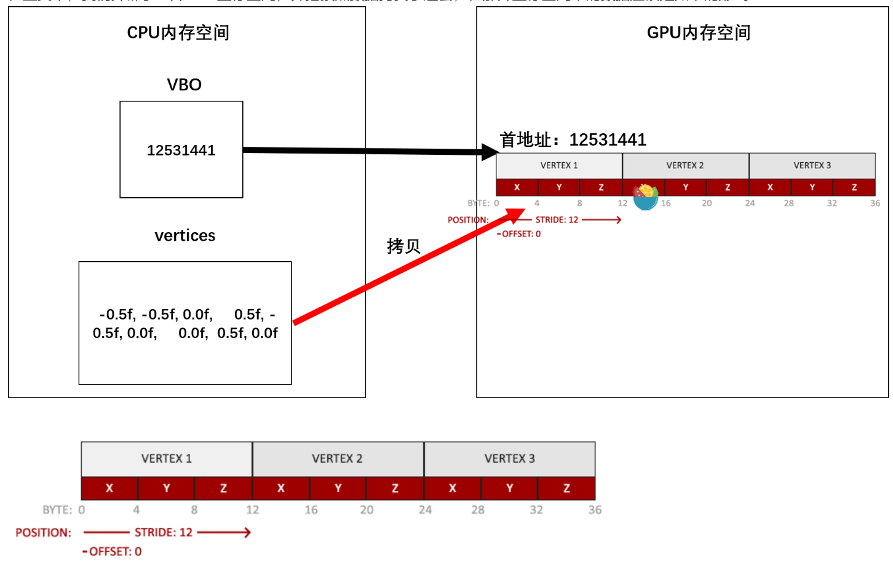
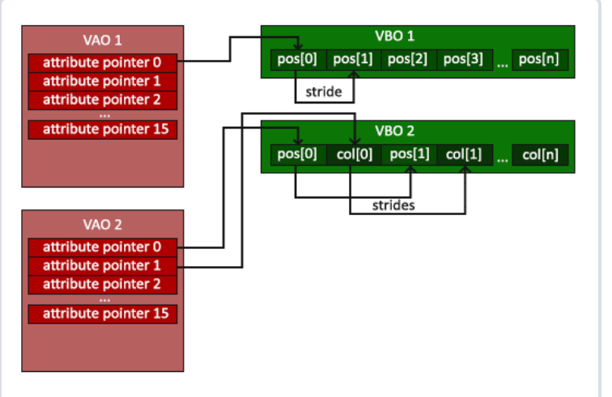
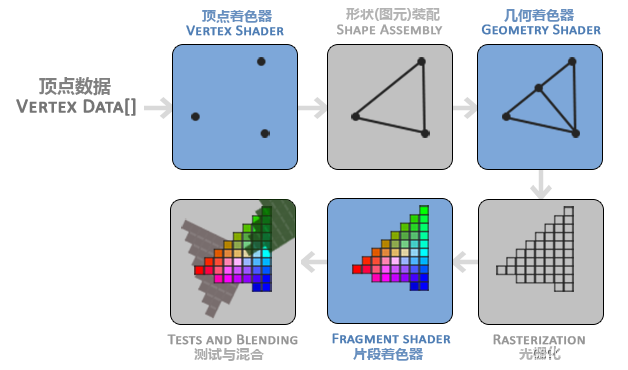
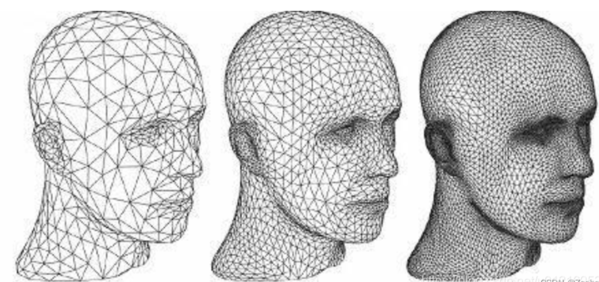
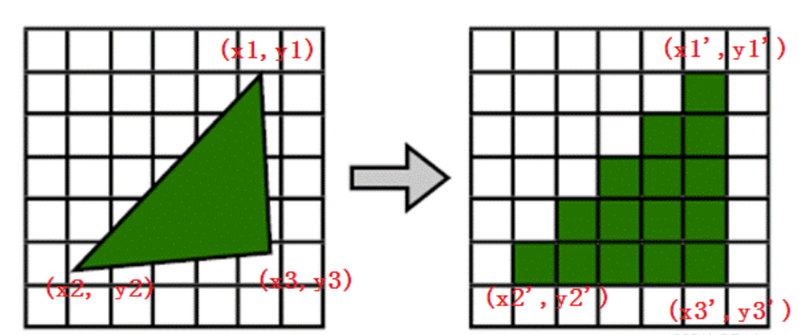

# 基础要点

## 什么是VAO,VBO,EBO/IBO ?

顶点数组对象：Vertex Array Object，VAO
顶点缓冲对象：Vertex Buffer Object，VBO
元素缓冲对象：Element Buffer Object，EBO 或 索引缓冲对象 Index Buffer Object，IBO

### 1.VBO

#### BO (Buffer Object) 缓冲对象

BO是OpenGL管理的一段内存，为和CPU内存区分开，一般称OpenGL管理的内存为：显存(显卡里的内存)。

显卡访问显存比较快，而Buffer Object，就是由OpenGL维护的一块显存区域。

由于显卡访问显存，比访问内存（CPU里的内存区域）要快很多。所以一般，需要先把数据，从内存传输到显存中去。

显卡里申请的这片显存区域，存放顶点数据，就叫VBO，存放图像数据，就叫PBO，根据它存放的数据的不同，有不同的叫法。

#### VBO （Vertex Buffer Object，顶点缓冲对象）

> 开始绘制图形之前，我们要给OpenGL输入顶点数据。这些数据开始存在C++创建的CPU内存中。 
> 之后这些顶点数据作为输入发送给OpenGL渲染管线第一阶段，顶点着色器。顶点着色器会在GPU上创建显存用于存储这些顶点数据，同时告诉OpenGL如何诠释这些现存（eg:顶点数据前三个是坐标，后三个是顶点法线，再后两个是uv坐标）

```C++
//顶点数据
float _vertices[] = {
    // positions          // normals           // texture coords
    -0.5f, -0.5f, -0.5f,  0.0f,  0.0f, -1.0f,  0.0f, 0.0f,
    0.5f, -0.5f, -0.5f,  0.0f,  0.0f, -1.0f,  1.0f, 0.0f,
    0.5f,  0.5f, -0.5f,  0.0f,  0.0f, -1.0f,  1.0f, 1.0f,
    0.5f,  0.5f, -0.5f,  0.0f,  0.0f, -1.0f,  1.0f, 1.0f,
    -0.5f,  0.5f, -0.5f,  0.0f,  0.0f, -1.0f,  0.0f, 1.0f,
    -0.5f, -0.5f, -0.5f,  0.0f,  0.0f, -1.0f,  0.0f, 0.0f,
}

```

**+ VBO作用**：管理这个在GPU上创建的显存。
**+ 使用VBO的好处**：使用这些缓冲对象的好处是我们可以一次性的发送一大批数据到显卡上，而不是每个顶点发送一次。从CPU把数据发送到显卡相对较慢，所以只要可能我们都要尝试尽量一次性发送尽可能多的数据。当数据发送至显卡的内存中后，顶点着色器访问顶点是个非常快的过程的。

如下示例在OpenGL中的使用：

```C++

/**
*void glGenBuffers(GLsizei n,GLuint * buffers);方法
*诠释：将n个当前未使用的缓冲对象名称(id),保存至buffers所指向的内存区域中。
*这n个缓冲对象ID不一定是连续整型数据（eg:可能是1，5，8，不一定是1，2，3）
*/

//创建一个VBO对象
unsigned int VBO;
glGenBuffers(1, &VBO);

//使用VBO数据创建多个VBO
unsigned int VBO[3];
glGenBuffers(3,VBO);

```

glGenBuffers函数起一个名字，这个名字对应的GPU内的显存地址，VBO内存储那个名字ID，VBO成了一个指向GPU内一块内存空间的指针，此时还未指向。


```C++
/**
*void glBindBuffer(GLenum target,GLuint buffer);
* + target:缓冲对象类型：GL_ARRAY_BUFFER数组缓冲区，存储颜色、位置、纹理坐标等顶点属性，或者其它自定义属性。
* + buffer:要绑定的缓冲对象ID.
*诠释：
*1.如果是第一次绑定buffer，且buffer是一个非0的unsigned int。那么将创建一个与该名称相对应的新缓冲对
*2.如果绑定到一个已经创建的缓冲对象，那么它将成为当前被激活的缓冲对象。
*3.如果buffer为0，那么OpenGL将不再对当前的target应用任何缓冲对象
*/

```

经历完绑定则ID（VBO）真正指向显存内的区域，此时应该只知道该显存区域的首地址。并且告诉OpenGL，这片显存的类型是GL_ARRAY_BUFFER型。


从这一刻起，任何在GL_ARRAY_BUFFER目标上的缓冲调用都会用来配置当前绑定的缓冲对象（VBO）

```C++
//然后使用glBufferData函数将数据储存进那片显存区域中（缓冲对象）
glBufferData(GL_ARRAY_BUFFER, sizeof(vertices), vertices, GL_STATIC_DRAW);


/*glBufferData专门用来把用户定义的数据复制到当前绑定缓冲的函数。
第一个参数：目标缓冲的类型
第二个参数：指定传输数据大小(以字节为单位)
第三个参数：希望发送的实际数据
第四个参数：指定显卡如何管理数据
        + GL_STATIC_DRAW ：数据不会或几乎不会改变。
        + GL_DYNAMIC_DRAW：数据会被改变很多。
        + GL_STREAM_DRAW ：数据每次绘制时都会改变。
*/
```

完成上面工作：在显存中分贝数据所需要的工作，将数据从CPU内存中拷贝到GPU显存中。



### 2.VAO（Vertex Array Object，顶点数组对象）

通过上面我们可以知道，已经将顶点数据送到GPU，但OpenGL还不知道它该如何解释内存中的顶点数据。
GPU内的这块显存区域里紧密连续的一个个数据，我们需要告知OpenGL，从哪里到哪里是顶点数据的位置信息，哪些是颜色信息，等等。
同时，还需要告诉OpenGL，如何将顶点数据连接到顶点着色器属性上。

```GLSL
/*
顶点着色器中可以有好几个顶点属性，使用关键字 in 来声明，如下面举例的着色器所示，
由于我们只关心位置(Position)数据，所以我们只需要一个顶点属性，输入的该是顶点的三维坐标。
*/
#version 330 core
layout (location = 0) in vec3 aPos;

void main()
{
    gl_Position = vec4(aPos.x, aPos.y, aPos.z, 1.0);
}
```

上文中，我们开辟了一片GPU显存空间，并把顶点数据拷贝了进去，在那片显存空间中的数据应该是如下的形式：


```C++
//使用glVertexAttribPointer函数可以告诉OpenGL该如何解析这些数据（应用到逐个顶点属性上）
glVertexAttribPointer(0, 3, GL_FLOAT, GL_FALSE, 3 * sizeof(float), (void*)0);
/*
第一个参数：指定我们要配置的顶点属性。还记得我们在顶点着色器中使用layout(location = 0)定义了position顶点属性的位置值(Location)吗？它可以把顶点属性的位置值设置为0。因为我们希望把数据传递到这一个顶点属性中，所以这里我们传入0。
第二个参数：指定顶点属性的大小。顶点属性是一个vec3，它由3个值组成，所以大小是3。
第三个参数：指定数据的类型，这里是GL_FLOAT(GLSL中vec*都是由浮点数值组成的)。
第四个参数：定义我们是否希望数据被标准化(Normalize)。如果我们设置为GL_TRUE，所有数据都会被映射到0（对于有符号型signed数据是-1）到1之间。我们把它设置为GL_FALSE。
第五个参数：叫做步长(Stride)，它告诉我们在连续的顶点属性组之间的间隔。由于下个组位置数据在3个float之后，我们把步长设置为3 * sizeof(float)。要注意的是由于我们知道这个数组是紧密排列的（在两个顶点属性之间没有空隙）我们也可以设置为0来让OpenGL决定具体步长是多少（只有当数值是紧密排列时才可用）。一旦我们有更多的顶点属性，我们就必须更小心地定义每个顶点属性之间的间隔，我们在后面会看到更多的例子（译注: 这个参数的意思简单说就是从这个属性第二次出现的地方到整个数组0位置之间有多少字节）。
第六个参数：的类型是void*，所以需要我们进行这个奇怪的强制类型转换。它表示位置数据在缓冲中起始位置的偏移量(Offset)。由于位置数据在数组的开头，所以这里是0。我们会在后面详细解释这个参数。
*/

//glEnableVertexAttribArray(0)启用了顶点着色器的（location = 0）的属性变量
glEnableVertexAttribArray(0);

/*
默认情况下，出于性能考虑，所有顶点着色器的属性（Attribute）变量都是关闭的，意味着数据在着色器端是不可见的，哪怕数据已经上传到GPU。只有由glEnableVertexAttribArray启用指定属性，才可在顶点着色器中访问逐顶点的属性数据。
数据在GPU端是否可见，即，着色器能否读取到数据，由是否启用了对应的属性决定，这就是glEnableVertexAttribArray的功能，允许顶点着色器读取GPU显存内的数据。
*/
```

#### VAO 作用

每当我们绘制一个物体的时候都必须重复这一过程，但是如果有超过5个顶点属性，上百个不同物体呢.

有没有一些方法可以使我们把所有这些状态配置储存在一个对象中，并且可以通过绑定这个对象来恢复状态呢？

**VAO就是这个作用**，它可以像顶点缓冲对象那样被绑定，任何随后的顶点属性调用都会储存在这个VAO中。

这样的好处就是，当配置顶点属性指针时，你只需要将那些调用执行一次，之后在绘制物体的时候只需要绑定相应的VAO就行了。这使得在不同顶点数据和顶点属性配置之间的切换变得非常简单，只需要绑定不同的VAO就行了。刚刚设置的所有状态都将存储在VAO中。

一个VAO会存储一下内容

+ glEnableVertexAttribArray和 glDisableVertexAttribArray的调用。
+ 通过glVertexAttribPointer设置的顶点属性配置。
+ glVertexAttribPointer是对哪块显存区域（顶点缓冲对象）内的数据做出的解释。



每一个VAO包括了，如何解释数据、解释哪段数据、读取数据权限的启用。所以每次渲染物体前，绑定配置好的VAO就可以直接开始渲染了。

VAO的使用

```C++
//配置VAO流程

//生成顶点缓冲对象，顶点数组对象
unsigned int VBO, VAO;
glGenVertexArrays(1, &VAO);
glGenBuffers(1, &VBO);
//先绑定顶点数组对象
glBindVertexArray(VAO);
//绑定顶点缓冲对象
glBindBuffer(GL_ARRAY_BUFFER, VBO);
//将数据存入顶点缓冲对象所指的内存中
glBufferData(GL_ARRAY_BUFFER, mouseVertices.size() * sizeof(Vertex), &mouseVertices[0], GL_STATIC_DRAW);
//告诉OpenGL该如何解析顶点坐标数据
glVertexAttribPointer(0, 3, GL_FLOAT, GL_FALSE, sizeof(Vertex), (void*)0);
//启用顶点位置属性
glEnableVertexAttribArray(0);//这里的0是顶点着色器中location=0中的0
//解绑顶点数组对象
glBindVertexArray(0);

//VAO的使用
//选用进行渲染的着色器小程序
glUseProgram(shaderProgram);
glBindVertexArray(VAO);
渲染的程序代码（）;
```

### 3.EBO（Element Buffer Object，索引缓冲对象）

EBO和VBO同样也是个缓冲对象，只是里面存储不是顶点数据，而是索引数据，它指导了绘制图形时，经过怎样的顺序选用VBO的顶点数据。

eg:如下

```C++
float vertices[] = {
    0.5f, 0.5f, 0.0f,   // 右上角
    0.5f, -0.5f, 0.0f,  // 右下角
    -0.5f, -0.5f, 0.0f, // 左下角
    -0.5f, 0.5f, 0.0f   // 左上角
};
unsigned int indices[] = { // 注意索引从0开始! 
    0, 1, 3, // 第一个三角形
    1, 2, 3  // 第二个三角形
};

```

顶点数据vertices数组，索引数据indices数组，由四个顶点绘制了两个三角形组成了一个矩形，其中有两个顶点重复使用。


## 图形渲染管线



**第一阶段：顶点数据传入GPU**.
**第二阶段：顶点着色器处理顶点数据**
**第三阶段：图元装配**(非自定义，OpenGL自动完成) --基本图元（点/线/三角面）是构成实体模型的基本单位
**第四阶段：几何着色器**，（几何着色器将第三步输出的图元进一步扩展成更细的多边形（类似有限元分割），且这一步是可自定义的，可以借助一些曲面细分的技术，使靠近计算机的部分具有更丰富的细节，远离计算机的部分具有较少的细节。）

**第五阶段：光栅化**.
光栅化将几何着色器输出的图元转换成一块块离散的片元（对应像素坐标中的一个个离散的像素）。

这是将连续模拟信号转换成离散信号的过程，因为在此之前，顶点的坐标仍是连续的，具有小数的，而最终屏幕上的像素坐标是离散的，整数形式的。

光栅化包含两部分工作：

决定屏幕像素坐标中哪些像素被图元覆盖，在渲染过程中要进行涂色
如果顶点坐标包括颜色信息（如RGB），通过插值的方式将颜色信息逐一分配到个个像素上
光栅化步骤是非自定义的，由OpenGL自动完成，最终输出一块块片元。

**第六阶段：片段着色器**.

片段着色器计算一个片元的最终颜色，决定最终的渲染效果.

**第七阶段:测试和混合**.

这一步非自定义，由OpenGL自动完成，只要用户启用了深度测试，OpenGL便会根据深度（片元距离摄像机的距离），计算哪些

片元是能被摄像机看见的，哪些片元是被其他片元遮挡的，并渲染能被摄像机看到的片元。