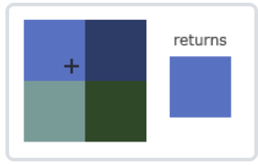
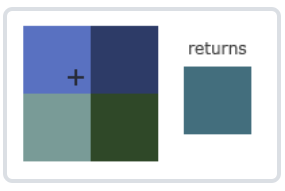
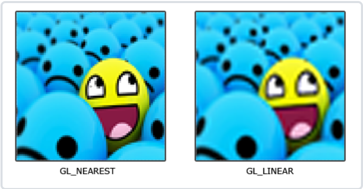
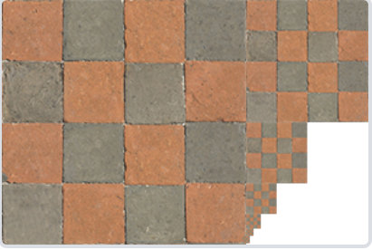

# 纹理

## 纹理环绕方式

纹理坐标的范围通常是从(0, 0)到(1, 1)，那如果我们把纹理坐标设置在范围之外会发生什么？OpenGL默认的行为是重复这个纹理图像（我们基本上忽略浮点纹理坐标的整数部分），但OpenGL提供了更多的选择：

|环绕方式|描述|
|--|--|
|GL_REPEAT|对纹理的默认行为。重复纹理图像。|
|GL_MIRRORED_REPEAT|和GL_REPEAT一样，但每次重复图片是镜像放置的。|
|GL_CLAMP_TO_EDGE|纹理坐标会被约束在0到1之间，超出的部分会重复纹理坐标的边缘，产生一种边缘被拉伸的效果。|
|GL_CLAMP_TO_BORDER|超出的坐标为用户指定的边缘颜色|


可使用`glTexParameter`函数对单独的一个坐标轴设置（s、t（如果是使用3D纹理那么还有一个r）它们和x、y、z是等价的）：

```c++
glTexParameteri(GL_TEXTURE_2D, GL_TEXTURE_WRAP_S, GL_MIRRORED_REPEAT);
glTexParameteri(GL_TEXTURE_2D, GL_TEXTURE_WRAP_T, GL_MIRRORED_REPEAT);

//第一个参数指定纹理目标，2D纹理--> GL_TEXTURE_2D.
//第二个参数指定设置的选项与应用纹理轴，我们打算配置的是WRAP选项，并且指定S和T轴
//第三个参数：环绕方式（GL_MIRRORED_REPEAT等）

//如果我们选择GL_CLAMP_TO_BORDER选项，我们还需要指定一个边缘的颜色。
//这需要使用glTexParameter函数的fv后缀形式，用GL_TEXTURE_BORDER_COLOR作为它的选项，并且传递一个float数组作为边缘的颜色值：
float borderColor[] = { 1.0f, 1.0f, 0.0f, 1.0f };
glTexParameterfv(GL_TEXTURE_2D, GL_TEXTURE_BORDER_COLOR, borderColor);

```

## 纹理过滤

纹理坐标不依赖于分辨率(Resolution)，它可以是任意浮点值，所以OpenGL需要知道怎样将纹理像素映射到纹理坐标.

当你有一个很大的物体但是纹理的分辨率很低的时候这就变得很重要了。你可能已经猜到了，OpenGL也有对于纹理过滤(Texture Filtering)的选项。纹理过滤有很多个选项，但是现在我们只讨论最重要的两种：**GL_NEAREST**和**GL_LINEAR**。

>Texture Pixel也叫Texel，你可以想象你打开一张.jpg格式图片，不断放大你会发现它是由无数像素点组成的，这个点就是纹理像素；注意不要和纹理坐标搞混，纹理坐标是你给模型顶点设置的那个数组，OpenGL以这个顶点的纹理坐标数据去查找纹理图像上的像素，然后进行采样提取纹理像素的颜色。

**GL_NEAREST**（也叫邻近过滤，Nearest Neighbor Filtering）是OpenGL默认的纹理过滤方式。

当设置为GL_NEAREST的时候，OpenGL会选择中心点最接近纹理坐标的那个像素。下图中你可以看到四个像素，加号代表纹理坐标。左上角那个纹理像素的中心距离纹理坐标最近，所以它会被选择为样本颜色：



**GL_LINEAR**（也叫线性过滤，(Bi)linear Filtering）它会基于纹理坐标附近的纹理像素，计算出一个插值，近似出这些纹理像素之间的颜色。一个纹理像素的中心距离纹理坐标越近，那么这个纹理像素的颜色对最终的样本颜色的贡献越大。下图中你可以看到返回的颜色是邻近像素的混合色：



那么这两种纹理过滤方式有怎样的视觉效果呢？让我们看看在一个很大的物体上应用一张低分辨率的纹理会发生什么吧（纹理被放大了，每个纹理像素都能看到）：



GL_NEAREST产生了颗粒状的图案，我们能够清晰看到组成纹理的像素，而GL_LINEAR能够产生更平滑的图案，很难看出单个的纹理像素。GL_LINEAR可以产生更真实的输出，但有些开发者更喜欢8-bit风格，所以他们会用GL_NEAREST选项

当进行**放大**(Magnify)和**缩小**(Minify)操作的时候可以设置纹理过滤的选项，比如你可以在纹理被缩小的时候使用邻近过滤，被放大时使用线性过滤。我们需要使用glTexParameter*函数为放大和缩小指定过滤方式。这段代码看起来会和纹理环绕方式的设置很相似：

```C++
glTexParameteri(GL_TEXTURE_2D, GL_TEXTURE_MIN_FILTER, GL_NEAREST);
glTexParameteri(GL_TEXTURE_2D, GL_TEXTURE_MAG_FILTER, GL_LINEAR);
```

**多级渐远纹理**.

想象一下，假设我们有一个包含着上千物体的大房间，每个物体上都有纹理。有些物体会很远，但其纹理会拥有与近处物体同样高的分辨率。由于远处的物体可能只产生很少的片段，OpenGL从高分辨率纹理中为这些片段获取正确的颜色值就很困难，因为它需要对一个跨过纹理很大部分的片段只拾取一个纹理颜色。在小物体上这会产生不真实的感觉，更不用说对它们使用高分辨率纹理浪费内存的问题了。

OpenGL使用一种叫做多级渐远纹理(Mipmap)的概念来解决这个问题，它简单来说就是一系列的纹理图像，后一个纹理图像是前一个的二分之一。多级渐远纹理背后的理念很简单：距观察者的距离超过一定的阈值，OpenGL会使用不同的多级渐远纹理，即最适合物体的距离的那个。由于距离远，解析度不高也不会被用户注意到。同时，多级渐远纹理另一加分之处是它的性能非常好。让我们看一下多级渐远纹理是什么样子的：



手工为每个纹理图像创建一系列多级渐远纹理很麻烦，幸好OpenGL有一个glGenerateMipmap函数，在创建完一个纹理后调用它OpenGL就会承担接下来的所有工作了。后面的教程中你会看到该如何使用它。

在渲染中切换多级渐远纹理级别(Level)时，OpenGL在两个不同级别的多级渐远纹理层之间会产生不真实的生硬边界。就像普通的纹理过滤一样，切换多级渐远纹理级别时你也可以在两个不同多级渐远纹理级别之间使用NEAREST和LINEAR过滤。为了指定不同多级渐远纹理级别之间的过滤方式，你可以使用下面四个选项中的一个代替原有的过滤方式：

|过滤方式|描述|
|--|--|
|GL_NEAREST_MIPMAP_NEAREST|使用最邻近的多级渐远纹理来匹配像素大小，并使用邻近插值进行纹理采样|
|GL_LINEAR_MIPMAP_NEAREST|使用最邻近的多级渐远纹理级别，并使用线性插值进行采样|
|GL_NEAREST_MIPMAP_LINEAR|在两个最匹配像素大小的多级渐远纹理之间进行线性插值，使用邻近插值进行采样|
|GL_LINEAR_MIPMAP_LINEAR|在两个邻近的多级渐远纹理之间使用线性插值，并使用线性插值进行采样|

就像纹理过滤一样，我们可以使用glTexParameteri将过滤方式设置为前面四种提到的方法之一：

```c++
glTexParameteri(GL_TEXTURE_2D, GL_TEXTURE_MIN_FILTER, GL_LINEAR_MIPMAP_LINEAR);
glTexParameteri(GL_TEXTURE_2D, GL_TEXTURE_MAG_FILTER, GL_LINEAR);
```

一个常见的错误是，将放大过滤的选项设置为多级渐远纹理过滤选项之一。这样没有任何效果，因为多级渐远纹理主要是使用在纹理被缩小的情况下的：纹理放大不会使用多级渐远纹理，为放大过滤设置多级渐远纹理的选项会产生一个GL_INVALID_ENUM错误代码。