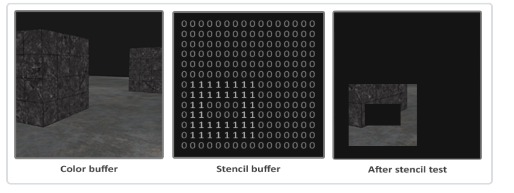

# 模板测试

模板测试是根据模板缓冲(Stencil Buffer)来进行的，我们可以在渲染的时候更新它来获得一些很有意思的效果。

一个模板缓冲中，（通常）每个模板值(Stencil Value)是8位的。所以每个像素/片段一共能有256种不同的模板值。我们可以将这些模板值设置为我们想要的值，然后当某一个片段有某一个模板值的时候，我们就可以选择丢弃或是保留这个片段了。

>每个窗口库都需要为你配置一个模板缓冲。GLFW自动做了这件事，所以我们不需要告诉GLFW来创建一个，但其它的窗口库可能不会默认给你创建一个模板库，所以记得要查看库的文档。

## 什么是模板测试？

渲染物体时，每个像素都会有一个对应的模板值，这个值存储在模板缓冲区中。渲染一个新的像素时，会将这个像素的模板值与模板缓冲区中的值进行比较，根据比较结果来渲染这个像素。这就是模板测试。

## 模板缓冲示例



模板缓冲首先会被清除为0，之后在模板缓冲中使用1填充了一个空心矩形。场景中的片段将会只在片段的模板值为1的时候会被渲染（其它的都被丢弃了）。

模板缓冲操作允许我们在渲染片段时将模板缓冲设定为一个特定的值。通过在渲染时修改模板缓冲的内容，我们写入了模板缓冲。在同一个（或者接下来的）渲染迭代中，我们可以读取这些值，来决定丢弃还是保留某个片段。使用模板缓冲的时候你可以尽情发挥，但大体的步骤如下：

+ 启用模板缓冲的写入。
+ 渲染物体，更新模板缓冲的内容。
+ 禁用模板缓冲的写入。
+ 渲染（其它）物体，这次根据模板缓冲的内容丢弃特定的片段。

所以，通过使用模板缓冲，我们可以根据场景中已绘制的其它物体的片段，来决定是否丢弃特定的片段。

```glsl
//启用GL_STENCIL_TEST来启用模板测试。在这一行代码之后，所有的渲染调用都会以某种方式影响着模板缓冲。
glEnable(GL_STENCIL_TEST);

//和颜色和深度缓冲一样，你也需要在每次迭代之前清除模板缓冲。
glClear(GL_COLOR_BUFFER_BIT | GL_DEPTH_BUFFER_BIT | GL_STENCIL_BUFFER_BIT);

//和深度测试的glDepthMask函数一样，模板缓冲也有一个类似的函数。glStencilMask允许我们设置一个位掩码(Bitmask)，
//它会与将要写入缓冲的模板值进行与(AND)运算。默认情况下设置的位掩码所有位都为1，不影响输出，但如果我们将它设置为0x00，
//写入缓冲的所有模板值最后都会变成0.这与深度测试中的glDepthMask(GL_FALSE)是等价的。
glStencilMask(0xFF); // 每一位写入模板缓冲时都保持原样
glStencilMask(0x00); // 每一位在写入模板缓冲时都会变成0（禁用写入）

```

## 模板函数

我们可以通过glStencilFunc和glStencilOp来配置模板测试。

`glStencilFunc(GLenum func, GLint ref, GLuint mask)`

+ func：设置模板测试函数(Stencil Test Function)。这个测试函数将会应用到已储存的模板值上和glStencilFunc函数的ref值上。可用的选项有：GL_NEVER、GL_LESS、GL_LEQUAL、GL_GREATER、GL_GEQUAL、GL_EQUAL、GL_NOTEQUAL和GL_ALWAYS。它们的语义和深度缓冲的函数类似。
+ ref：设置了模板测试的参考值(Reference Value)。模板缓冲的内容将会与这个值进行比较。
+ mask：设置一个掩码，它将会与参考值和储存的模板值在测试比较它们之前进行与(AND)运算。初始情况下所有位都为1。

```glsl
//告诉OpenGL，只要一个片段的模板值等于(GL_EQUAL)参考值1，片段将会通过测试并被绘制，否则会被丢弃。
glStencilFunc(GL_EQUAL, 1, 0xFF)
```

但是glStencilFunc仅仅描述了OpenGL应该对模板缓冲内容做什么，而不是我们应该如何更新缓冲。这就需要glStencilOp这个函数了。

`glStencilOp(GLenum sfail, GLenum dpfail, GLenum dppass)`

+ sfail：模板测试失败时采取的行为。
+ dpfail：模板测试通过，但深度测试失败时采取的行为。
+ dppass：模板测试和深度测试都通过时采取的行为。

可选则下面的其中一种行为:

|行为|描述|
|--|--|
|GL_KEEP|保持当前储存的模板值|
|GL_ZERO|将模板值设置为0|
|GL_REPLACE|将模板值设置为glStencilFunc函数设置的ref值|
|GL_INCR|如果模板值小于最大值则将模板值加1|
|GL_INCR_WRAP|与GL_INCR一样，但如果模板值超过了最大值则归零|
|GL_DECR|如果模板值大于最小值则将模板值减1|
|GL_DECR_WRAP|与GL_DECR一样，但如果模板值小于0则将其设置为最大值|
|GL_INVERT|按位翻转当前的模板缓冲值|

默认情况下glStencilOp是设置为(GL_KEEP, GL_KEEP, GL_KEEP)的，所以不论任何测试的结果是如何，模板缓冲都会保留它的值。默认的行为不会更新模板缓冲，所以如果你想写入模板缓冲的话，你需要至少对其中一个选项设置不同的值。

所以，通过使用glStencilFunc和glStencilOp，我们可以精确地指定更新模板缓冲的时机与行为了，我们也可以指定什么时候该让模板缓冲通过，即什么时候片段需要被丢弃。