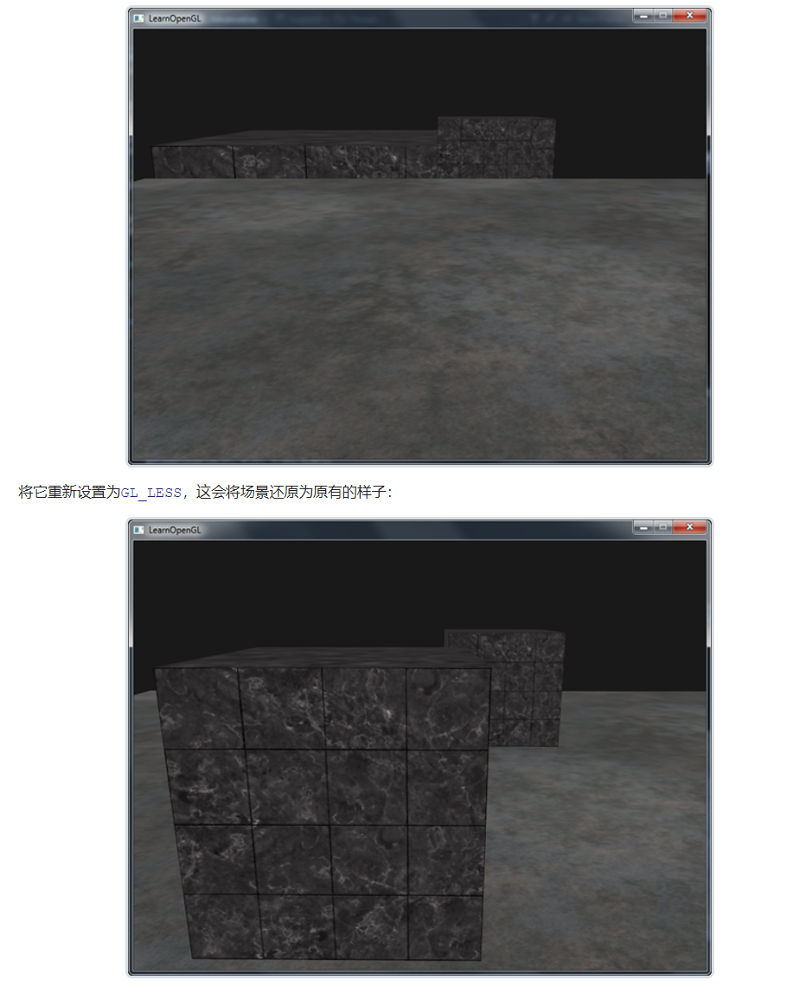

# 深度测试

深度缓冲(z缓冲)/帧缓冲相关概念查看图形学基础。

当深度测试(Depth Testing)被启动的时候，OpenGL会将一个片段的深度值与深度缓冲中的内容进行对比。OpenGL执行一次深度测试，**测试通过**，深度缓冲值会更新为新的深度值，**测试失败**，相关片段将被丢弃。

深度测试，是在片段着色器和模板测试(Stencil Testing)运行之后，在屏幕空间中运行的。

屏幕空间坐标与通过OpenGL的glViewport所定义的视口密切相关，并且可以直接使用GLSL内建变量gl_FragCoord从片段着色器中直接访问。**gl_FragCoord**的x和y分量代表了片段的屏幕空间坐标（其中(0, 0)位于左下角）。**gl_FragCoord中**也包含了一个z分量，它包含了片段真正的深度值。z值就是需要与深度缓冲内容所对比的那个值。

>现在大部分的GPU都提供一个叫做提前深度测试(Early Depth Testing)的硬件特性。提前深度测试允许深度测试在片段着色器之前运行。只要我们清楚一个片段永远不会是可见的（它在其他物体之后），我们就能提前丢弃这个片段。
>片段着色器通常开销都是很大的，所以我们应该尽可能避免运行它们。当使用提前深度测试时，片段着色器的一个限制是你不能写入片段的深度值。如果一个片段着色器对它的深度值进行了写入，提前深度测试是不可能的。OpenGL不能提前知道深度值。

深度测试默认是关闭的，需要使用GL_DEPTH_TEST来启动:

```glsl
glEnable(GL_DEPTH_TEST);
```

启动后,一个片段通过深度测试后，OpenGL会在深度缓冲中存储该片段的深度值(z值)。没通过，则会丢弃该片段。当开启深度缓冲，还需在每个渲染迭代之前使用GL_DEPTH_BUFFERT_BIT来清楚深度缓冲，否则会仍在使用上一次渲染迭代中的写入的深度值。

```GLSL
glClear(GL_COLOR_BUFFER_BIT | GL_DEPTH_BUFFER_BIT);
```

在某些情况下你会需要对所有片段都执行深度测试并丢弃相应的片段，但不希望更新深度缓冲。基本上来说，你在使用一个只读的(Read-only)深度缓冲。OpenGL允许我们禁用深度缓冲的写入，只需要设置它的深度掩码(Depth Mask)设置为GL_FALSE就可以了：

```glsl
glDepthMask(GL_FALSE);
```

>#注意这只在深度测试被启用的时候才有效果。

## 深度测试函数

OpenGL允许我们修改深度测试中使用的比较运算符。这**允许我们来控制OpenGL什么时候该通过或丢弃一个片段，什么时候去更新深度缓冲**。我们可以调用glDepthFunc函数来设置比较运算符（或者说深度函数(Depth Function)）：

```GLSL
glDepthFunc(GL_LESS);
```

|函数|描述|
|--|--|
|GL_ALWAYS| 永远通过深度测试|
|GL_NEVER|永远不通过深度测试|
|GL_LESS|在片段深度值小于缓冲的深度值时通过测试|
|GL_EQUAL|在片段深度值等于缓冲区的深度值时通过测试|
|GL_LEQUAL|在片段深度值小于等于缓冲区的深度值时通过测试|
|GL_GREATER|在片段深度值大于缓冲区的深度值时通过测试|
|GL_NOTEQUAL|在片段深度值不等于缓冲区的深度值时通过测试|
|GL_GEQUAL|在片段深度值大于等于缓冲区的深度值时通过测试|

默认情况下使用的深度函数是GL_LESS，它将会丢弃深度值大于等于当前深度缓冲值的所有片段。

在源代码中，我们将深度函数改为GL_ALWAYS：

```glsl
glEnable(GL_DEPTH_TEST);
glDepthFunc(GL_ALWAYS);
```

这将会模拟我们没有启用深度测试时所得到的结果。深度测试将会永远通过，所以最后绘制的片段将会总是会渲染在之前绘制片段的上面，即使之前绘制的片段本就应该渲染在最前面。因为我们是最后渲染地板的，它会覆盖所有的箱子片段：



## 深度值精度

深度缓冲包含了一个介于0.0和1.0之间的深度值，它将会与观察者视角所看见的场景中所有物体的z值进行比较。观察空间的z值可能是投影平截头体的**近平面**(Near)**和远平面**(Far)之间的任何值。我们需要一种方式来将这些观察空间的z值变换到[0, 1]范围之间，其中的一种方式就是将它们线性变换到[0, 1]范围之间。下面这个（线性）方程将z值变换到了0.0到1.0之间的深度值:

$$
F_{depth} = \frac{z-near}{far-near}
$$

这里的near和far值是我们之前提供给投影矩阵设置可视平截头体的（见坐标系统）那个 near 和 far 值。这个方程需要平截头体中的一个z值，并将它变换到了[0, 1]的范围中。z值和对应的深度值之间的关系可以在下图中看到：


>注意所有的方程都会将非常近的物体的深度值设置为接近0.0的值，而当物体非常接近远平面的时候，它的深度值会非常接近1.0。

然而，在实践中是几乎永远不会使用这样的线性深度缓冲(Linear Depth Buffer)的。要想有正确的投影性质，需要使用一个非线性的深度方程，它是与 1/z 成正比的。它做的就是在z值很小的时候提供非常高的精度，而在z值很远的时候提供更少的精度。花时间想想这个：我们真的需要对1000单位远的深度值和只有1单位远的充满细节的物体使用相同的精度吗？线性方程并不会考虑这一点。

由于非线性方程与 1/z 成正比，在1.0和2.0之间的z值将会变换至1.0到0.5之间的深度值，这就是一个float提供给我们的一半精度了，这在z值很小的情况下提供了非常大的精度。在50.0和100.0之间的z值将会只占2%的float精度，这正是我们所需要的。这样的一个考虑了远近距离的方程是这样的：

$$
F_{depth} = \frac{\frac{1}{z}-\frac{1}{near}}{\frac{1}{far} - \frac{1}{near}}
$$

如果你不知道这个方程是怎么回事也不用担心。重要的是要记住深度缓冲中的值在屏幕空间中不是线性的（在透视矩阵应用之前在观察空间中是线性的）。深度缓冲中0.5的值并不代表着物体的z值是位于平截头体的中间了，这个顶点的z值实际上非常接近近平面！你可以在下图中看到z值和最终的深度缓冲值之间的非线性关系：


## 深度缓冲的可视化

gl_FragCoord向量的z值包含了那个特定片段的深度值。我们将这个深度值输出为颜色，我们可以显示场景中所有片段的深度值。

```glsl
void main()
{
    FragColor = vec4(vec3(gl_FragCoord.z), 1.0);
}
```

你可能会注意到所有东西都是白色的，看起来就想我们所有的深度值都是最大的1.0。所以为什么没有靠近0.0（即变暗）的深度值呢？

屏幕空间中的深度值是非线性的，即它在z值很小的时候有很高的精度，而z值很大的时候有较低的精度。片段的深度值会随着距离迅速增加，所以几乎所有的顶点的深度值都是接近于1.0的。如果我们小心地靠近物体，你可能会最终注意到颜色会渐渐变暗，显示它们的z值在逐渐变小：


这很清楚地展示了深度值的非线性性质。近处的物体比起远处的物体对深度值有着更大的影响。只需要移动几厘米就能让颜色从暗完全变白

然而，我们也可以让片段非线性的深度值变换为线性的。要实现这个，我们需要仅仅反转深度值的投影变换。这也就意味着我们需要首先将深度值从[0, 1]范围重新变换到[-1, 1]范围的标准化设备坐标（裁剪空间）。接下来我们需要像投影矩阵那样反转这个非线性方程（方程2），并将这个反转的方程应用到最终的深度值上。最终的结果就是一个线性的深度值了。听起来是可行的，对吧？

首先我们将深度值变换为NDC，不是非常困难：

```glsl
float z = depth * 2.0 - 1.0;
```

接下来使用获取到的z值，应用逆变换来获取线性的深度值：

```glsl
float linearDepth = (2.0 * near * far) / (far + near - z * (far - near));
```

这个方程是用投影矩阵推导得出的，它使用了方程2来非线性化深度值，返回一个near与far之间的深度值.

将屏幕空间中非线性的深度值变换至线性深度值的完整片段着色器如下：

```GLSL
#version 330 core
out vec4 FragColor;

float near = 0.1; 
float far  = 100.0; 

float LinearizeDepth(float depth) 
{
    float z = depth * 2.0 - 1.0; // back to NDC 
    return (2.0 * near * far) / (far + near - z * (far - near));    
}

void main()
{             
    float depth = LinearizeDepth(gl_FragCoord.z) / far; // 为了演示除以 far
    FragColor = vec4(vec3(depth), 1.0);
}
```

由于线性化的深度值处于near与far之间，它的大部分值都会大于1.0并显示为完全的白色。通过在main函数中将线性深度值除以far，我们近似地将线性深度值转化到[0, 1]的范围之间。这样子我们就能逐渐看到一个片段越接近投影平截头体的远平面，它就会变得越亮，更适用于展示目的。

如果我们现在运行程序，我们就能看见深度值随着距离增大是线性的了。尝试在场景中移动，看看深度值是怎样以线性变化的。


颜色大部分都是黑色，因为深度值的范围是0.1的近平面到100的远平面，它离我们还是非常远的。结果就是，我们相对靠近近平面，所以会得到更低的（更暗的）深度值

## 深度冲突 

两个三角面或者平面紧密排列在一起的时候，深度缓冲没有足够的精度来决定两个形状哪个在前面。这样就会导致Z-Fighting(深度冲突)

## 防止深度冲突

+ 永远不要把多个物体摆得太靠近，以至于它们的一些三角形会重叠
+ 尽可能将近平面设置远一些。
+ 另外一个很好的技巧是牺牲一些性能，使用更高精度的深度缓冲。