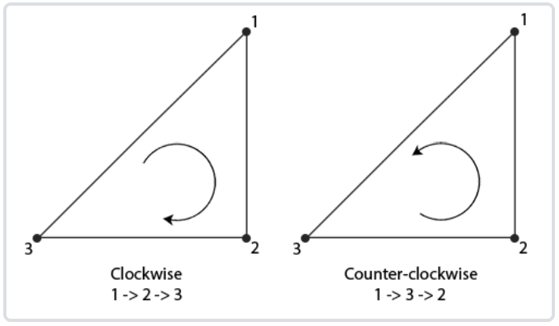
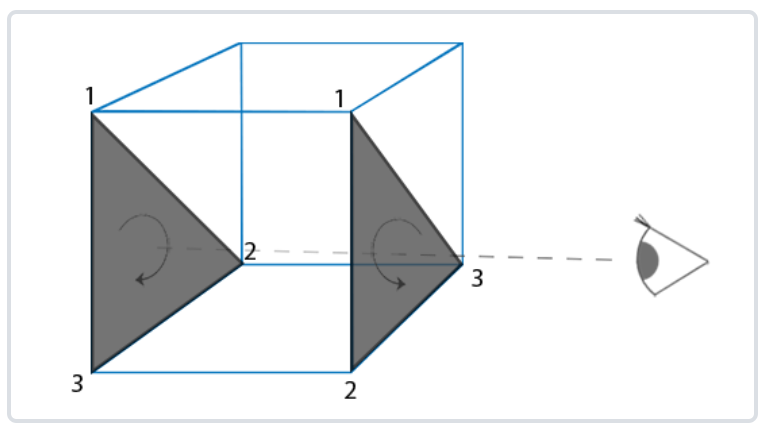
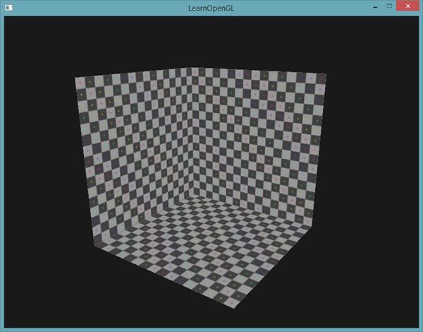

# 面剔除

顾名思义就是面剔除就是丢弃我们不想看到的面,只绘制我们想看到的面。

OpenGL可以检测**面向观察者的面**（Front Facing/正面）和**背向观察者的面**(Back Facing/背面),我们可以选择性的绘制正面或者背面。(通俗讲：一个三角面有正面和背面)

OpenGL是如何检测哪些面是正面，哪些是背面，OpenGL提供的一个技巧，即**分析顶点数据的环绕顺序**。

## 环绕顺序



如上图，以特定的环绕顺序定义三角形顶点，可能是**顺时针**，也可能是**逆时针**。

下面通过定义顶点顺序，来确定其三角面的环绕顺序：

```C++
float vertices[] = {
    // 顺时针
    vertices[0], // 顶点1
    vertices[1], // 顶点2
    vertices[2], // 顶点3
    // 逆时针
    vertices[0], // 顶点1
    vertices[2], // 顶点3
    vertices[1]  // 顶点2  
};
```

每组组成三角形图元的三个顶点就包含了一个环绕顺序。
OpenGL在渲染图元的时候将使用这个信息来决定一个三角形是一个**正向三角形还是背向三角形**。默认情况下，**逆时针顶点所定义的三角形将会被处理为正向三角形。**

### 如何定义顶点顺序？

**定义顶点顺序的时候，你应该想象对应的三角形是面向你的，所以你定义的三角形从正面看去应该是逆时针的**。这样定义顶点很棒的一点是，实际的环绕顺序是在光栅化阶段进行的，也就是顶点着色器运行之后。这些顶点就是从观察者视角所见的了。

观察者所面向的所有三角形顶点就是我们所指定的正确环绕顺序了，而立方体另一面的三角形顶点则是以相反的环绕顺序所渲染的。这样的结果就是，我们所面向的三角形将会是正向三角形，而背面的三角形则是背向三角形。下面这张图显示了这个效果：



在顶点数据中，我们将两个三角形都以逆时针顺序定义(1,2,3), 然而，如果从观察者当前视角使用1、2、3的顺序来绘制的话，从观察者的方向来看,背面的三角形将会是以顺时针顺序渲染的。虽然背面的三角形是以逆时针定义的，它现在是以顺时针顺序渲染的了。这正是我们想要剔除（Cull，丢弃）的不可见面了！

在顶点数据中，我们定义的是两个逆时针顺序的三角形。然而，从观察者的方面看，后面的三角形是顺时针的，如果我们仍以1、2、3的顺序以观察者当面的视野看的话。即使我们以逆时针顺序定义后面的三角形，它现在还是变为顺时针。它正是我们打算剔除（丢弃）的不可见的面！

## OpenGL怎么去剔除面？

OpenGL能够丢弃那些渲染为背向三角形的三角形图元。
已经知道如何设置顶点的环绕顺序了，我们就可以使用OpenGL的面剔除选项了(默认是禁用状态)。

启动面剔除，只需启用OpenGL的GL_CULL_FACE选项：

```GLSL
glEnable(GL_CULL_FACE); //剔除所有背面
```

OpenGL可以定义剔除的面的类型。

```GLSL
glCuffFace(GL_FRONT);

GL_BACK：只剔除背向面。
GL_FRONT：只剔除正向面。
GL_FRONT_AND_BACK：剔除正向面和背向面。

//glCullFace的初始值是GL_BACK。

```

glFrontFace，告诉OpenGL我们希望将顺时针的面（而不是逆时针的面）定义为正向面：

```GLSL
glFrontFace(GL_CCW);

//默认值是GL_CCW，它代表的是逆时针的环绕顺序，另一个选项是GL_CW，它（显然）代表的是顺时针顺序。
```

下面做一个实验,告诉OpenGL现在顺时针顺序代表的是正向面：

```glsl
glEnable(GL_CULL_FACE);
glCullFace(GL_BACK);
glFrontFace(GL_CW);
```

这样的结果是只有背向面被渲染了：



也可以仍使用默认的逆时针环绕顺序，但剔除正向面，来达到相同的效果：

```GLSL
glEnable(GL_CULL_FACE);
glCullFace(GL_FRONT);
```