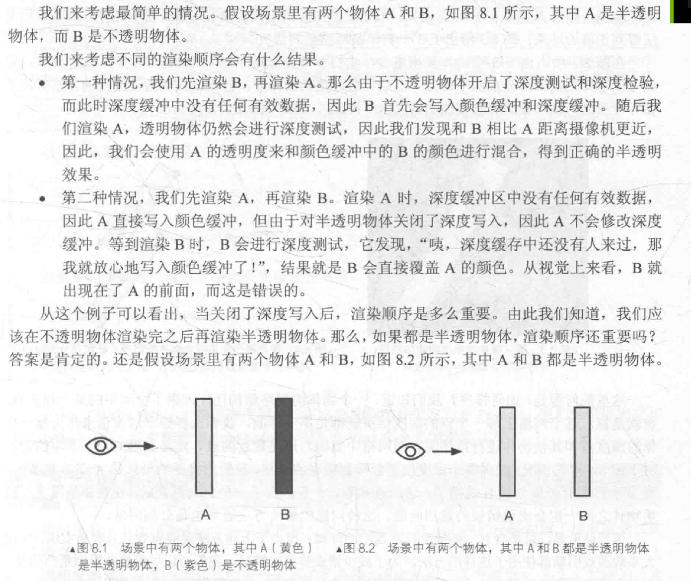
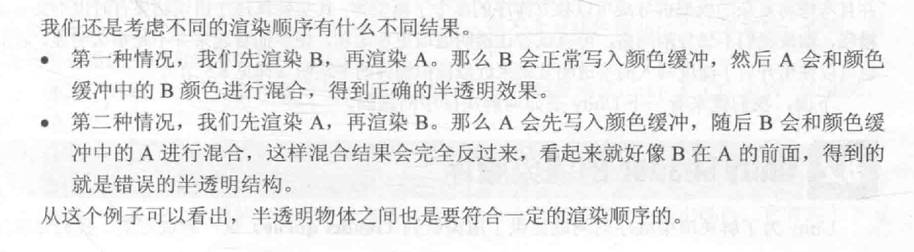
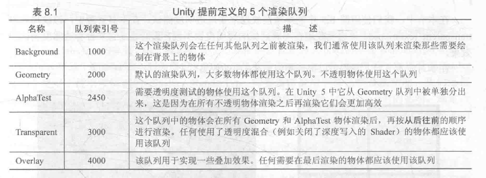
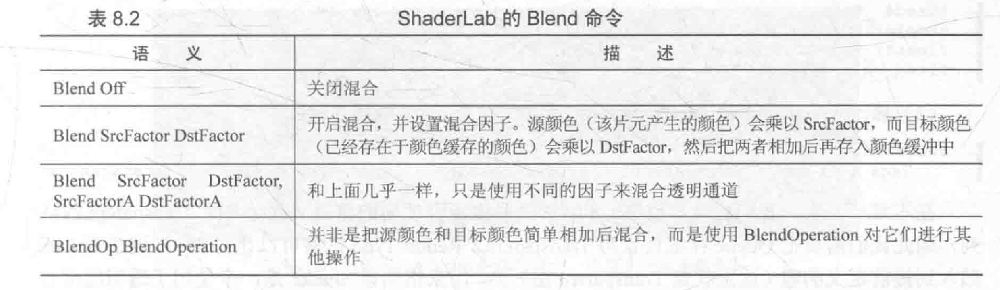
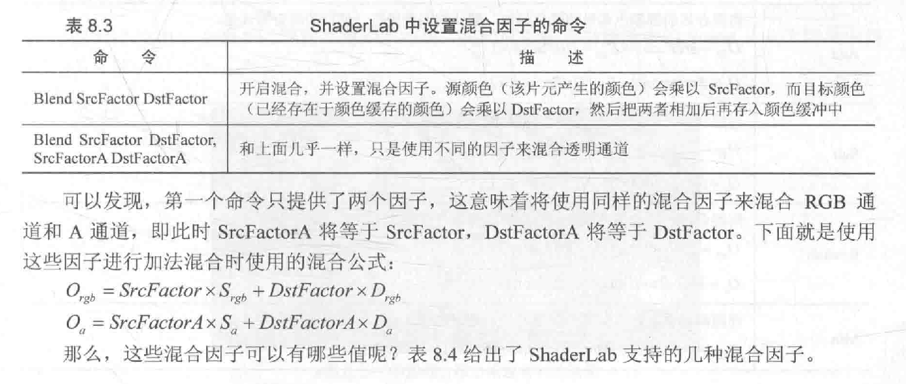
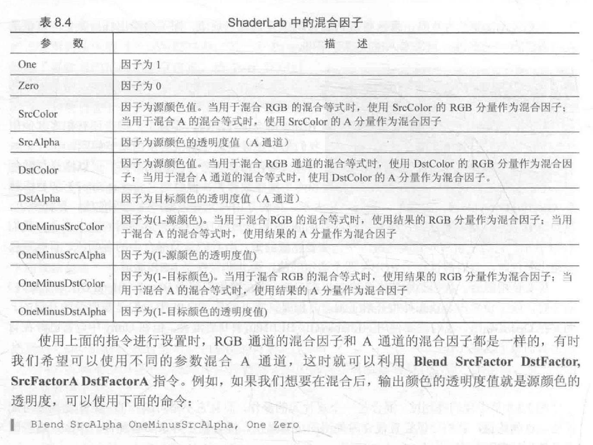
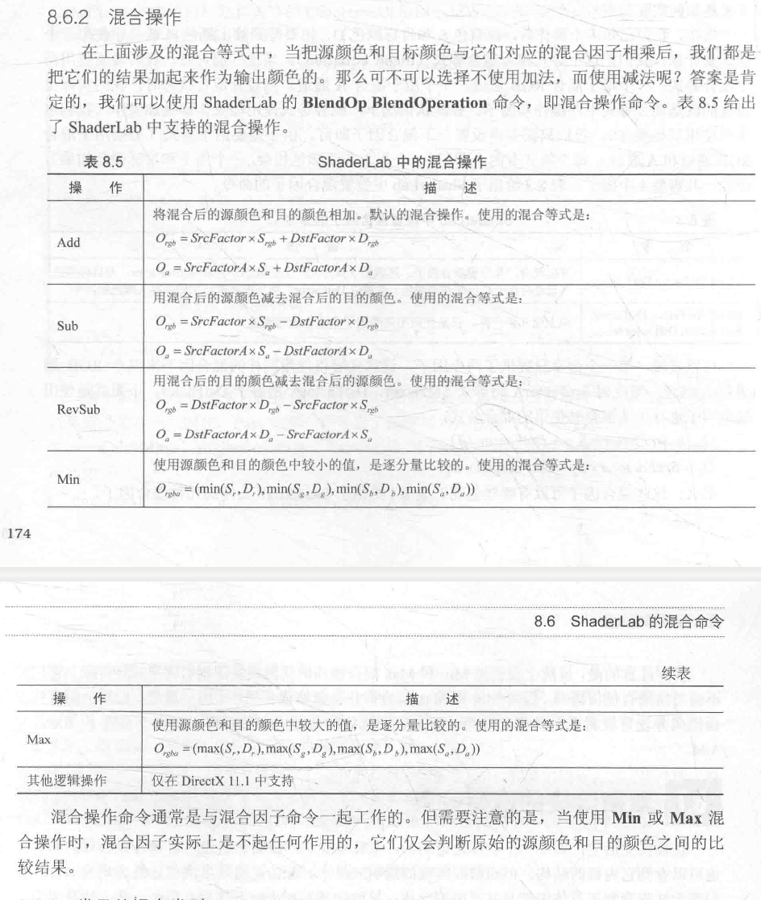

# 透明效果

Unity中通常使用两种方法来实现透明效果:第一种,**透明度测试**；第二种，**透明度混合**。

> 对于不透明的物体，我们不用考虑其渲染顺序，因为有深度缓冲(depth buffer/z-buffer)的存在。深度缓冲是用于决定可见性问题，它可以决定哪个物体的哪些部分被渲染在前面。
> 深度缓冲的基本思路：根据深度缓冲中存的值进行比较（**如开启深度测试** ），它的值距离摄像机更远，那么说明这个片元不应该被渲染在屏幕上，否则，这个片元应该被覆盖此时颜色缓冲中的值，并把它的深度值更新到深度缓冲中去(**如开启深度写入**)

**透明度测试**：极端机制，不满足条件的片元直接剔除，不做任何处理，但不能实现半透。（按照不透明物体的处理：**深度测试和深度写入都开通**）

**透明度混合**：可实现真正的半透。它会使用当前片元的透明度作为混合因子，与已经存储在颜色缓冲中的颜色值进行混合，得到新的颜色。（**开启深度测试，关闭深度写入**），这点决定，当一个不透明物体出现在一个透明物体前面，而我们先渲染不透明物体，它仍然可以正常遮挡住透明物体，总的来说，透明度混合，深度缓冲是只读的。

## 一.渲染顺序的重要性？

透明度混合，需要关闭深度写入，此时就需要小心处理透明物体的渲染顺序。

**为什么要关闭深度写入?**

如果不关闭深度写入，一个半透明表面背后的表面本来是可以透过它被我们看到的，但深度测试时判断结果是该半透明表面距离摄像机更近，导致后面的表面将会被剔除，我们就无法透过半透明表面看到后面的物体了。但是，我们由此就破坏了深度缓冲的工作机制，而这是一个非常非常糟糕的事情，尽管我们不得不这样做。
**所以关闭深度写入导致渲染顺序将变得非常重要**。

## 二.Unity Shader的渲染顺序

Unity 为了解决渲染顺序的问题提供了渲染队列(Render Queue)这一解决方案。

可以使用SubShader的Queue标签来决定我们的模型将归于哪个渲染队列。

Unity提前定义了5个渲染队列，且索引号越小表示越早被渲染。

## 三.透明度测试

## 四.透明度混合

可以得到**真正的半透效果**。它会使用当前片元的透明度作为混合因子，与已经存储在颜色缓冲中的颜色值进行混合，得到新的颜色。

透明度混合需要关闭深度写入，这我们就要非常小心物体的渲染顺序。

要进行混合，需要使用Unity提供的混合命令--Blend,Blend是Unity提供的设置混合模式的命令。

这些命令，在设置混合因子的同时也开启了混合模式。这是因为，只有开启了混合之后，设置片元的透明通道才有意义。Unity在我们使用Blend命令的同时会自动帮我们打开。

**混合后颜色**，源颜色的混合因子SrcFactor设为SrcAlpha,目标混合因子DstFactor设置为OneMinusSrcAlpha,则颜色如下：

$$
DstColor_{new} = SrcAlpha*SrcColor + (1-SrcAlpha)*DstColor_{old}
$$

### ShaderLab的混合命令

混合和两个参数有关：**源颜色**和**目标颜色**。源颜色，我们用**S**表示，指的是由片元着色器产生的颜色；目标颜色用**D**表示，指的是从颜色缓冲中读取的颜色。混合后的输出颜色**O**表示，它会重新写入到颜色缓冲中。

需要注意的是，这里的混合包含RGBA四个通道的值，而并非仅是RGB通道。

#### 混合等式和参数

混合是一个逐片元的操作，而它不是可编程的，但却是高度可配置的。也就是我们设置混合时使用运算操作，混合因子等来影响混合。

