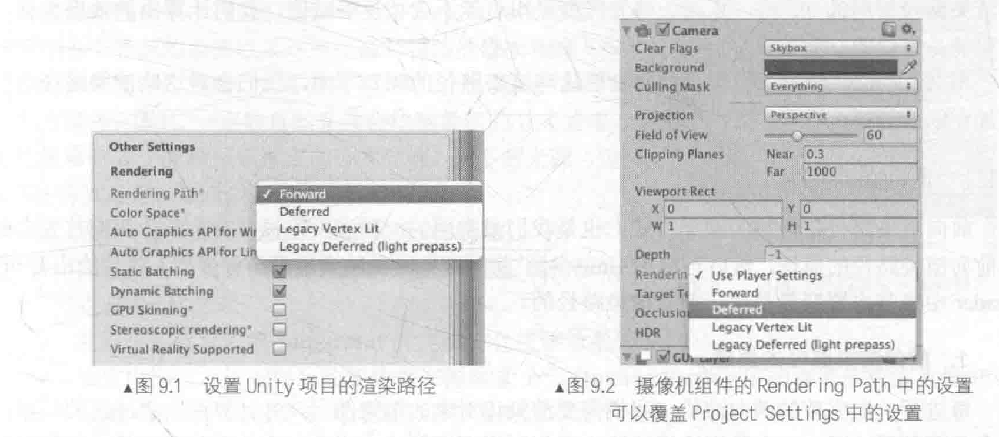
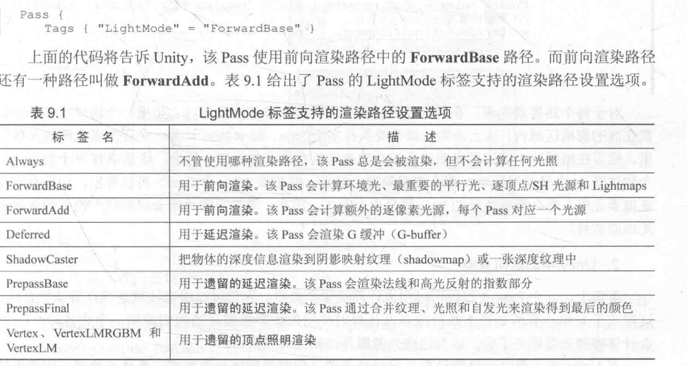

Unity中，**渲染路径**决定了光照是如何应用到Unity Shader中。因此，要和光源打交道，需要为每个Pass指定它使用的渲染路径。

Unity支持多种类型的渲染路径。**Unity5.0版本之前**，主要3种：前向渲染路径(Forward Rendering Path)，延迟渲染路径(Forward Rendering Path)和顶点照明渲染路径（Vertex Lit Rendering Path）. **Unity5.0之后**，Unity做了很多更改，主要有两个变化，首先顶点照明渲染路径被Unity抛弃；其次，新的延迟渲染路径代替了原来的延迟渲染路径。

为整个项目设置渲染时的渲染路径：

Edit->Project Settings -> Player -> Other Settings -> Rendering

完成了上面的设置，就可以在每个Pass中使用标签来指定该Pass使用的渲染路径。这是通过设置Pass的LightMode标签实现的。不同类型的渲染路径可能会包含多种标签设置。

指定渲染路径是我们和Unity的底层渲染引擎的一次重要的沟通。eg:如果我们为一个Pass设置了前向渲染路径的标签，相当于告诉Unity：“hi,我准备使用前向渲染了”

# 1.前向渲染路径

