Unity中，**渲染路径**决定了光照是如何应用到Unity Shader中。因此，要和光源打交道，需要为每个Pass指定它使用的渲染路径。

Unity支持多种类型的渲染路径。**Unity5.0版本之前**，主要3种：前向渲染路径(Forward Rendering Path)，延迟渲染路径(Forward Rendering Path)和顶点照明渲染路径（Vertex Lit Rendering Path）. **Unity5.0之后**，Unity做了很多更改，主要有两个变化，首先顶点照明渲染路径被Unity抛弃；其次，新的延迟渲染路径代替了原来的延迟渲染路径。

为整个项目设置渲染时的渲染路径：

Edit->Project Settings -> Player -> Other Settings -> Rendering

完成了上面的设置，就可以在每个Pass中使用标签来指定该Pass使用的渲染路径。这是通过设置Pass的LightMode标签实现的。不同类型的渲染路径可能会包含多种标签设置。

指定渲染路径是我们和Unity的底层渲染引擎的一次重要的沟通。eg:如果我们为一个Pass设置了前向渲染路径的标签，相当于告诉Unity：“hi,我准备使用前向渲染了”

# 1.前向渲染路径

传统的渲染方式，常用的一种渲染路径。

## 1.1前向渲染路径的原理。

每次进行一次完整的前向渲染，我们需要渲染该对象的渲染图元 ，并计算两个缓冲区的信息：一个是**颜色缓冲区**，一个是**深度缓冲区域**。
我们利用深度缓冲来决定一个片元是否可见，如果可见，就更新颜色缓冲区中的颜色值。以下为伪代码：

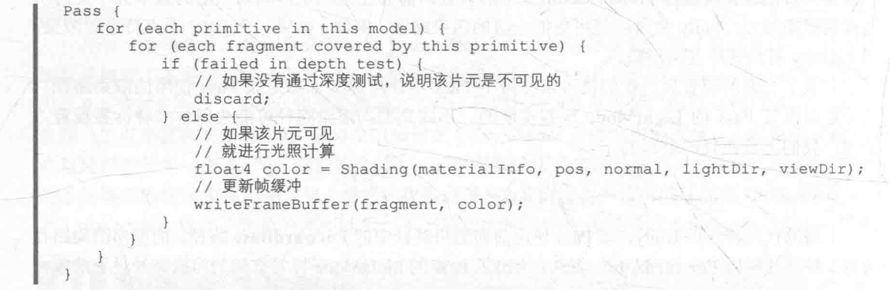

对于每个逐像素光源，我们都需要进行上面一次完整的渲染流程。如果一个物体在多个逐像素光源的影响区域内，那么该物体就需要执行多个Pass,每个Pass计算一个逐像素光源的光照结果，然后再帧缓冲中把这些光照结果混合起来得到最终的颜色值。
(如果有大量逐像素光照，那么需要执行的Pass数目也会很大。因此，渲染引擎通常会限制每个物体的逐像素光照的数目)。

## 1.2 Unity中的前向渲染

实际上，一个Pass不仅仅可以用来计算逐像素光照，它也可以用来计算逐顶点等其他光照。

Unity中,前向渲染路径有3中处理光照(即照亮物体)的方式：逐顶点处理了，逐像素处理，球谐函数（Spherical Harmonics,HS）处理。而决定一个光源使用哪种处理模式取决于它的类型和渲染模式。光源类型指的是该光源是平行光还是其他类型的光源，而光源的渲染模式指的是该光源是否是重要的。

如果我们把光照模式设置为Important,意味我们提醒Unity，这个光源很重要，要认真对待，把它当成一个逐像素光源来处理。

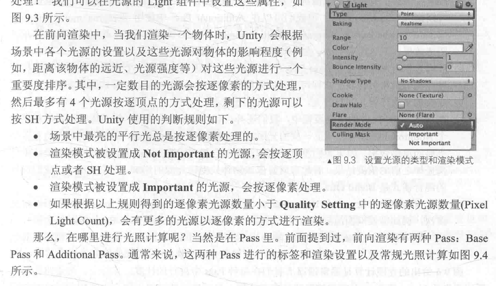
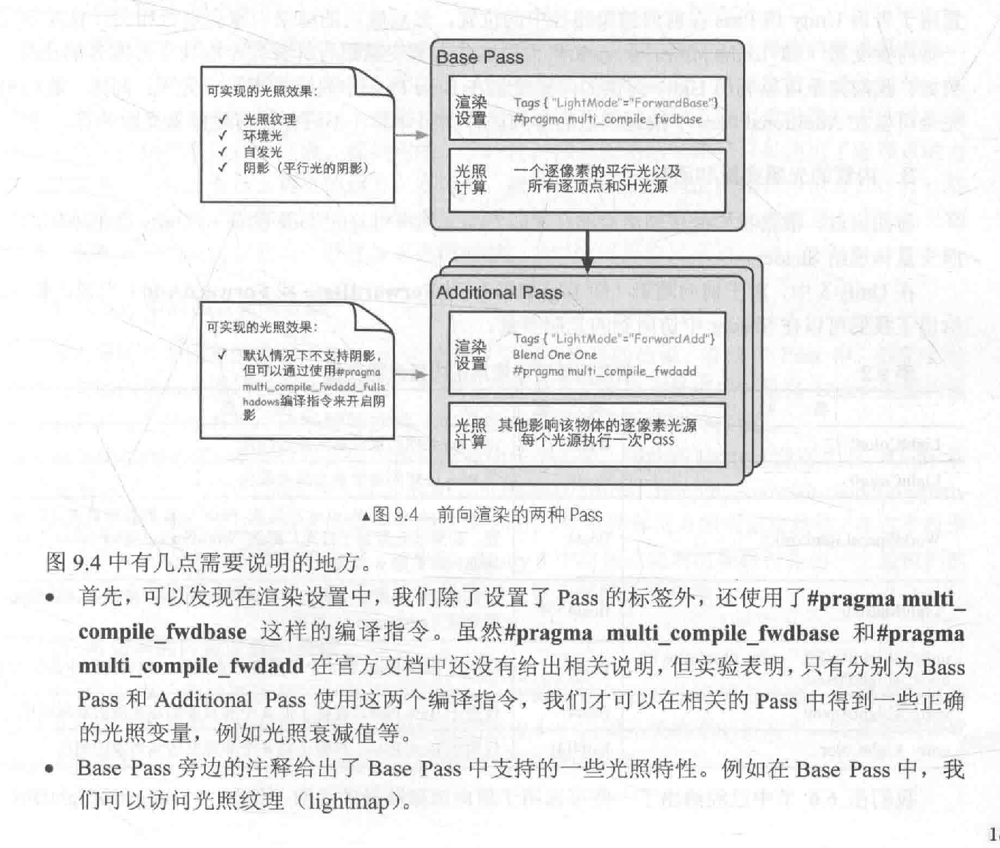
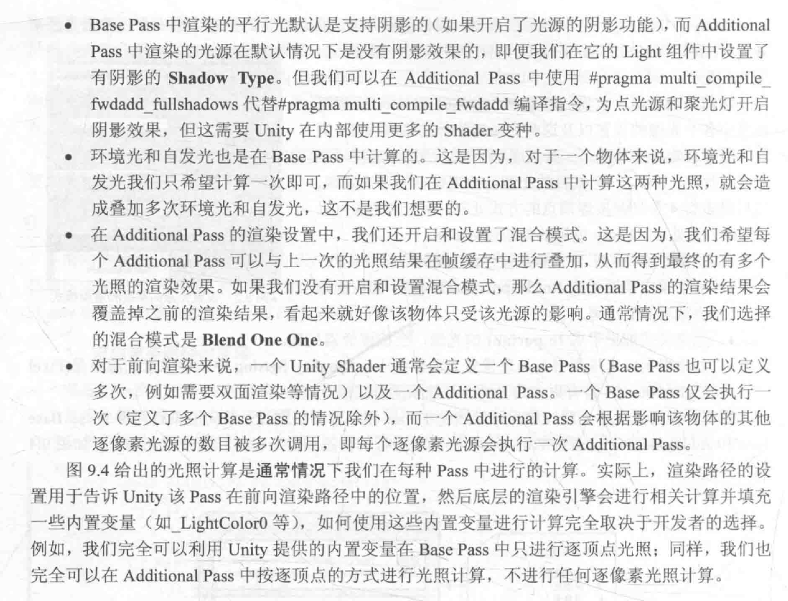

## 1.3内置的光照变量和函数

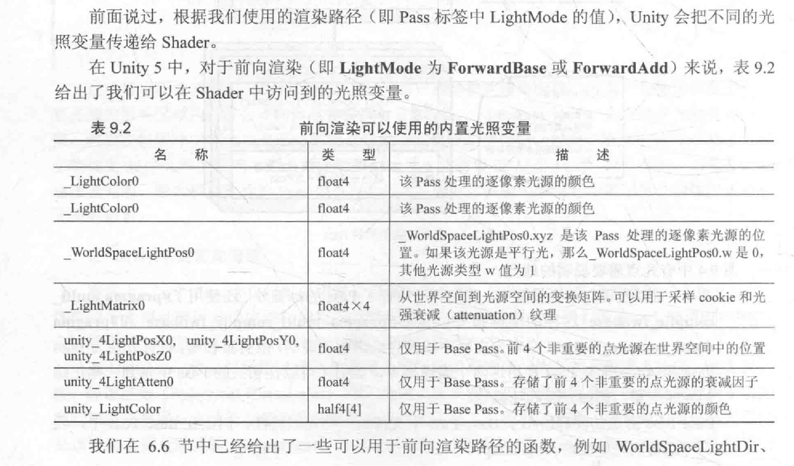
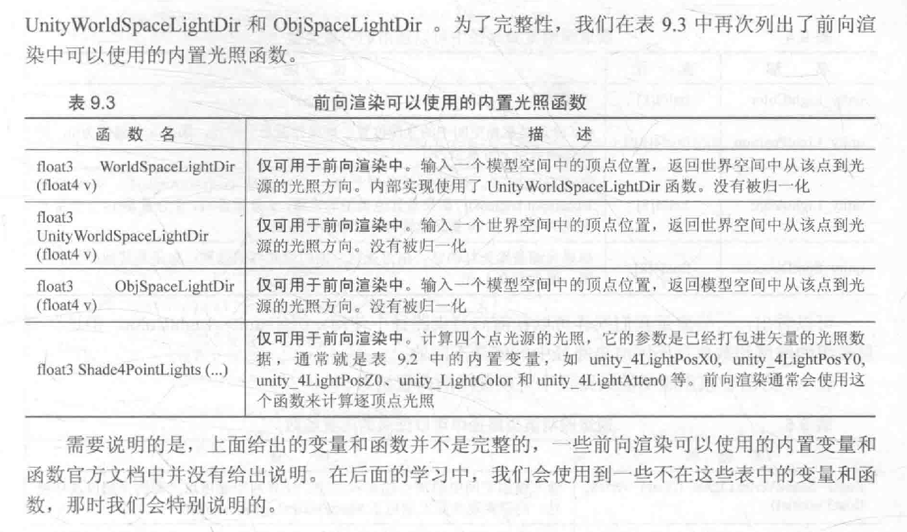

# 2.顶点照明渲染路径

顶点照明渲染路径是对硬件配置要求最少，运算性能最高，但同时也是得到的效果最差的一种类型，它不支持哪些逐像素才能得到的效果,eg:阴影，法线映射，高精度的高光反射等.

实际上，它仅仅是前向渲染路径的一个子集，就是说，所有可以在顶点照明渲染路径中实现的功能都可以在前向渲染路径中完成。

## 2.1 Unity中的顶点照明渲染

顶点照明渲染路径通常在一个Pass中就可以完成对物体的渲染。

在这个Pass中，我们会计算我们关心的所有光源对该物体的照明，并且这个计算是按逐顶点处理的。

这是Unity中最快速的渲染路径，并且具有最广泛的硬件支持。

Unity 5之后，可能已经被移除。

## 2.2 可访问的内置变量和函数

Unity中，我们可以在一个顶点照明的Pass中最多访问到8个逐顶点光源。

如果我们只需要渲染其中两个光源对物体的照明，可以仅使用9.4表中内置的光照数据的前两个。

如果影响该物体的光源数目小于8，那么数组中剩下的光源颜色会设置为黑色。

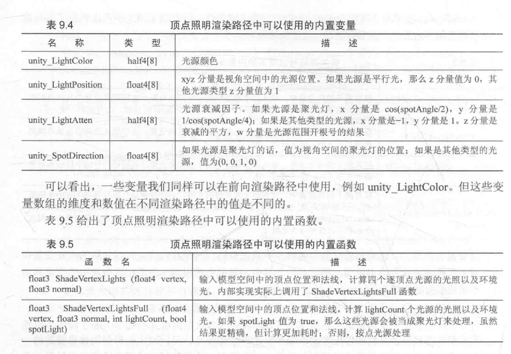

# 3.延迟渲染路径

前向渲染的问题是:当场景中包含大量实时光源时，前向渲染的性能会急速下降。

eg:如果我们在场景的某一块区域放置了多个光源，这些光源影响的区域互相重叠，那么未来得到最终的光照效果，我们需要为该区域内的每个物体执行多个Pass来计算不同光源对该物体的光照结果，然后再颜色缓冲中把这些结果混合起来得到最终的光照。

延迟渲染是比较古老的渲染方法，但上述前向渲染可能造成的瓶颈问题，近几年又流行起来。

## 3.1 延迟渲染的原理

延迟渲染主要包含了两个Pass。在第一个Pass中，我们不进行任何光照计算，而是仅仅计算哪些片元是可见的，这主要是通过深度缓冲技术来实现，当法线一个片元是可见的，我们就把它的相关信息存储到G缓冲区中。然后，在第二个Pass中，我们利用G缓冲区的各个片元信息。eg:表面法线，视角方向，漫反射系数等。进行真正的光照计算。

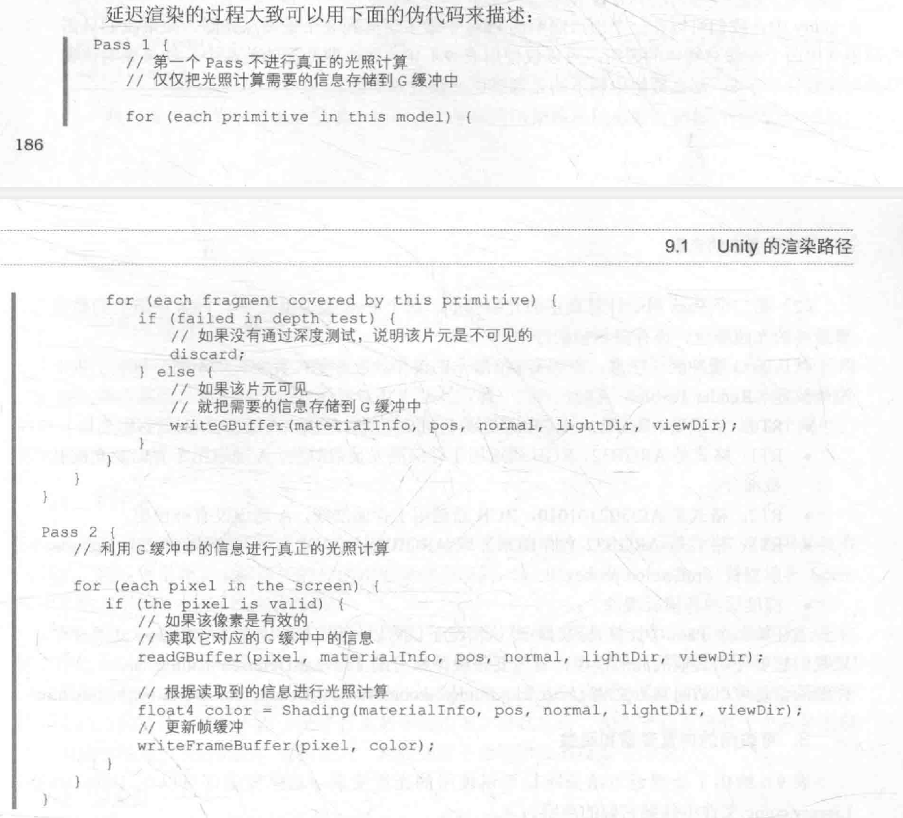

## 3.2 Unity中的延迟渲染

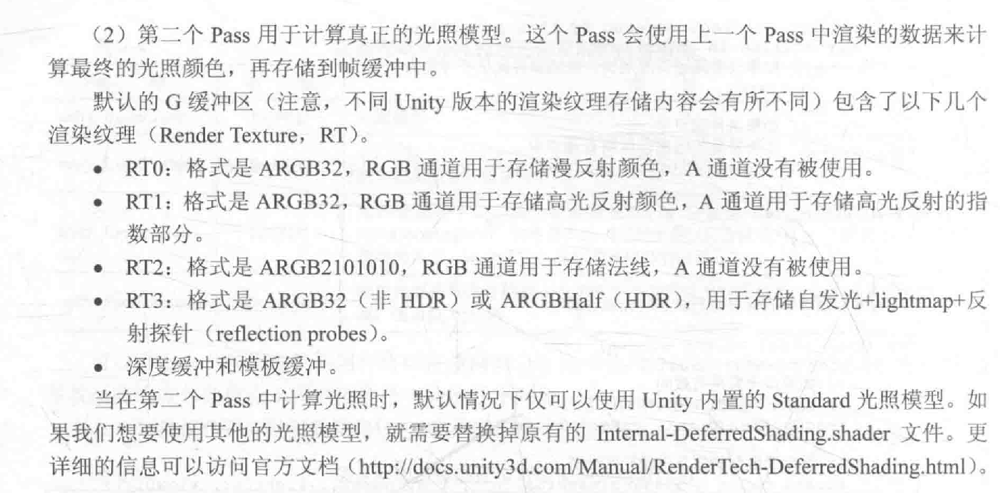
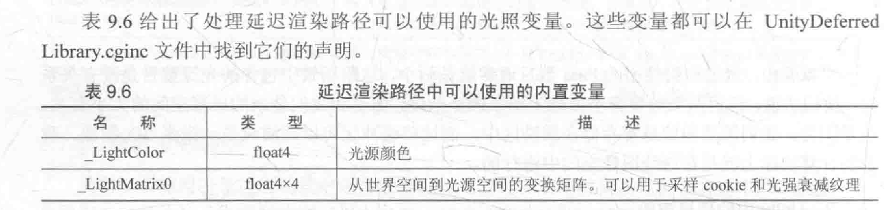

## 3.3 可访问的内置变量和函数

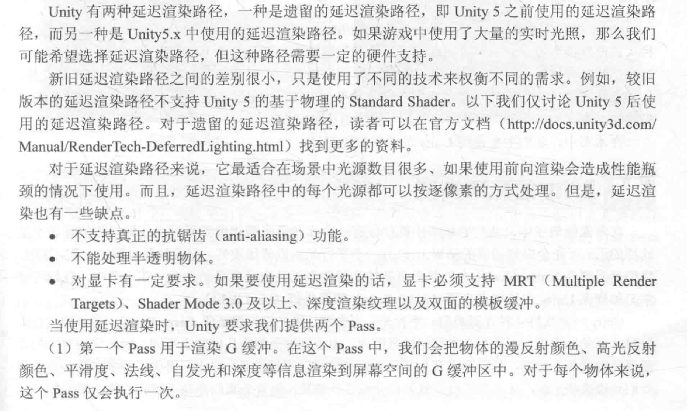