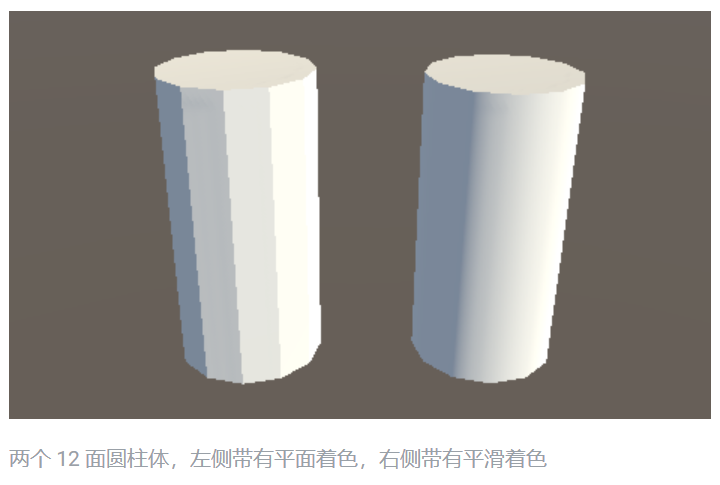
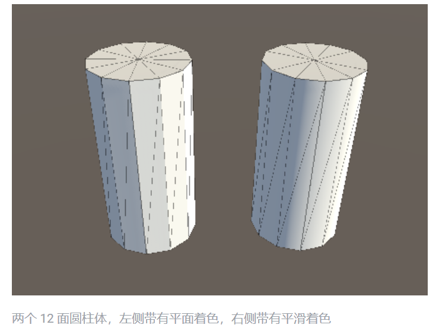
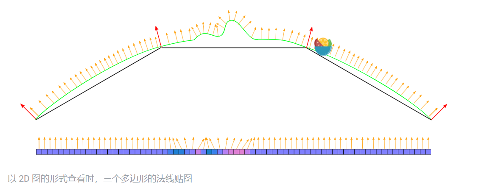
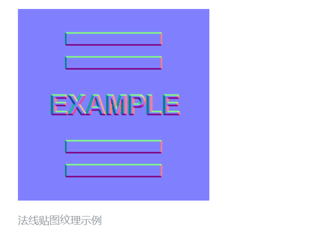
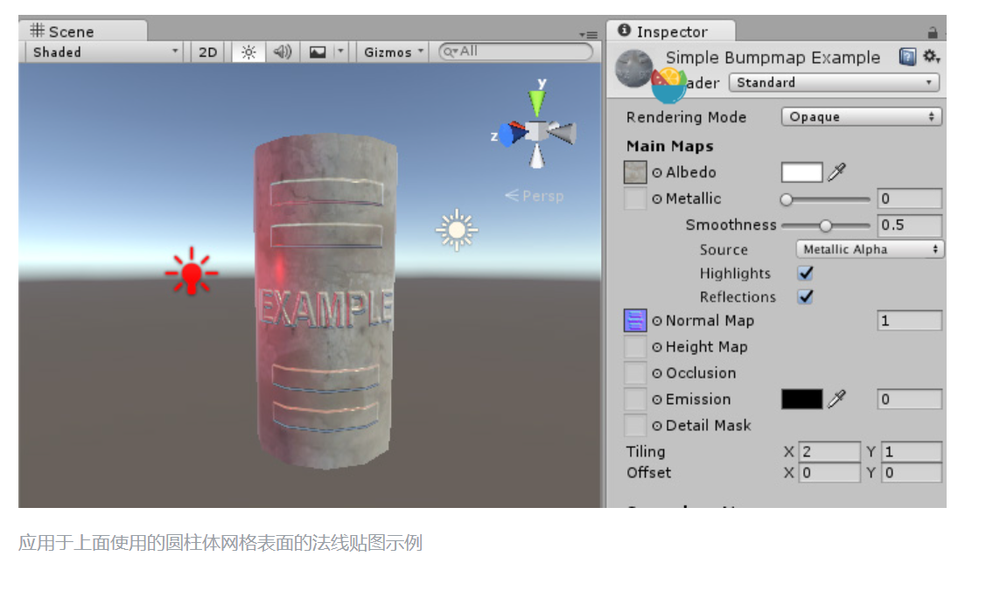
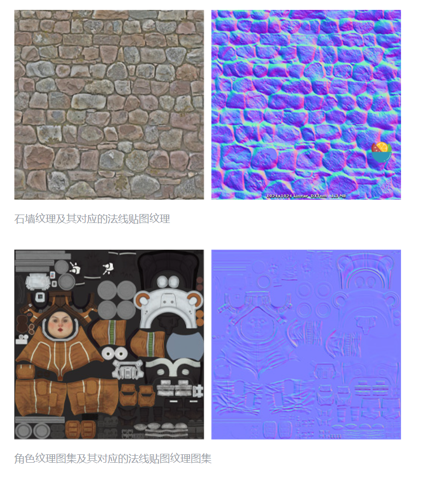
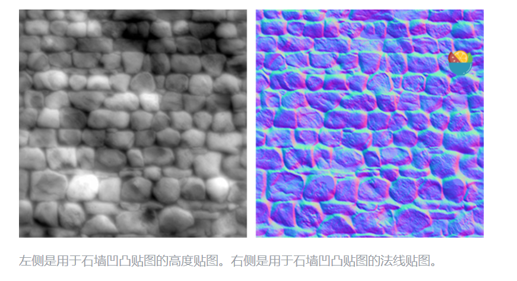
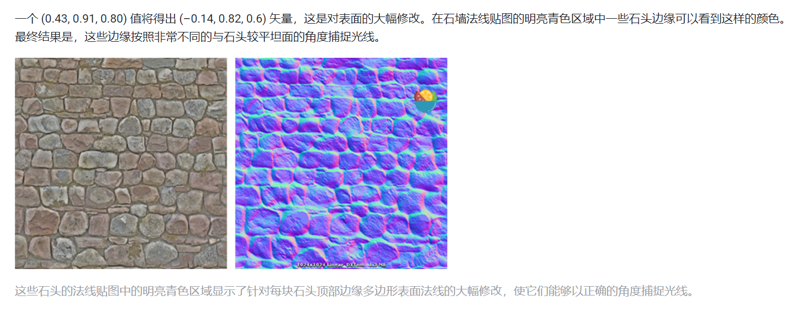
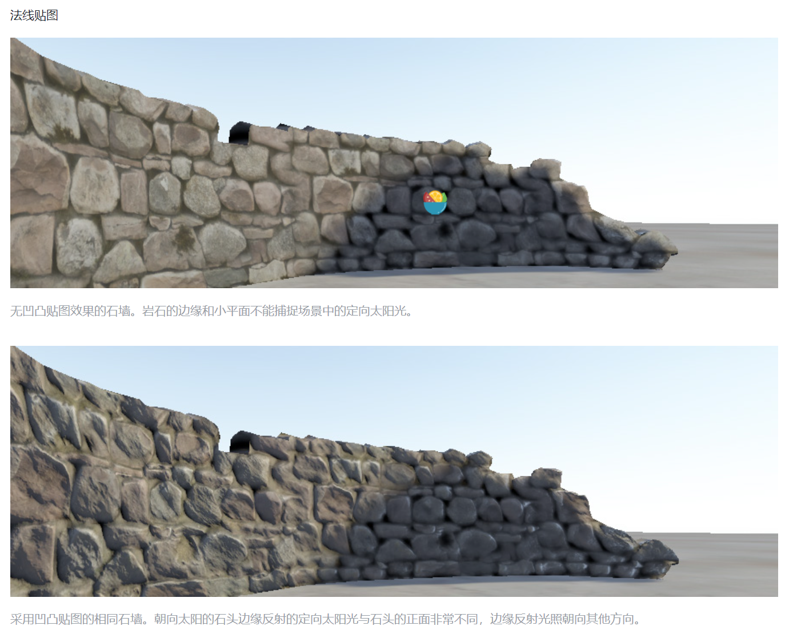

# 法线贴图

法线贴图 (Normal Map) **是一种凹凸贴图 (Bump Map)**。它们是一种特殊的纹理，可让您将表面细节（如**凹凸**、**凹槽**和**划痕**）添加到模型，从而捕捉光线，就像由真实几何体表示一样。

## 如何创建和使用凹凸贴图

凹凸贴图通常也称为**法线贴图**或**高度贴图** (Height Map)，但这些术语的含义略有不同，下文稍后将进行说明。

### 什么是表面法线?

为了真正解释法线贴图的工作原理，我们将首先介绍什么是“**法线**”以及如何在实时光照中使用法线。

可能最基本的例子就是一个模型的每个表面多边形仅根据相对于光线的表面角度获得光照。表面角度可表示为表面垂直方向突出的一条线，而相对于表面的该方向（矢量）即称为“表面法线”，或简称为法线。

在上图中，左圆柱体具有基本的平面着色，并且每个多边形根据其与光源的相对角度进行着色。每个多边形上的光照在多边形区域内保持恒定，因为该表面是平坦的。以下是显示了线框网格的同样两个圆柱体：

右侧的模型与左侧的模型具有相同数量的多边形，但是显示为平滑着色；多边形上的光照产生了曲面外观。为什么会这样？

原因是用于**反射光线的每个点处的表面法线沿着多边形的宽度逐渐变化，所以对于表面上的任何给定点，光反射表现为好像该表面是弯曲的而不是实际的平坦恒定多边形。**

以 2D 图的形式查看时，平面着色圆柱体外侧的三个表面多边形将如下所示：

表面法线用橙色箭头表示。**这些值用于计算光线如何从表面反射**，所以您可以看到光线沿着每个多边形的长度具有相同响应，因为表面法线指向相同的方向。因此就会产生“平面着色”，这也是左圆柱体的多边形看起来有硬边的原因。

然而，对于平滑着色的圆柱体，表面法线在平面多边形上发生变化，如下所示：

**法线方向在平面多边形表面上逐渐变化，因此表面上的着色产生了平滑曲线的印象（如绿线所示）**。这不会影响网格的实际多边形性质，只会影响在平面表面上计算光照的方式。这种明显的曲面并不存在，以掠射角观察这些面时将揭示出平面多边形的真实性质，但从大多数视角看，圆柱体看起来具有平滑的曲面。

使用这种基本平滑着色时，实际上只根据每个顶点来存储确定法线方向的数据，因此该表面上的变化值是从一个顶点到下一个顶点之间进行插值的。在上图中，红色箭头表示每个顶点存储的法线方向，橙色箭头表示多边形区域上的内插法线方向的示例。

### 什么是法线贴图？

法线贴图使表面法线的这种修改更进一步，使用纹理来存储有关如何修改模型上的表面法线的信息。法线贴图是映射到模型表面的图像纹理，类似于常规颜色纹理，但法线贴图纹理中的每个像素（称为**纹理像素**）表示平面法线方向与平面（或平滑插值）多边形“真实”表面法线之间的偏差。

该图再次以 2D 形式表示 3D 模型的表面上的三个多边形，每个橙色箭头对应于法线贴图纹理中的像素。下面的是法线贴图纹理的单像素切片。在中心位置，您可以看到法线已被修改，在多边形的表面上呈现出几个凹凸的外观。因为这些修改过的法线将用于光照计算，所以这些凹凸只会由于表面上的光照显示情况而变得明显。

原始法线贴图文件中可见的颜色通常具有蓝色色调，并且不包含任何实际的浅色或深色着色，这是因为这些颜色本身不打算按原样显示。实际上，每个纹理像素的 RGB 值表示方向矢量的 X、Y 和 Z 值，并作为对多边形表面的基本内插平滑法线的修改而应用。

这是一个简单的法线贴图，包含一些凸起的矩形和文本的凹凸信息。此法线贴图可导入到 Unity 中，并放入标准着色器的 Normal Map 字段中。在材质中与颜色贴图（Albedo 贴图）相结合并应用于上述圆柱体网格的表面时，结果如下所示：

同样，这不会影响网格的实际多边形性质，只会影响在表面上计算光照的方式。表面上明显凸起的字幕和形状并不存在，以掠射角观察这些面时将揭示出平面表面的真实性质，但从大多数视角看，圆柱体现在看起来具有从表面凸起的浮雕细节。

### 如何获取或制作法线贴图？

法线贴图通常与模型或纹理一起由 3D 或纹理美术师制作而成，并且通常镜像出反照率贴图的布局和内容。有时，法线贴图是手工制作的，有时是从 3D 应用程序中渲染出来的。

如何从 3D 应用程序渲染法线贴图超出了本文档的范畴，但基本概念是 3D 美术师将制作模型的两个版本：一个以多边形包含所有细节的高分辨率模型，还有一个可立即用于游戏的低分辨率模型。高分辨率模型的细节化程度太高，无法在游戏中以最佳状态运行（网格中有太多三角形），但需要在 3D 建模应用程序中用于生成法线贴图。然后，低分辨率版本的模型可以忽略非常精细的几何细节，这些细节现在已存储在法线贴图中，因此可以使用法线贴图来渲染该模型。一个典型的用例就是显示角色服装上的折痕、按钮、搭扣和接缝的凹凸细节。

有一些软件包可以分析常规摄影纹理中的光照，并从中提取法线贴图。为此，需要假设原始纹理从恒定方向接受光照，还要分析明暗区域并假设其与倾斜表面对应。但是，当实际使用凹凸贴图时，您需要确保反照率纹理没有来自图像中任何特定方向的光线（理想情况下应表示完全没有光线的表面的颜色），因为 Unity 将根据光线方向、曲面角度和凹凸贴图信息计算出光照信息。

下面提供了两个例子，一个是简单的重复石墙纹理及其对应的法线贴图，另一个是角色的纹理图集及其对应的法线贴图：

### 凹凸贴图、法线贴图和高度贴图有什么区别？

**法线贴图**和**高度贴图**都是凹凸贴图的类型。二者都包含一些数据用于表示较简单多边形网格的表面上的明显细节，但各自却以不同的方式存储这些数据。

在上方左侧，您可以看到用于石墙凹凸贴图的高度贴图。

**高度贴图是一种简单的黑白纹理**，其中每个像素表示该点在表面上看起来应该凸起的程度。像素**颜色越白，该区域看起来越高**。

**法线贴图是 RGB 纹理**，其中每个像素表示表面看起来应该面向的方向的差异（相对于其未经修改的表面法线）。由于矢量存储在 RGB 值中的方式，这些纹理往往为蓝紫色调。

现代实时 3D 图形硬件依赖于法线贴图，因为此类型的贴图包含了必要的矢量来修改在表面上反射光线的方式。Unity 还可接受高度贴图类型的凹凸贴图，但必须在导入时将其转换为法线贴图才能使用。

### 为什么呈现紫蓝色？

了解这一点对于使用法线贴图并不重要！跳过这一段是可以的。但是，如果真的想知道，请参考以下信息：RGB 颜色值用于存储矢量的 X、Y、Z 方向，其中的 Z 为“向上”（与 Unity 通常使用 Y 作为“向上”的惯例相反）。此外，纹理中的值视为经过减半处理，即添加了 0.5 的系数。这样就能存储所有方向的矢量。因此，为了将 RGB 颜色转换为矢量方向，必须乘以 2，然后减去 1。例如，RGB 值 (0.5, 0.5, 1) 或十六进制的 #8080FF 将得到矢量 (0,0,1)，这便是用于法线贴图的“向上”，并表示模型表面没有变化。这就是您在此页面前面的法线贴图“示例”的平面区域中看到的颜色。

